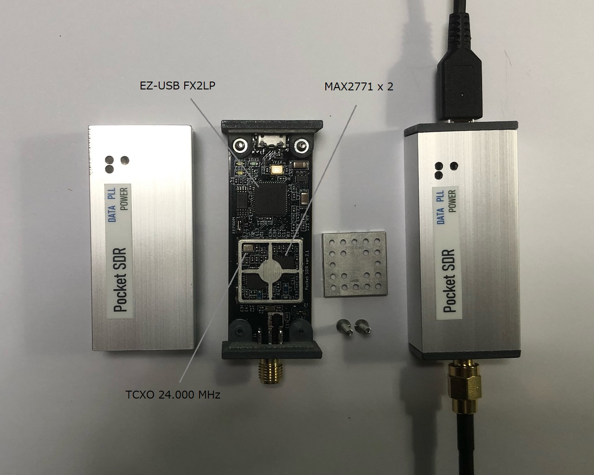
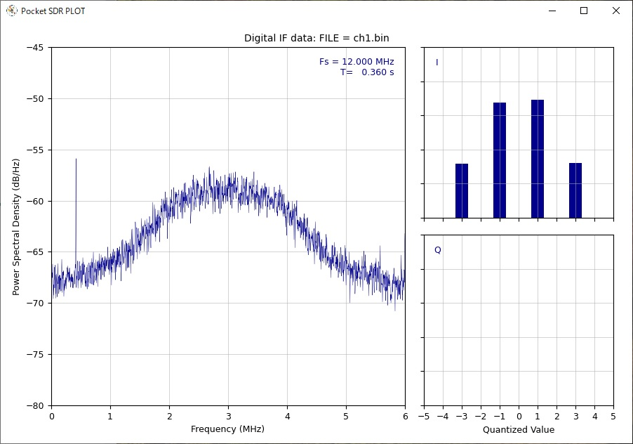
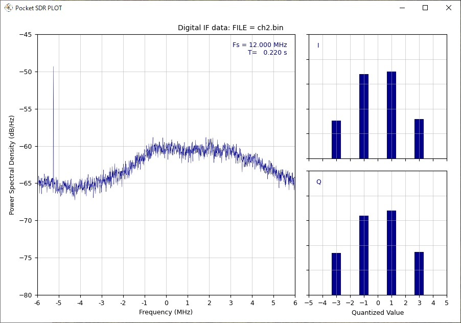

# **PocketSDR - An Open-Source GNSS SDR Front-end Device, ver. 0.1**

## **Overview**

PocketSDR is an open-source SDR (software defined radio) based GNSS (Global 
Navigation Satellite System) RF front-end device. It supports almost all signal
bands for GPS, GLONASS, Galileo, QZSS, BeiDou, NavIC and SBAS.

PocketSDR consists of 2 CH Maxim MAX2771 GNSS RF front-end IC (LNA, mixer, filter,
ADC, frequency synthesizer) and Cypress EZ-USB FX2LP USB 2.0 controller.
The front-end CH1 is dedicated for GNSS L1 band (1525 - 1610 MHz) and CH2 is for
GNSS L2/L5/L6 band (1160 - 1290 MHz).

The frequency of the reference oscillator (TCXO) is 24.000 MHz and ADC sampling
frequency can be configured up to 24 MHz.

PocketSDR contains also some utility programs to configure the device, capture
and dump the digitized IF (inter-frequency) data. These supports Windows,
Linux and other environments.



--------------------------------------------------------------------------------

## **Package Structure**
```
PocketSDR --+-- bin     PocketSDR utility binary programs for Windows
            +-- src     PocketSDR utility source programs
            +-- conf    Configuration files for device settings
            +-- util    Windows driver installation utility (ref [3])
            +-- doc     Documents (ref {1], [2])
            +-- FW      Firmware source programs and images
            |   +-- cypress  Cypress libraries for EZ-USB firmware development
            |                (ref [4])
            +-- HW      PocketSDR CAD data and parts list for hardware
                        (*.brd and *.sch are for Eagle, *.f3d is for Fusion 360)
```

--------------------------------------------------------------------------------

## **Installation for Windows**

* Extract PocketSDR.zip to an appropriate directory <install_dir>.

* Attach PocketSDR to PC via USB cable.

* Install USB driver (WinUSB) for PocketSDR.
    * Execute zadig-2.6.exe in <install_dir>\PocketSDR\util.
    * Execute menu Options - List All Devices and select "EZ-USB" (USBID 04B4
      1004). 
    * Select WinUSB (v6.1.xxxx.xxxxx) and Push "Replace Driver" or  "Reinstall
      Driver".
    
    <br>
* Add the PocketSDR binary programs path (<install_dir>\PocketSDR\bin) to 
  the command search path (Path) of Windows environment variables.

* To rebuild the binary programs, you need MinGW64 and libusb-1.0 library. 
  Refer MSYS2 (https://www.msys2.org/) for details.

--------------------------------------------------------------------------------

## **Installation for Linux**

* Extract PocketSDR.zip to an appropriate directory <install_dir>.
```
    $ unzip PocketSDR.zip
```
* Install libusb-1.0 developtment package. For Ubuntu:
```
    $ sudo apt install libusb-1.0-0-dev
```
* Move to the source program directory, edit makefile and build utilities.
```
    $ cd <install_dir>/src
    $ vi makefile
    ...
    #LIBUSB = -L/mingw64/lib -llibusb-1.0
    LIBUSB = -lusb-1.0
    ...
    $ make
    $ make install
```
* Add the PocketSDR binary programs path (<install_dir>/PocketSDR/bin) to 
  the command search path.

--------------------------------------------------------------------------------

## **Utility Programs**

PocketSDR contains the following utility programs.

- **pocket_conf**: SDR device configurator
- **pocket_scan**: Scan and list USB Devices
- **pocket_dump**: Capture and dump digital IF data of SDR device
- **pocket_plot.py**: Plot PSD and histgrams of digital IF data

For details, refer comment lines in src/pocket_conf.c, src/pocket_scan.c, 
src/pocket_dump.c and src/pocket_plot.py. You need Python 3, Numpy and 
matplotlib to execute pocket_plot.py.

--------------------------------------------------------------------------------

## **Execution Examples of Utility Programs**

```
    $ pocket_conf conf/pocket_L1L6_12MHz.conf
    ...
    $ pocket_dump -t 10 ch1.bin ch2.bin
    ...
    $ pocket_plot.py ch1.bin -f 12 &
    $ pocket_plot.py ch2.bin -f 12 -IQ &
``` 




--------------------------------------------------------------------------------

## **Rebuild F/W and Write F/W Image to PocketSDR**

* Install Cypress EZ-USB FX2LP Development Kit (ref [4]) to a Windows PC. As
default, it is installed to C:\Cypress and C:\Keil.

* Execute Keil uVision2 (C:\Keil\UV2\uv2.exe).

* Execute Menu Project - Open Project, select <install_dir>\PocketSDR\FW\pocket_fw.Uv2>
and open the project.

* Execute Menu Project - Rebuild all target files and you can get a F/W image
as <install_dir>\PocketSDR\FW\pocket_fw.iic.

* Attach PocketSDR via USB cable to the PC.

* Open Windows Device Manager, select "EZ-USB" as "Universal Serial Bus Device",
select right-button menu Update Driver, select "Browse your computer for driver software"
and input the CyUSB driver path (C:\Cypress\USB\CY3684_EZ-USB_FX2LP_DVK\1.1\Drivers).
After the driver installation , you find "Cypress FX2LP Sample Device" as 
"Universal Serial Bus Controller" in Windows Device Manager.

* Execute USB Control Center (C:\Cypress\USB\CY3684_EZ-USB_FX2LP_DVK\1.1\Windows Applications\
c_sharp\controlcenter\bin\Release\CyControl.exe).

--------------------------------------------------------------------------------

## **References**

[1] Maxim integrated, MAX2771 Multiband Universal GNSS Receiver, July 2018

[2] Cypress, EZ-USB FX2LP USB Microcontroller High-Speed USB Peripheral 
  Controller, Rev. AB, December 6, 2018

[3] Zadig USB driver installation made easy (https://zadig.akeo.ie/)

[4] Cypress, CY3684 EZ-USB FX2LP Development Kit
    (https://www.cypress.com/documentation/development-kitsboards/cy3684-ez-usb-fx2lp-development-kit)

--------------------------------------------------------------------------------

## **History**

- 2021-10-20  0.1  1st draft version
- 2021-10-25  0.2  Add Rebuild F/W and Write F/W Image to PocketSDR

