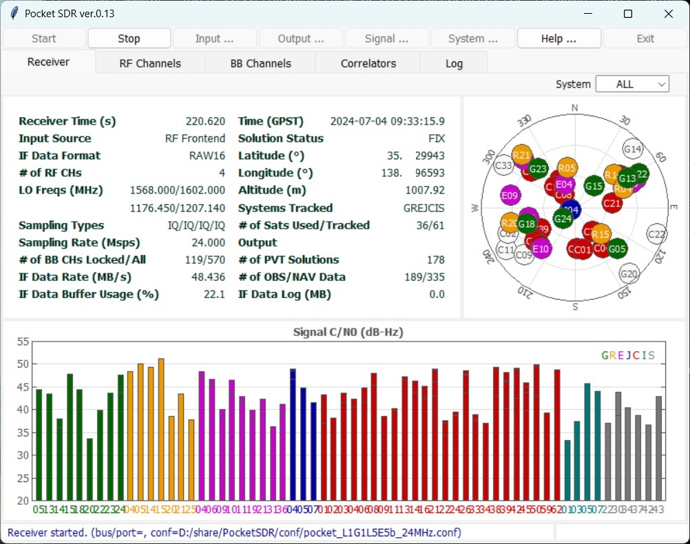
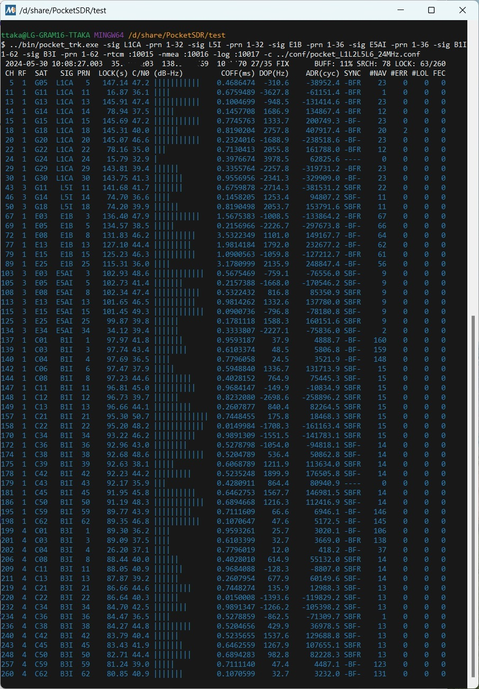

# **Pocket SDR - An Open-Source GNSS SDR, ver. 0.13**

## **Overview**

Pocket SDR is an open-source GNSS (Global Navigation Satellite System) receiver
based on the SDR (software defined radio) technology. It consists of RF frontend
devices named "Pocket SDR FE", some utilities for the devices, and GNSS-SDR
APs (application programs) written in Python, C, and C++. It supports almost all
signals for GPS, GLONASS, Galileo, QZSS, BeiDou, NavIC, and SBAS.

The Pocket SDR FE device consists of 2 or 4 RF frontend channels, which support
GNSS L1 band (1525 - 1610 MHz), or L2/L5/L6 band (1160 - 1290 MHz). The bandwidth
of each RF channel covers up to 36 MHz. The sampling rate of the ADC can be
configured up to 32 Msps (FE 2CH) or 48 Msps (FE 4CH).

The Pocket SDR also contains some utility programs for the Pocket SDR FE devices,
to setup the devices, capture and dump the digitized IF (inter-frequency) data.
These utilities support Windows, Linux, Raspberry Pi OS, macOS and other environments.
The Pocket SDR also provides GNSS-SDR APs to show the PSD (power spectrum
density) of captured IF data, search GNSS signals, track these signals, decode
navigation data and generate PVT (position, velocity and time) solutions. The
supported GNSS signals are as follows. For details on these signals and signal
IDs used in the APs, refer [Pocket SDR Signal IDs](/doc/signal_IDs.pdf).

* **GPS**: L1C/A, L1C-D, L1C-P, L2C-M, L5-I, L5-Q
* **GLONASS**: L1C/A (L1OF), L2C/A (L2OF), L1OCd, L1OCp, L2OCp, L3OCd, L3OCp
* **Galileo**: E1-B, E1-C, E5a-I, E5a-Q, E5b-I, E5b-Q, E6-B, E6-C
* **QZSS**: L1C/A, L1C/B, L1C-D, L1C-P, L1S, L2C-M, L5-I, L5-Q, L5S-I, L5S-Q, L6D, L6E
* **BeiDou**: B1I, B1C-D, B1C-P, B2a-D, B2a-P, B2I, B2b-I, B3I
* **NavIC**: L1-SPS-D, L1-SPS-P, L5-SPS
* **SBAS**: L1C/A, L5-I, L5-Q

These utilities and APs are written in Python, C, and C++ by very compact way. They
are easily modified by users to add user's unique algorithms. 


**<p style="text-align: center;">Pocket SDR FEs (FE 2CH v.2.1, FE 2CH v.2.3, and FE 4CH v.3.0)</p>**

The introduction of Pocket SDR is shown in the following slides.

T.Takasu, An Open Source GNSS SDR: Development and Application, IPNTJ Next GNSS
Technology WG, Feb 21, 2022
(https://gpspp.sakura.ne.jp/paper2005/IPNTJ_NEXTWG_202202.pdf)

For an application of Pocket SDR, refer the following slides.

T.Takasu, Development of QZSS L6 Receiver without Pilot Signal by using SDR,
IPNTJ Annual Conference, June 10, 2022
(https://gpspp.sakura.ne.jp/paper2005/IPNTJ_20220610.pdf)

--------------------------------------------------------------------------------

## **Directory Structure and Contents**
```
PocketSDR --+-- bin     Pocket SDR APs binary programs
            +-- app     Pocket SDR APs source programs
            |   +-- pocket_conf  Pocket SDR FE device configurator
            |   +-- pocket_dump  Dump digital IF data of Pocket SDR FE device
            |   +-- pocket_scan  Scan and list USB devices
            |   +-- pocket_acq   GNSS signal acquisition
            |   +-- pocket_trk   GNSS signal tracking and PVT generation
            |   +-- pocket_snap  Snapshot Positioning
            +-- src     Pocket SDR library source programs
            +-- python  Pocket SDR Python scripts
            +-- lib     Libraries for APs and Python scripts
            |   +-- win32        Libraries for Windows
            |   +-- linux        Libraries for Linux or Raspberry Pi OS
            |   +-- build        Makefiles to build libraries
            |   +-- cyusb        Cypress EZ-USB API (CyAPI.a) and includes
            |   +-- RTKLIB       RTKLIB source programs based on 2.4.3 b34
            |   +-- (libfec)     Library for FEC (forward error corrections) ([1])
            |   +-- (LDPC-codes) Library for LDPC-decoder ([2])
            +-- conf    Configuration files for Pocket SDR FE
            +-- FE_2CH  Pocket SDR FE 2CH H/W and F/W
            +-- FE_4CH  Pocket SDR FE 4CH H/W and F/W
            +-- driver  Windows driver for Pocket SDR FE
            +-- doc     Documents
            +-- image   Image files for documents
            +-- sample  Sample digital IF data captured by Pocket SDR FE
            +-- test    Test codes and data

            () : not included in the package
```

--------------------------------------------------------------------------------

## **Installation for Windows**

* Extract PocketSDR.zip or clone the git repository (https://github.com/tomojitakasu/PocketSDR)
 to an appropriate directory <install_dir>.
* Attach Pocket SDR FE to PC via USB cable.
* Install USB driver (CYUSB) for Pocket SDR RF frontend according to
  PocketSDR\driver\readme.txt.
* Add the Pocket SDR binary programs path (<install_dir>\PocketSDR\bin) to 
  the command search path (Path) of Windows environment variables.
* Add the Pocket SDR Python scripts path (<install_dir>\PocketSDR\python) to 
  the command search path (Path) of Windows environment variables.
* To rebuild the binary programs, you need MinGW64. Refer MSYS2 (https://www.msys2.org/)
for details.
* In MinGW64 environment, you need fftw3 library. To install fftw3 library.
```
$ pacman -S mingw-w64-x86_64-fftw
```

--------------------------------------------------------------------------------

## **Installation for Linux or Raspberry Pi OS**

* You need fundamental development packages and some libraries. Confirm the following
packages exist: gcc, g++, make, libusb-1.0-0-dev, libfftw3-dev, python3, python3-numpy,
python3-scipy, python3-matplotlib
* Extract PocketSDR.zip or clone the git repository to an appropriate directory <install_dir>.
```
$ unzip PocketSDR.zip
or
$ git clone https://github.com/tomojitakasu/PocketSDR
```
* Move to the library directory, install external library source trees ([1], [2]) as follows:
```
$ cd <install_dir>/lib
$ chmod +x clone_lib.sh
$ ./clone_lib.sh
```
* Move to the library build directory and build libraries.
```
$ cd <install_dir>/lib/build
$ make
$ make install
```
* Move to the application program directory and build utilities and APs.
```
$ cd <install_dir>/app
$ make
$ make install
```
* Add the Pocket SDR binary programs path (<install_dir>/PocketSDR/bin) to 
  the command search path.
* Usually you need to have a root permission to access USB devices. So you have to add
"sudo" to execute pocket_conf, pocket_dump like:
```
$ sudo pocket_conf ../conf/pocket_L1L6_12MHz.conf
$ sudo pocket_dump -t 10 ch1.bin ch2.bin
```

--------------------------------------------------------------------------------

## **Installation for macOS**

* You need Homebrew as a package manager for macOS. Install Homebrew according to
the following link.

  https://brew.sh/

* Open a terminal window on macOS and install the basic libraries by using Homebrew:
```
$ brew install numpy
$ brew install scipy
$ brew install python-matplotlib
$ brew install python-tk
$ brew install tcl-tk
$ brew install libusb
```
* Extract PocketSDR.zip or clone the git repository to an appropriate directory <install_dir>.
```
$ unzip PocketSDR.zip
or
$ git clone https://github.com/tomojitakasu/PocketSDR
```
* Move to the library directory, install external library source trees ([1], [2]) as follows:
```
$ cd <install_dir>/lib
$ chmod +x clone_lib.sh
$ ./clone_lib.sh
```
* Move to the library build directory and build libraries.
```
$ cd <install_dir>/lib/build
$ make
$ make install
```
* Move to the application program directory and build utilities and APs.
```
$ cd <install_dir>/app
$ make
$ make install
```
* Add the Pocket SDR binary programs path (<install_dir>/PocketSDR/bin) to 
  the command search path.

--------------------------------------------------------------------------------

## **Utility Programs for Pocket SDR FE**

Pocket SDR contains the following utility programs for the Pocket SDR FE.

- **pocket_conf**: Pocket SDR FE device configurator
- **pocket_scan**: Scan and list USB Devices
- **pocket_dump**: Capture and dump digital IF data of Pocket SDR FE device

For details, refer comment lines in src/pocket_conf.c, src/pocket_scan.c, 
src/pocket_dump.c.

--------------------------------------------------------------------------------

## **GNSS-SDR APs (Application Programs)**

Pocket SDR contains the following application programs for GNSS-SDR.

- **pocket_psd.py** : Plot PSD and histograms of digital IF data
- **pocket_acq.py** : GNSS signal acquisition in digital IF data
- **pocket_trk.py** : GNSS signal tracking and navigation data decoding in digital IF data
- **pocket_snap.py**: Snapshot positioning with digital IF data
- **pocket_plot.py**: Plot GNSS signal tracking log by pocket_trk.py
- **pocket_sdr.py** : GUI-based GNSS-SDR receiver
- **pocket_acq**    : C-version of pocket_acq.py (w/o graph plots)
- **pocket_trk**    : C-version of pocket_trk.py (w/o graph plots)
- **pocket_snap**   : C-version of pocket_snap.py

For details, refer comment lines in python/pocket_psd.py, python/pocket_acq.py,
python/pocket_trk.py, python/pocket_snap.py and python/pocket_plot.py. You need
Python 3, Numpy, Scipy and matplotlib to execute Python scripts.

--------------------------------------------------------------------------------
## **GUI-based GNSS-SDR Receiver AP**

In ver.0.13, GUI-based GNSS-SDR receiver AP "Pocket SDR" is added. To execute
the AP:
```
$ chmod +x <install_dir>/python/pocket_sdr.py
$ ./<install_dir>/python/pocket_sdr.py
or
$ python <install_dir>/python/pocket_sdr.py
```
You can see the Pocket SDR AP window. If you connect Pocket SDR FE 2CH or 4CH to
the PC, push the button "Start" top of the window to launch the GNSS-SDR receiver.
To stop the receiver, push the button "Stop".

The detailed instructions for the AP will be added later as a manual. 



--------------------------------------------------------------------------------

## **Execution Examples of Utility Programs and GNSS-SDR APs**

```
$ sudo pocket_conf
...
$ sudo pocket_conf conf/pocket_L1L6_12MHz.conf
Pocket SDR device settings are changed.
 
$ sudo pocket_dump -t 5 ch1.bin ch2.bin
  TIME(s)    T   CH1(Bytes)   T   CH2(Bytes)   RATE(Ks/s)
      5.0    I     60047360  IQ    120094720      11985.5

$ pocket_psd.py ch1.bin -f 12 -h
$ pocket_acq.py ch1.bin -f 12 -sig L1CA -prn 1-32,193-199
SIG= L1CA, PRN=   1, COFF=  0.23492 ms, DOP= -1519 Hz, C/N0= 33.6 dB-Hz
SIG= L1CA, PRN=   2, COFF=  0.98558 ms, DOP=  2528 Hz, C/N0= 33.8 dB-Hz
SIG= L1CA, PRN=   3, COFF=  0.96792 ms, DOP=  3901 Hz, C/N0= 33.7 dB-Hz
SIG= L1CA, PRN=   4, COFF=  0.96192 ms, DOP= -1957 Hz, C/N0= 40.4 dB-Hz
...
$ pocket_acq.py ch1.bin -f 12 -IQ 1 -sig L1CA -prn 4

$ pocket_acq.py ch1.bin -f 12 -IQ 1 -sig L1CA -prn 8 -3d

$ pocket_acq.py ch2.bin -f 12 -sig L6D -prn 194 -p

$ pocket_trk.py ch1.bin -f 12 -IQ 1 -sig L1CA -prn 1-32
 TIME(s):      4.90                                                            SRCH:   0  LOCK:  9/ 32
 CH  SAT   SIG PRN  LOCK(s) C/N0 (dB-Hz)         COFF(ms) DOP(Hz)    ADR(cyc) SYNC  #NAV #ERR #LOL NER
  5  G05  L1CA   5     4.89 47.3 |||||||||||    0.7176882   958.2      4687.7 -B--     0    0    0   0
  6  G06  L1CA   6     4.89 41.7 |||||||        0.6283584 -3510.3    -17163.6 -B--     0    0    0   0
  7  G07  L1CA   7     4.89 40.5 |||||||        0.6468045 -1258.6     -6152.3 -B--     0    0    0   0
 11  G11  L1CA  11     4.89 46.7 |||||||||||    0.1002834 -1660.3     -8114.1 -B--     0    0    0   0
 13  G13  L1CA  13     4.89 47.8 |||||||||||    0.1235314  1803.9      8825.4 -B--     0    0    0   0
 15  G15  L1CA  15     4.89 40.3 ||||||         0.8688543  2864.4     14011.2 -B--     0    0    0   0
 20  G20  L1CA  20     4.89 46.5 ||||||||||     0.4835166  -161.2      -789.3 -B--     0    0    0   0
 29  G29  L1CA  29     4.89 44.5 |||||||||      0.4977522   429.7      2108.4 -B--     0    0    0   0
 30  G30  L1CA  30     4.89 44.2 |||||||||      0.7357694   540.2      2643.5 -B--     0    0    0   0
...
$ pocket_trk.py ch1.bin -f 12 -IQ 1 -sig E1B -prn 18 -p
...
$ pocket_trk.py ch2.bin -f 12 -sig E6B -prn 4 -log trk.log -p -ts 0.2
...
``` 


--------------------------------------------------------------------------------

## **Real-time GNSS Signal Tracking with Pocket SDR FE and pocket_trk AP**

With the Pocket SDR FE device and the AP pocket_trk, you can track GNSS signals
and generate PVT solutions in real-time. In this case, the sampling frequency,
IF frequencies, sampling type (I or I/Q), RF channel selections are automatically
configured according to the device info obtained from the device. Multiple GNSS
signals and PRN numbers can be specified as pocket_trk options -sig and -prn.
On Linux or Raspberry Pi OS, you might have to add "sudo" to access the Pocket SDR FE
device.

``` 
$ pocket_trk -sig L1CA -prn 1-32 -sig L5I -prn 1-32
``` 

As default, the signal tracking status are shown as the following example.

``` 
 2024-05-30 08:39:50.996  35.1234065  138.1234560  1234.45  8/ 9 FIX      BUFF:  1% SRCH: 17 LOCK: 11/ 32
 CH RF  SAT   SIG PRN  LOCK(s) C/N0 (dB-Hz)         COFF(ms) DOP(Hz)    ADR(cyc) SYNC  #NAV #ERR #LOL FEC
  5  1  G05  L1CA   5    52.14 47.5 |||||||||||    0.6361186   779.8     41233.8 -BFR     7    0    0   0
  6  1  G06  L1CA   6    52.05 40.7 |||||||        0.0092524 -3740.1   -194068.1 -BF-     7    0    0   0
 ...
``` 

The first line of the status indicates:

```
2024-05-30 08:39:50.996: Signal reception time expressed in GPS time
 35.1234065 : PVT solution latitude  (deg, +: north, -: south)
138.1234560 : PVT solution longitude (deg, +: east, -: west)
1234.45     : PVT solution ellipsoidal height (m)
8/ 9        : Numbers of satellites for PVT and all tracking satellites
FIX         : FIX PVT fixed, --- PVT not available
BUFF:  1%   : Internal IF data buffer usage rate (overloaded if exceeding 100%)
SRCH: 17    : Signal search channel number
LOCK: 11/ 32: Numbers of signal lock channels and all channels
```

The third and following lines of the status indicates:

```
CH  : Receiver channel number (1-999)
RF  : RF frontend RF channel number (1-4)
SAT : GNSS satellite (Gnn: GPS, Rnn: GLONASS, Enn: Galileo, Jnn: QZSS,
      Cnn: BeiDou, Inn: NavIC, Snn: SBAS)
SIG : GNSS signal ID
PRN : PRN number or FCN for GLONASS FDMA
LOCK: Continuos lock time (s)
C/N0: C/N0 (dB-Hz) and C/N0 bar
COFF: Tracking PRN code offset (ms)
DOP : Doppler frequency (Hz)
ADR : Accumulated Doppler range (cycle)
SYNC: Synchronization status (secondary code, bit, frame, and polarity)
#NAV: Number of properly decoded navigation subframes or messages
#ERR: Number of error navigation subframes or messages
#LOL: Number of loss-of-lock trackings
FEC : Number of corrected error bits by FEC (-1: unrecoverable errors)
```

The GNSS PVT solutions can be output as NMEA 0183 format ([3]) by -nmea option.

``` 
$ pocket_trk -sig L1CA -prn 1-32 -nmea <path>
``` 

The path is just a local file path. To output data to outside of the AP,
use :port as the path to accept connections by a TCP server, or address:port
to connect an external TCP server.

The GNSS observation data and navigation data can be output as RTCM3 MSM7 and
navigation data formats ([4]) by -rtcm option.

``` 
$ pocket_trk -sig L1CA -prn 1-32 -rtcm <path>
``` 

The GNSS signal tracking log including observation data and HEX dump of navigation
data can be output by -log option.

``` 
$ pocket_trk -sig L1CA -prn 1-32 -log <path>
``` 



--------------------------------------------------------------------------------

## **References**

[1] https://github.com/quiet/libfec

[2] https://github.com/radfordneal/LDPC-codes

[3] NMEA 0183, Standard for Interfacing Marine Electronic Devices, National Marine
Electronics Association and International Marine Electronics Assosiation, 2013

[4] RTCM 10403.3 with Amendment 1, Differential GNSS (Global Navgation Satellite
Systems) service - version 3, Radio Technical Commission for Maritime Services,
April 28, 2020

--------------------------------------------------------------------------------

## **History**

* 2021-10-20  0.1  1st draft version
* 2021-10-25  0.2  Add Rebuild F/W and Write F/W Image to PocketSDR
* 2021-12-01  0.3  Add and modify Python scripts
* 2021-12-25  0.4  Add and modify Python scripts
* 2022-01-05  0.5  Fix several problems.
* 2022-01-13  0.6  Add and modify Python scripts
* 2022-02-15  0.7  Improve performance, Add some Python scripts.
* 2022-07-08  0.8  Add C-version of pocket_acq.py and pocket_trk.py.
* 2024-01-03  0.9  Add C-version of pocket_snap.py.
                   pocket_trk supports multi-signal and multi-threading
* 2024-01-12  0.10 Support NavIC L1-SPS-D, L1-SPS-P, GLONASS L1OCd, L1OCp and L2OCp.
* 2024-01-25  0.11 Support decoding of GLONASS L1OCd NAV data
                   Support NB-LDCP error correction for BDS B1C, B2a and B2b
* 2024-05-28  0.12 Performance optimized.
                   Support PVT generation, RTCM3 and NMEA outputs
* 2024-07-04  0.13 GUI-based GNSS-SDR receiver AP added.
                   Support macOS.
