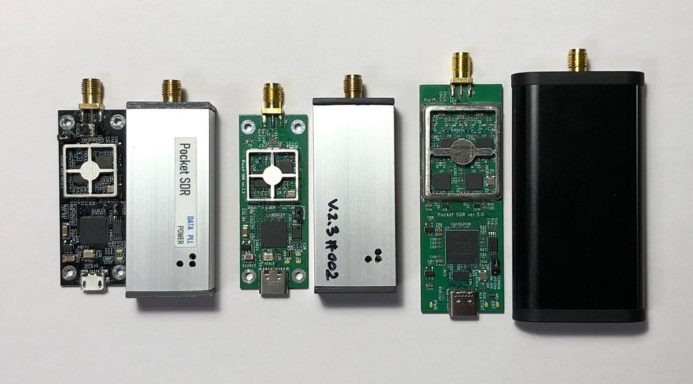
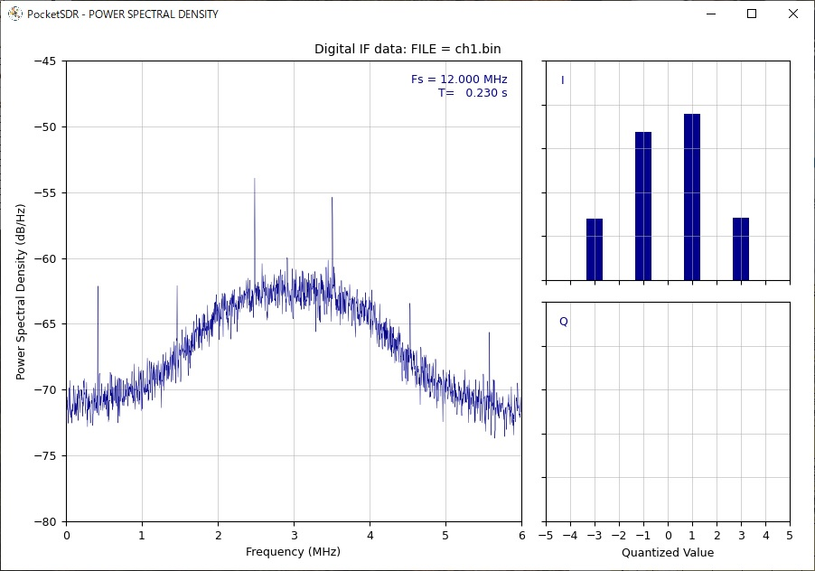
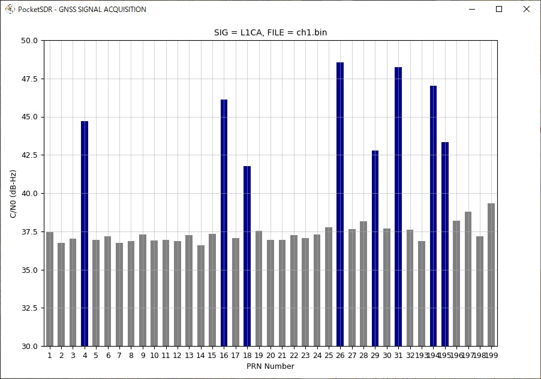
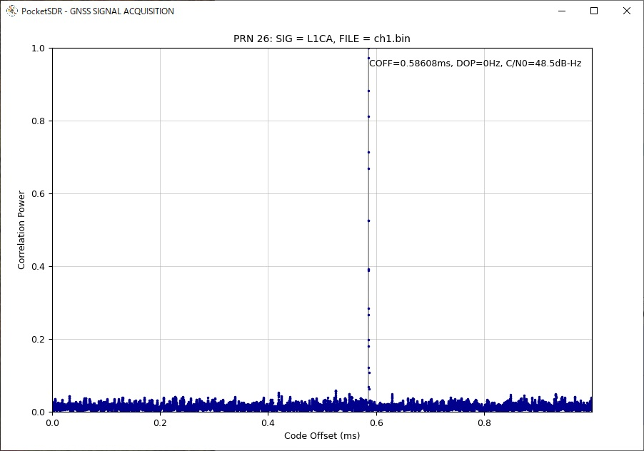
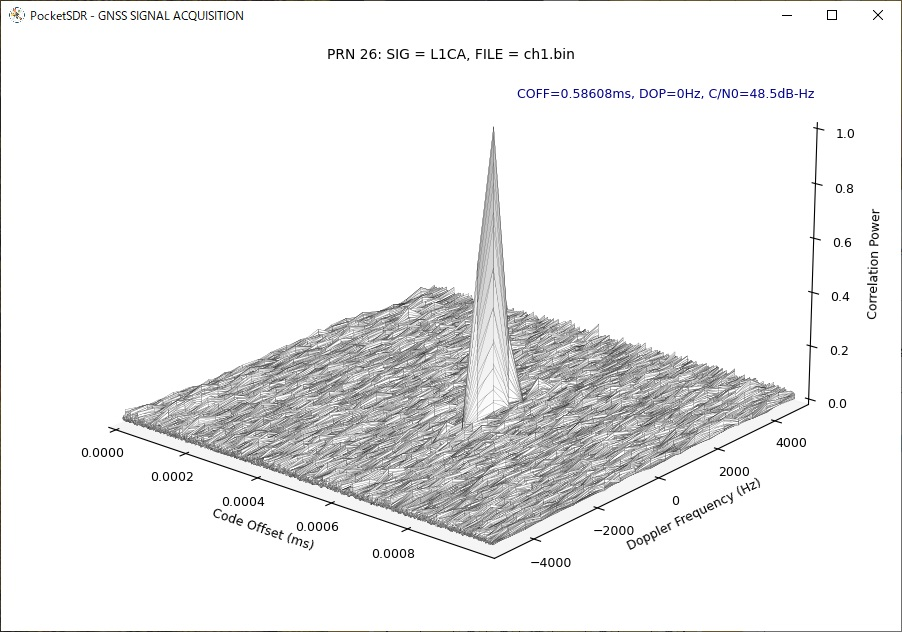
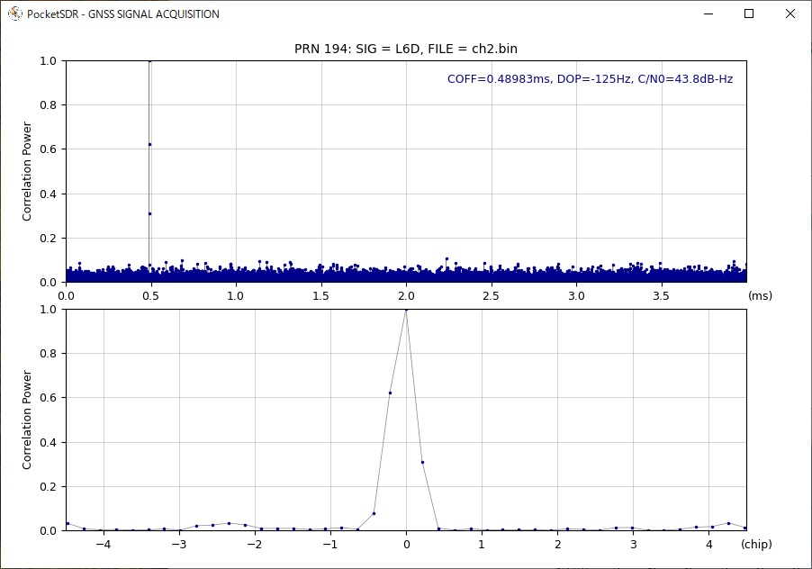
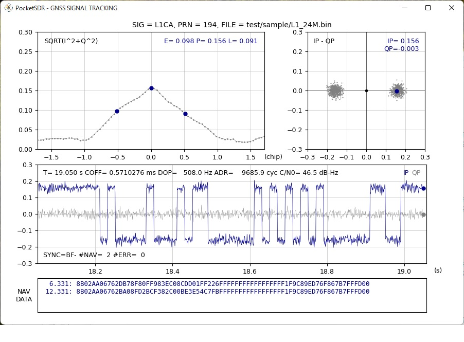
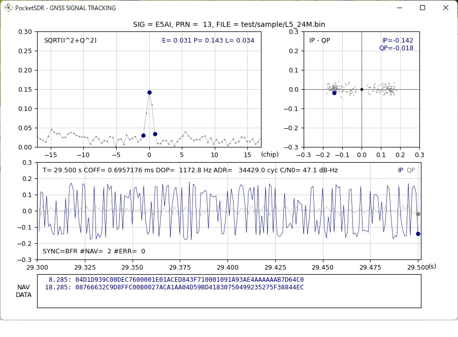

# **Pocket SDR - An Open-Source GNSS SDR, ver. 0.8**

## **Overview**

Pocket SDR is an open-source GNSS (Global Navigation Satellite System) receiver
based on SDR (software defined radio) technology. It consists of a RF front-end
device, some utilities for the device and GNSS-SDR APs (application programs)
written in Python and C. It supports almost all signals for GPS, GLONASS,
Galileo, QZSS, BeiDou, NavIC and SBAS.

The RF front-end device consists of 2 CH Maxim MAX2771 GNSS RF front-end IC
(LNA, mixer, filter, ADC, frequency synthesizer) and Cypress EZ-USB FX2LP USB
2.0 controller to connect to host PCs. The front-end CH1 is dedicated for GNSS
L1 band (1525 - 1610 MHz) and CH2 is for GNSS L2/L5/L6 band (1160 - 1290 MHz).
The frequency of the reference oscillator (TCXO) is 24.000 MHz and ADC sampling
frequency can be configured up to 24 MHz.

Pocket SDR contains some utility programs for the RF front-end device to
configure the device, capture and dump the digitized IF (inter-frequency) data.
These supports Windows, Linux and other environments.

Pocket SDR also provides GNSS-SDR APs to show the PSD (power spectrum density)
of captured IF data, search the GNSS signals, track these signals and decode
navigation data in them. The supported GNSS signals are as follows. These APs
are written in Python by very compact way. They are easily modified by users
to add user's unique algorithms. 

GPS: L1C/A, L1CP, L1CD, L2CM, L5I, L5Q, GLONASS: L1C/A, L2C/A, L3OCD, L3OCP,
Galileo: E1B, E1C, E5aI, E5aQ, E5bI, E5bQ, E6B, E6C, QZSS: L1C/A, L1C/B, L1CP,
L1CD, L1S, L2CM, L5I, L5Q, L5SI, L5SQ, L6D, L6E, BeiDou: B1I, B1CP, B1CD, B2I,
B2aD, B2aP, B2bI, B3I, NavIC: L5-SPS, SBAS: L1C/A, L5I, L5Q



The introduction of Pocket SDR is shown in the following slides.

T.Takasu, An Open Source GNSS SDR: Development and Application, IPNTJ Next GNSS
Technology WG, Feb 21, 2022
(https://gpspp.sakura.ne.jp/paper2005/IPNTJ_NEXTWG_202202.pdf)

--------------------------------------------------------------------------------

## **Package Structure**
```
PocketSDR --+-- bin     Pocket SDR utilities and APs binary programs for Windows
            +-- app     Pocket SDR utilities and APs source programs
            +-- src     Pocket SDR library source programs
            +-- python  Pocket SDR Python scripts
            +-- lib     External library for utilities and APs
            +-- conf    Configuration files for device settings
            +-- driver  Windows driver for EZ-USB FX2LP/FX3 (cyusb3.sys) ([4])
            +-- doc     Documents (ref {1], [2])
            +-- FW      Firmware source programs and images
            |   +-- cypress  Cypress libraries for EZ-USB firmware development
            |                (ref [4])
            +-- HW      Pocket SDR RF frontend CAD data and parts list
            |           (*.brd and *.sch are for Eagle, *.f3d is for Fusion 360)
            +-- image   Image files for documents
            +-- sample  Sample digital IF data captured by Pocket SDR
            +-- test    Test codes
```

--------------------------------------------------------------------------------

## **Installation for Windows**

* Extract PocketSDR.zip to an appropriate directory <install_dir>.

* Attach Pocket SDR RF frontend to PC via USB cable.

* Install USB driver (CYUSB) for Pocket SDR RF frontend according to
  PocketSDR\driver\readme.txt.

* Add the Pocket SDR binary programs path (<install_dir>\PocketSDR\bin) to 
  the command search path (Path) of Windows environment variables.

* Add the Pocket SDR Python scripts path (<install_dir>\PocketSDR\python) to 
  the command search path (Path) of Windows environment variables.

* To rebuild the binary programs, you need MinGW64 and libusb-1.0 library. 
  Refer MSYS2 (https://www.msys2.org/) for details.

* In MinGW64 environment, you need fftw3 library. To install fftw3 library.
```
    $ pacman -S mingw-w64-x86_64-fftw
```

--------------------------------------------------------------------------------

## **Installation for Linux**

* Extract PocketSDR.zip to an appropriate directory <install_dir>.
```
    $ unzip PocketSDR.zip
```
* Install libusb-1.0 developtment package. For Ubuntu:
```
    $ sudo apt install libusb-1.0-0-dev
```
* Install libfftw3 developtment package. For Ubuntu:
```
    $ sudo apt install libfftw3-dev
```
* Move to the library directory, build libraries.
```
    $ cd <install_dir>/lib/build
    $ make
    $ make install
```
* Move to the source program directory, build utilities and APs.
```
    $ cd <install_dir>/app
    $ make
    $ make install
```
* Add the Pocket SDR binary programs path (<install_dir>/PocketSDR/bin) to 
  the command search path.

* Usually you need to have root permission to access USB devices. So you add
sudo to execute pocket_conf, pocket_dump like:
```
   $ sudo pocket_conf ../conf/pocket_L1L6_12MHz.conf
   $ sudo pocket_dump -t 10 ch1.bin ch2.bin
```

--------------------------------------------------------------------------------

## **Utility Programs for RF frontend**

Pocket SDR contains the following utility programs.

- **pocket_conf**: SDR device configurator
- **pocket_scan**: Scan and list USB Devices
- **pocket_dump**: Capture and dump digital IF data of SDR device

For details, refer comment lines in src/pocket_conf.c, src/pocket_scan.c, 
src/pocket_dump.c.

--------------------------------------------------------------------------------

## **GNSS-SDR APs (Application Programs)**

Pocket SDR contains the following application programs for GNSS-SDR.

- **pocket_psd.py** : Plot PSD and histgrams of digital IF data
- **pocket_acq.py** : GNSS signal acquisition in digital IF data
- **pocket_trk.py** : GNSS signal tracking and navigation data decoding in digital IF data
- **pocket_snap.py**: Snapshot positioning with digital IF data
- **pocket_plot.py**: Plot GNSS signal tracking log by pocket_trk.py
- **pocket_acq**    : C-version of pocket_acq.py (w/o graph plots)
- **pocket_trk**    : C-version of pocket_trk.py (w/o graph plots)

For details, refer comment lines in python/pocket_psd.py, python/pocket_acq.py,
python/pocket_trk.py, python/pocket_snap.py and python/pocket_plot.py. You need
Python 3, Numpy, Scipy and matplotlib to execute Python scripts. pocket_trk.py
uses external shared libraries of LIBFEC [5] and RTKLIB [6] in lib/ directory.
These were built for Windows (64bit) and Linux for x86_64 CPU.

--------------------------------------------------------------------------------

## **Execution Examples of Utility Programs and GNSS-SDR APs**

```
    $ pocket_conf
    ...
    $ pocket_conf conf/pocket_L1L6_12MHz.conf
    Pocket SDR device settings are changed.
    
    $ pocket_dump -t 5 ch1.bin ch2.bin
      TIME(s)    T   CH1(Bytes)   T   CH2(Bytes)   RATE(Ks/s)
          5.0    I     59768832  IQ    119537664      11922.8
    
    $ pocket_psd.py ch1.bin -f 12 -h
    $ pocket_acq.py ch1.bin -f 12 -fi 3 -sig L1CA -prn 1-32,193-199
    PRN   1: SIG= L1CA, COFF=  0.12817 ms, DOP=  3500 Hz, C/N0= 37.4 dB-Hz
    PRN   2: SIG= L1CA, COFF=  0.85242 ms, DOP= -3500 Hz, C/N0= 36.8 dB-Hz
    PRN   3: SIG= L1CA, COFF=  0.39400 ms, DOP= -2000 Hz, C/N0= 37.0 dB-Hz
    PRN   4: SIG= L1CA, COFF=  0.96692 ms, DOP=  2000 Hz, C/N0= 44.7 dB-Hz
    ...
    $ pocket_acq.py ch1.bin -f 12 -fi 3 -sig L1CA -prn 26

    $ pocket_acq.py ch1.bin -f 12 -fi 3 -sig L1CA -prn 26 -3d

    $ pocket_acq.py ch2.bin -f 12 -sig L6D -prn 194 -p
    
    $ pocket_trk.py L1_24M.bin -prn 1-32 -f 24 -fi 6
	  TIME(s)   SIG  PRN  STATE   LOCK(s)  C/N0 (dB-Hz)        COFF(ms)   DOP(Hz)   ADR(cyc)  SYNC #NAV #ERR
	    1.550  L1CA    1   LOCK     1.539  42.5 ||||||||      0.8017699    3218.8     4949.3  ---     0    0
	    0.011  L1CA    2   IDLE     0.000   0.0               0.0000000       0.0        0.0  ---     0    0
	    0.011  L1CA    3   IDLE     0.000   0.0               0.0000000       0.0        0.0  ---     0    0
	    0.011  L1CA    4   IDLE     0.000   0.0               0.0000000       0.0        0.0  ---     0    0
	    0.011  L1CA    5   IDLE     0.000   0.0               0.0000000       0.0        0.0  ---     0    0
	    0.011  L1CA    6   IDLE     0.000   0.0               0.0000000       0.0        0.0  ---     0    0
	    1.550  L1CA    7   LOCK     1.539  45.7 ||||||||||    0.6995059     582.8      901.5  ---     0    0
	    1.550  L1CA    8   LOCK     1.539  47.6 |||||||||||   0.0733506    -777.2    -1196.8  ---     0    0
	    0.011  L1CA    9   IDLE     0.000   0.0               0.0000000       0.0        0.0  ---     0    0
	    1.550  L1CA   10   LOCK     1.539  38.6 |||||         0.8658548      -6.2       -9.4  ---     0    0
	...
    $ pocket_trk.py L1_24M.bin -prn 194 -sig L1CA -f 24 -fi 6 -log trk.log  -p
    ...
    $ pocket_trk.py L5_24M.bin -prn 13 -sig E5AI -f 24 -log trk.log -p -ts 0.2
    ...
``` 









--------------------------------------------------------------------------------

## **Rebuild F/W and Write F/W Image to Pocket SDR RF frontend**

* Install Cypress EZ-USB FX2LP Development Kit (ref [4]) to a Windows PC. As
default, it is installed to C:\Cypress and C:\Keil.

* Execute Keil uVision2 (C:\Keil\UV2\uv2.exe).

* Execute Menu Project - Open Project, select <install_dir>\PocketSDR\FW\pocket_fw.Uv2>
and open the project.

* Execute Menu Project - Rebuild all target files and you can get a F/W image
as <install_dir>\PocketSDR\FW\pocket_fw.iic.

* Attach Pocket SDR RF frontend via USB cable to the PC.

* Execute USB Control Center (C:\Cypress\USB\CY3684_EZ-USB_FX2LP_DVK\1.1\Windows Applications\
c_sharp\controlcenter\bin\Release\CyControl.exe).

* Select Cypress FX2LP Sample Device, execute menu Program - FX2 - 64KB EEPROM,
select the F/W image <install_dir>\PocketSDR\FW\pocket_fw.iic and open it.

* If you see "Programming succeeded." in status bar, the F/W is properly written
to PocketSDR.

* To use utility programs for Pocket SDR, you need to reinstall WinUSB driver for
Pocket SDR. Refer "Installation for Windows" above.

--------------------------------------------------------------------------------

## **References**

[1] Maxim integrated, MAX2771 Multiband Universal GNSS Receiver, July 2018

[2] Cypress, EZ-USB FX2LP USB Microcontroller High-Speed USB Peripheral 
  Controller, Rev. AB, December 6, 2018

[3] (deleted)

[4] Cypress, CY3684 EZ-USB FX2LP Development Kit
    (https://www.cypress.com/documentation/development-kitsboards/cy3684-ez-usb-fx2lp-development-kit)

[5] https://github.com/quiet/libfec

[6] https://github.com/tomojitakasu/RTKLIB

--------------------------------------------------------------------------------

## **History**

- 2021-10-20  0.1  1st draft version
- 2021-10-25  0.2  Add Rebuild F/W and Write F/W Image to PocketSDR
- 2021-12-01  0.3  Add and modify Python scripts
- 2021-12-25  0.4  Add and modify Python scripts
- 2022-01-05  0.5  Fix several problems.
- 2022-01-13  0.6  Add and modify Python scripts
- 2022-02-15  0.7  Improve performance, Add some Python scripts.
- 2022-07-08  0.8  Add C-version of pocket_acq.py and pocket_trk.py.

