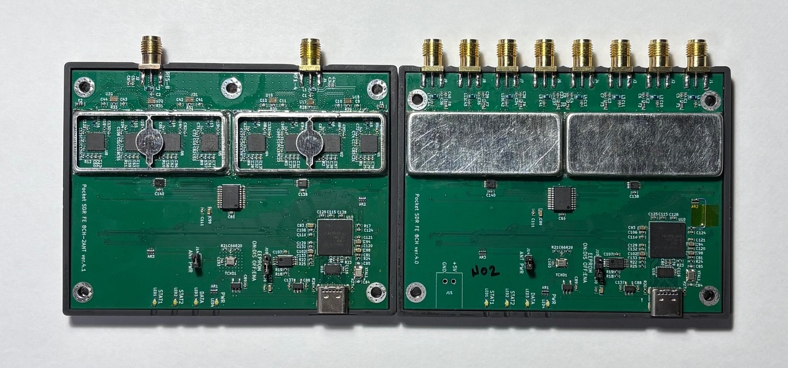
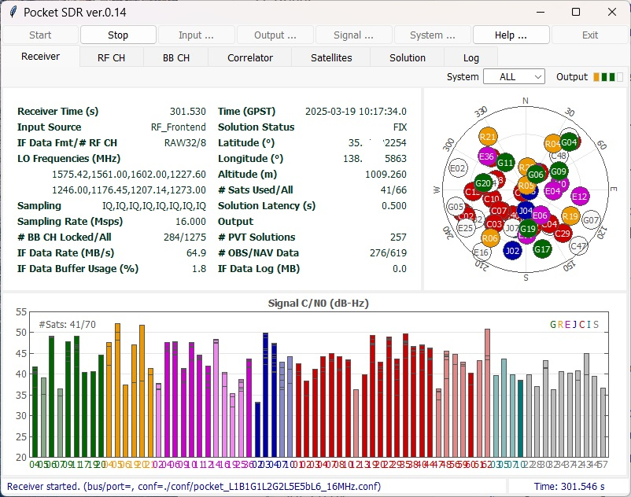

# **Pocket SDR - An Open-Source GNSS SDR, ver. 0.14**

## **Overview**

**Pocket SDR** is an open-source Global Navigation Satellite System (GNSS) receiver based
on software-defined radio (SDR) technology. It consists of RF frontend devices named
**Pocket SDR FE**, utilities for these devices, and GNSS SDR applications (APs) written
in Python, C, and C++. It supports almost all signals for **GPS**, **GLONASS**, **Galileo**,
**QZSS**, **BeiDou**, **NavIC**, and **SBAS**.

The Pocket SDR FE device includes 2, 4, or 8 RF frontend channels, supporting the
GNSS L1 band (1525 - 1610 MHz) or L2/L5/L6 bands (1160 - 1290 MHz). Each RF channel
provides a bandwidth of up to 36 MHz. The ADC sampling rate can be configured up to
32 Msps (FE 2CH) or 48 Msps (FE 4CH and FE 8CH).

Pocket SDR also includes utility programs to configure the Pocket SDR FE devices,
capture, and dump digitized IF (inter-frequency) data. These utilities are compatible
with **Windows**, **Linux**, **Raspberry Pi OS**, **macOS**, and other environments. Additionally,
Pocket SDR provides GNSS SDR APs to display the PSD (power spectrum density) of
captured IF data, search for GNSS signals, track these signals, decode navigation data,
and generate PVT (position, velocity, and time) solutions. The supported GNSS signals
are as follows. For details on these signals and their IDs, refer to
[**Pocket SDR Signal IDs**](/doc/signal_IDs.pdf).

* **GPS**: L1C/A, L1C-D, L1C-P, L2C-M, L5-I, L5-Q
* **GLONASS**: L1C/A (L1OF), L2C/A (L2OF), L1OCd, L1OCp, L2OCp, L3OCd, L3OCp
* **Galileo**: E1-B, E1-C, E5a-I, E5a-Q, E5b-I, E5b-Q, E6-B, E6-C
* **QZSS**: L1C/A, L1C/B, L1C-D, L1C-P, L1S, L2C-M, L5-I, L5-Q, L5S-I, L5S-Q, L6D, L6E
* **BeiDou**: B1I, B1C-D, B1C-P, B2a-D, B2a-P, B2I, B2b-I, B3I
* **NavIC**: L1-SPS-D, L1-SPS-P, L5-SPS
* **SBAS**: L1C/A, L5-I, L5-Q

These utilities and applications are written in Python, C, and C++ in a compact and modular way,
making them easy to modify for adding custom algorithms.

<p align="center">
  
  <b>Pocket SDR FE 2CH (v.2.0 and v.2.3), FE 4CH</b>
</p>

<p align="center">
  
  <b>Pocket SDR FE 8CH-2ANT and -8ANT</b>
</p>

<p align="center">
  
  <b>GUI-based Real-Time GNSS SDR Receiver AP</b>
</p>

The introduction to Pocket SDR is available in the following slides:

T.Takasu, An Open Source GNSS SDR: Development and Application, IPNTJ Next GNSS
Technology WG, February 21, 2022
(https://gpspp.sakura.ne.jp/paper2005/IPNTJ_NEXTWG_202202.pdf)

For an application of Pocket SDR, refer to the following slides:

T.Takasu, Development of QZSS L6 Receiver without Pilot Signal by using SDR,
IPNTJ Annual Conference, June 10, 2022
(https://gpspp.sakura.ne.jp/paper2005/IPNTJ_20220610.pdf)

For design and implementation details, refer to the following slides:

T.Takasu, Pocket SDR: Design, Implementation and Applications, A seminar for
GNSS Software Defined Receivers, Nov 19, 2024
(https://gpspp.sakura.ne.jp/paper2005/pocketsdr_seminar_202411_revA.pdf)

--------------------------------------------------------------------------------

## **Directory Structure and Contents**
```
PocketSDR
├── bin         # Pocket SDR APs binary programs
├── app         # Pocket SDR APs source programs
│   ├── pocket_conf  # Pocket SDR FE device configurator
│   ├── pocket_dump  # Dump digital IF data of Pocket SDR FE device
│   ├── pocket_scan  # Scan and list USB devices
│   ├── pocket_acq   # GNSS signal acquisition
│   ├── pocket_trk   # GNSS signal tracking and PVT generation
│   ├── pocket_snap  # Snapshot Positioning
│   └── convbin      # RINEX converter supporting Pocket SDR
├── src         # Pocket SDR library source programs
├── python      # Pocket SDR Python scripts
├── lib         # Libraries for APs and Python scripts
│   ├── win32        # Libraries for Windows
│   ├── macos        # Libraries for mac OS
│   ├── linux        # Libraries for Linux or Raspberry Pi OS
│   ├── build        # Makefiles to build libraries
│   ├── cyusb        # Cypress EZ-USB API (CyAPI.a) and includes
│   ├── RTKLIB       # RTKLIB source programs based on 2.4.3 b34
│   ├── (libfec)     # Library for FEC (forward error corrections) ([1])
│   └── (LDPC-codes) # Library for LDPC-decoder ([2])
├── conf        # Configuration files for Pocket SDR FE
├── FE_2CH      # Pocket SDR FE 2CH H/W and F/W
├── FE_4CH      # Pocket SDR FE 4CH H/W and F/W
├── FE_8CH      # Pocket SDR FE 8CH H/W and F/W
├── driver      # Driver installation instruction for Pocket SDR FE
├── doc         # Documents
├── image       # Image files for documents
├── sample      # Sample digital IF data captured by Pocket SDR FE
└── test        # Test codes and data

Note: Items in parentheses () are not included in the package.
```

--------------------------------------------------------------------------------

## **Installation for Windows**

* Download and extract PocketSDR.zip or clone the git repository [**here**](https://github.com/tomojitakasu/PocketSDR) to an appropriate directory <install_dir>.
to an appropriate directory <install_dir>.
```
> unzip PocketSDR.zip
or
> git clone https://github.com/tomojitakasu/PocketSDR
```
* Install USB device driver for Pocket SDR FE according to [**driver/readme.txt**](/driver/readme.txt)
.
* Install [**Python**](https://www.python.org/) with checking "Add python.exe to PATH".
* Install additional python packages as follows.
```
> pip install numpy scipy matplotlib
```
* Add the Pocket SDR binary programs path (<install_dir>\PocketSDR\bin) to 
  the command search path (Path) of Windows environment variables.
* Add the Pocket SDR Python scripts path (<install_dir>\PocketSDR\python) to 
  the command search path (Path) of Windows environment variables.

--------------------------------------------------------------------------------

## **To rebuild binary programs for Windows**
* If you want to rebuild the binary APs or the shared libraries for the python APs
for Windows, you need **MinGW64**. Refer to [**MSYS2**](https://www.msys2.org/) for details.
In MinGW64 environment, install fundamental development tools and fftw3 library.
```
$ pacman -Syy
$ pacman -S git
$ pacman -S make
$ pacman -S mingw-w64-x86_64-gcc
$ pacman -S mingw-w64-x86_64-fftw
```
* Move to the library directory, install external library source trees ([1], [2]) as follows:
```
$ cd <install_dir>/lib
$ ./clone_lib.sh
```
* Move to the library build directory and build libraries.
```
$ cd <install_dir>/lib/build
$ make
$ make install
```
* Move to the application program directory and build utilities and APs.
```
$ cd <install_dir>/app
$ make
$ make install
```
--------------------------------------------------------------------------------

## **Installation for Linux or Raspberry Pi OS**

* You need fundamental development packages and some libraries. Confirm the following
packages installed: git, gcc, g++, make, libusb-1.0-0-dev, libfftw3-dev, python3, python3-numpy,
python3-scipy, python3-matplotlib, python3-tk
* Download and extract PocketSDR.zip or clone the git repository to an appropriate directory <install_dir>.
```
$ unzip PocketSDR.zip
or
$ git clone https://github.com/tomojitakasu/PocketSDR
```
* Move to the library directory. The external libraries are for Forward Error Correction (FEC) and Low-Density Parity-Check (LDPC) decoding. Install the external library source trees ([1], [2]) as follows:
```
$ cd <install_dir>/lib
$ chmod +x clone_lib.sh
$ ./clone_lib.sh
```
* Move to the library build directory and build libraries.
```
$ cd <install_dir>/lib/build
$ make
```
* Move to the application program directory and build utilities and APs.
```
$ cd <install_dir>/app
$ make
$ make install
```
* Add the Pocket SDR binary programs path (<install_dir>/PocketSDR/bin) to 
  the command search path.
* For Linux or Raspberry Pi OS users, you usually need to have root permission to access USB devices. So you have to add
"sudo" to execute some utilities, APs or python scripts like:
```
$ sudo pocket_conf ../conf/pocket_L1L6_12MHz.conf
$ sudo pocket_dump -t 10 ch1.bin ch2.bin
```

--------------------------------------------------------------------------------

## **Installation for macOS**

* You need [**Homebrew**](https://brew.sh) as a package manager for macOS. Install Homebrew by running the following command in the terminal:

* Open a terminal window on macOS and install the basic libraries by using Homebrew:
```
$ brew install numpy
$ brew install scipy
$ brew install python3-matplotlib
$ brew install python3-numpy
$ brew install python3-tk
$ brew install libusb
```
* Download and extract PocketSDR.zip or clone the git repository to an appropriate directory <install_dir>.
```
$ unzip PocketSDR.zip
or
$ git clone https://github.com/tomojitakasu/PocketSDR
```
* Move to the library directory, install external library source trees ([1], [2]) as follows:
```
$ cd <install_dir>/lib
$ chmod +x clone_lib.sh
$ ./clone_lib.sh
```
* Move to the library build directory and build libraries.
```
$ cd <install_dir>/lib/build
$ make
$ make install
```
* Move to the application program directory and build utilities and APs.
```
$ cd <install_dir>/app
$ make
$ make install
```
* Add the Pocket SDR binary programs path (<install_dir>/PocketSDR/bin) to 
  the command search path.

--------------------------------------------------------------------------------

## **GNSS SDR Utilities and APs**

Pocket SDR includes the following utilities for the Pocket SDR FE.

- **pocket_scan**: Scans and lists USB Devices.
- **pocket_conf**: Configures Pocket SDR FE device.
- **pocket_dump**: Captures and dumps IF data from the Pocket SDR FE device

Pocket SDR also provides the following GNSS SDR APs:

- **pocket_psd.py** : Plots PSD and histograms of IF data.
- **pocket_acq.py** : Performs GNSS signal acquisition from IF data.
- **pocket_trk.py** : Tracks GNSS signals and decodes navigation data in IF data.
- **pocket_snap.py**: Executes snapshot positioning using captured IF data.
- **pocket_sdr.py** : A GUI-based GNSS SDR receiver application.
- **pocket_plot.py**: Plots receiver logs generated by pocket_trk or pocket_sdr.py.
- **pocket_acq**    : A C-version of pocket_acq.py (w/o graphical plots).
- **pocket_trk**    : A C-version of pocket_trk.py (w/o graphical plots).
- **pocket_snap**   : A C-version of pocket_snap.py.

For more details about these utilities and APs, please refer to [**Pocket SDR Command References**](/doc/command_ref.pdf).

--------------------------------------------------------------------------------
## **GUI-based Real-Time GNSS SDR Receiver AP**

Starting from version 0.13, Pocket SDR includes a GUI-based real-time GNSS SDR
receiver AP, **pocket_sdr.py**. To execute the application, follow these steps:

```
$ chmod +x <install_dir>/python/pocket_sdr.py
$ sudo ./<install_dir>/python/pocket_sdr.py
or alternatively:
$ sudo python <install_dir>/python/pocket_sdr.py
```

For more information about this application, please refer to [**pocket_sdr.py help**](/doc/pocket_sdr_help.pdf).

--------------------------------------------------------------------------------

## **Execution Examples of Utilities and APs**

Here are some examples of how to execute the utilities and applications:

```
$ sudo pocket_conf
...
$ sudo pocket_conf conf/pocket_L1L6_12MHz.conf
Pocket SDR device settings are changed.
 
$ sudo pocket_dump -t 5 ch1.bin ch2.bin
  TIME(s)    T   CH1(Bytes)   T   CH2(Bytes)   RATE(Ks/s)
      5.0    I     60047360  IQ    120094720      11985.5

$ pocket_psd.py ch1.bin -f 12 -h

$ pocket_acq.py ch1.bin -f 12 -sig L1CA -prn 1-32,193-199
SIG= L1CA, PRN=   1, COFF=  0.23492 ms, DOP= -1519 Hz, C/N0= 33.6 dB-Hz
SIG= L1CA, PRN=   2, COFF=  0.98558 ms, DOP=  2528 Hz, C/N0= 33.8 dB-Hz
SIG= L1CA, PRN=   3, COFF=  0.96792 ms, DOP=  3901 Hz, C/N0= 33.7 dB-Hz
SIG= L1CA, PRN=   4, COFF=  0.96192 ms, DOP= -1957 Hz, C/N0= 40.4 dB-Hz
...
$ pocket_acq.py ch1.bin -f 12 -sig L1CA -prn 4
...
$ pocket_acq.py ch1.bin -f 12 -sig L1CA -prn 8 -3d
...
$ pocket_acq.py ch2.bin -f 12 -sig L6D -prn 194 -p
...
$ pocket_trk.py ch1.bin -f 12 -sig L1CA -prn 1-32
...
$ pocket_trk.py ch1.bin -f 12 -sig E1B -prn 18 -p
...
$ pocket_trk.py ch2.bin -f 12 -sig E6B -prn 4 -log trk.log -p -ts 0.2
...
``` 


--------------------------------------------------------------------------------

## **References**

1. [libfec](https://github.com/quiet/libfec): A library for forward error correction (FEC).
2. [LDPC-codes](https://github.com/radfordneal/LDPC-codes): A library for LDPC (Low-Density Parity-Check) decoding.
3. *NMEA 0183: Standard for Interfacing Marine Electronic Devices*, National Marine Electronics Association and International Marine Electronics Association, 2013.
4. *RTCM 10403.3 with Amendment 1: Differential GNSS (Global Navigation Satellite Systems) Service - Version 3*, Radio Technical Commission for Maritime Services, April 28, 2020.

--------------------------------------------------------------------------------

## **History**

- **2021-10-20 (v0.1)**: Initial draft version.
- **2021-10-25 (v0.2)**: Added rebuild firmware and write firmware image to Pocket SDR.
- **2021-12-01 (v0.3)**: Added and modified Python scripts.
- **2021-12-25 (v0.4)**: Added and modified Python scripts.
- **2022-01-05 (v0.5)**: Fixed several issues.
- **2022-01-13 (v0.6)**: Added and modified Python scripts.
- **2022-02-15 (v0.7)**: Improved performance and added more Python scripts.
- **2022-07-08 (v0.8)**: Added C-version of pocket_acq.py and pocket_trk.py.
- **2024-01-03 (v0.9)**: Added C-version of pocket_snap.py. pocket_trk now supports multi-signal and multi-threading.
- **2024-01-12 (v0.10)**: Added support for NavIC L1-SPS-D, L1-SPS-P, GLONASS L1OCd, L1OCp, and L2OCp.
- **2024-01-25 (v0.11)**: Added support for decoding GLONASS L1OCd NAV data and NB-LDPC error correction for BDS B1C, B2a, and B2b.
- **2024-05-28 (v0.12)**: Performance optimizations. Added support for PVT generation, RTCM3, and NMEA outputs.
- **2024-07-04 (v0.13)**: Added GUI-based GNSS SDR receiver AP. Added support for macOS and Raspberry Pi OS.
- **2025-03-21 (v0.14)**: Added Pocket SDR FE 8CH. Fixed various issues.

--------------------------------------------------------------------------------
