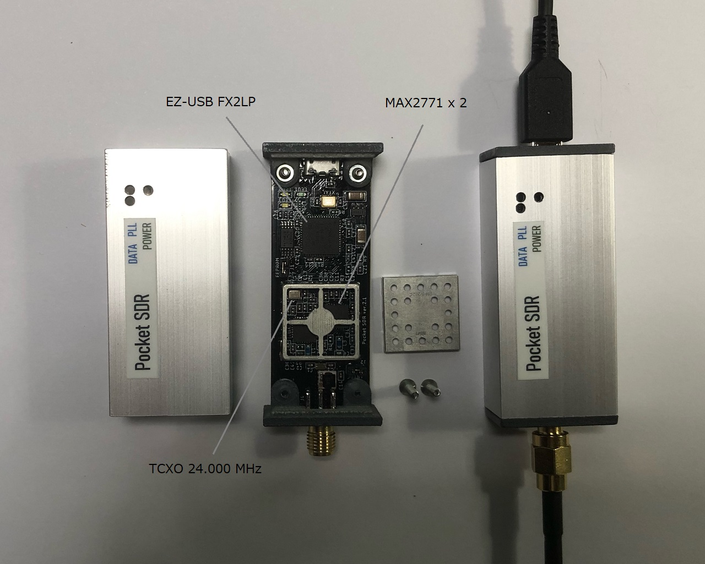
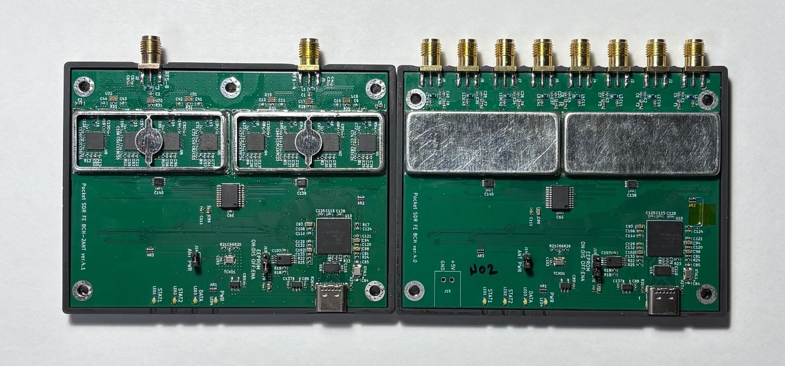
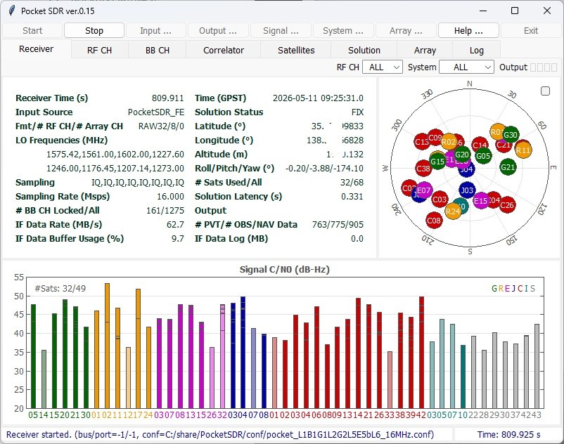
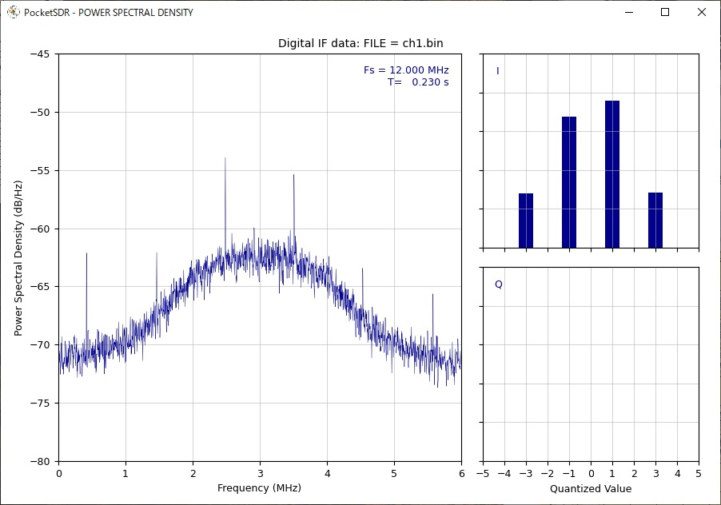
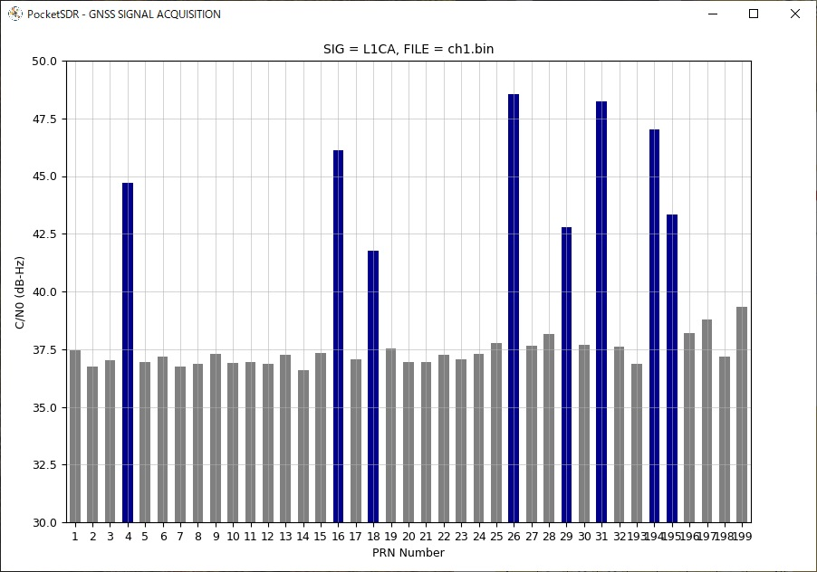
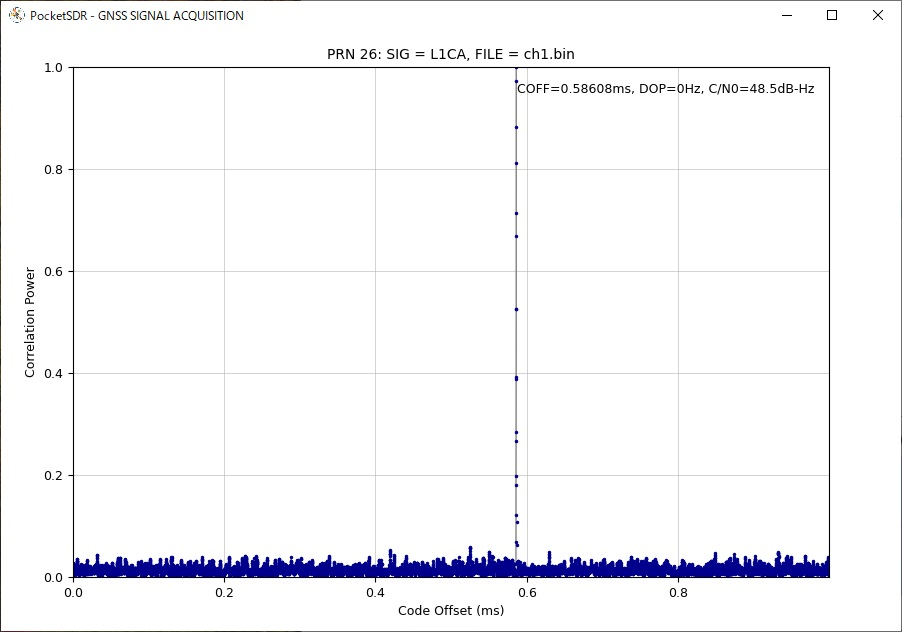
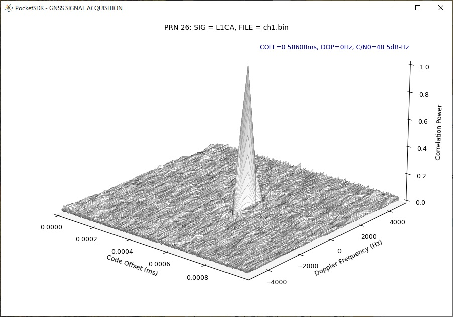
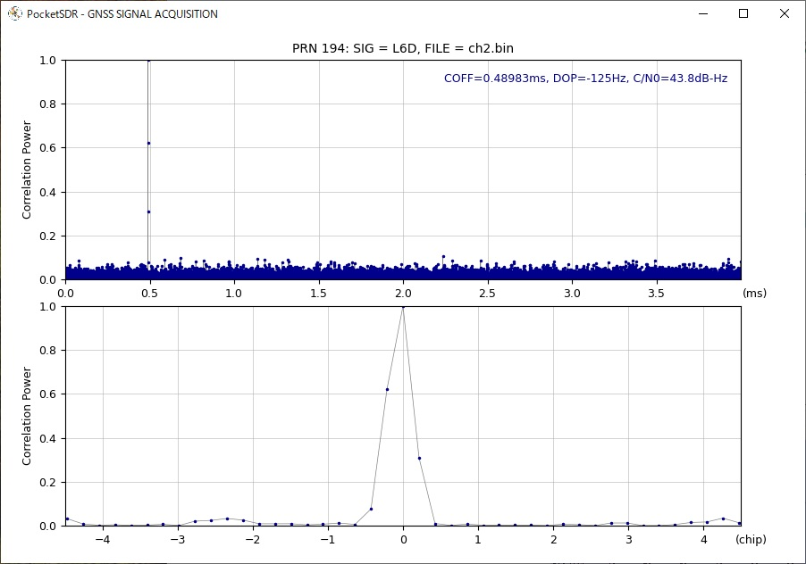
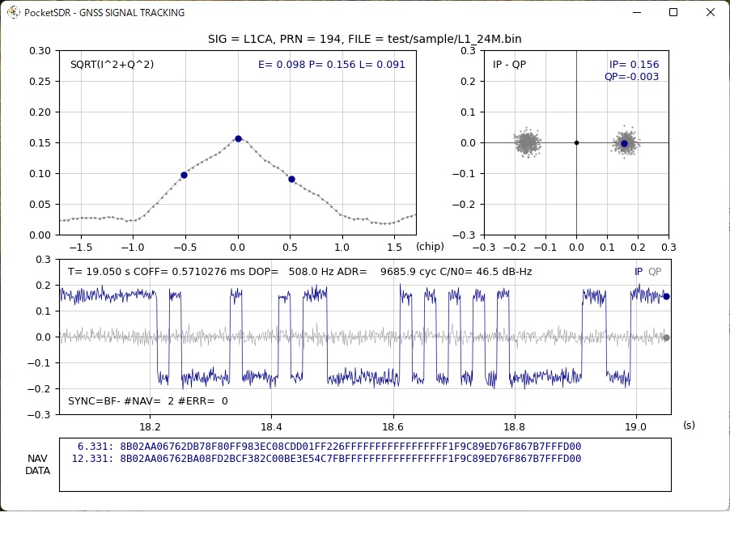
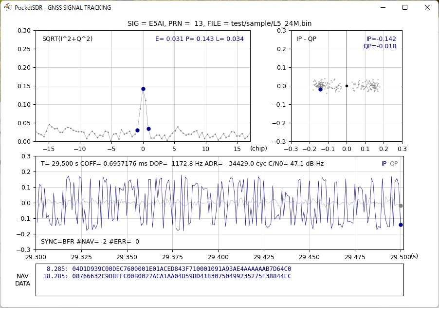

# **Pocket SDR - An Open-Source GNSS SDR,<br> ver. 0.16**

<div style="text-align: right;">
<strong>2026-06-01</strong>
</div>

---

## **Overview**

**Pocket SDR** is an open-source Global Navigation Satellite System (GNSS) receiver based
on software-defined radio (SDR) technology. It consists of RF frontend devices named
**Pocket SDR FE**, utilities for these devices, and GNSS SDR applications (APs) written
in Python, C, and C++. It supports almost all signals for **GPS**, **GLONASS**, **Galileo**,
**QZSS**, **BeiDou**, **NavIC**, and **SBAS**.

The Pocket SDR FE device includes 2, 4, or 8 RF frontend channels, supporting the
GNSS L1 band (1525 - 1610 MHz) or L2/L5/L6 bands (1160 - 1290 MHz). For these signal bands, refer to [**GNSS Signal Bands**](https://github.com/tomojitakasu/PocketSDR/blob/master/doc/signal_bands.pdf). Each RF channel
of the Pocket SDR FE device provides IF (intermediate-frequency) bandwidth of up to 36 MHz. The ADC sampling rate can be configured up to 32 Msps (FE 2CH) or 48 Msps (FE 4CH and FE 8CH).

Pocket SDR also includes utility programs to configure the Pocket SDR FE devices,
capture, and dump digitized IF data.
Additionally, Pocket SDR provides GNSS SDR APs to display the PSD (power spectrum density) of captured IF data, search for GNSS signals, track these signals, decode navigation data, and generate PVT (position, velocity, and time) solutions.
These utilities and APs are compatible with **Windows**, **Linux**, **Raspberry Pi OS**, **macOS**, and other environments.

The supported GNSS signals by Pocket SDR are as follows. For details on these signals and Pocket SDR signal IDs, refer to
[**GNSS Signals**](https://github.com/tomojitakasu/PocketSDR/blob/master/doc/signal_IDs.pdf).

* **GPS**: L1C/A, L1C-D, L1C-P, L2C-M, L5-I, L5-Q
* **GLONASS**: L1C/A (L1OF), L2C/A (L2OF), L1OCd, L1OCp, L2OCp, L3OCd, L3OCp
* **Galileo**: E1-B, E1-C, E5a-I, E5a-Q, E5b-I, E5b-Q, E5AltBOC (E5abQ), E6-B, E6-C
* **QZSS**: L1C/A, L1C/B, L1C-D, L1C-P, L1S, L2C-M, L5-I, L5-Q, L5S-I, L5S-Q, L6D, L6E
* **BeiDou**: B1I, B1C-D, B1C-P, B2a-D, B2a-P, B2I, B2b-I, B3I
* **NavIC**: L1-SPS-D, L1-SPS-P, L5-SPS
* **SBAS**: L1C/A, L5-I, L5-Q

These utilities and APs are written in Python, C, and C++ in a compact and modular way,
making them easy to modify for adding custom algorithms.

In addition to the Pocket SDR FE devices, Pocket SDR supports third-party
SDR hardware (**USRP**, **LimeSDR**, **bladRF**, **PlutoSDR**, **RTL-SDR**, and so on) via 
[**SoapySDR**](https://github.com/pothosware/SoapySDR/wiki).
See [**SoapySDR Device Notes**](https://github.com/tomojitakasu/PocketSDR/blob/master/doc/notes_soapy_dev.md) for verified devices,
installation notes, and device-specific caveats.

<p align="center">
  
  <b>Pocket SDR FE 2CH (v.2.0 and v.2.3), FE 4CH</b>
</p>

<p align="center">
  
  <b>Pocket SDR FE 8CH (2-RF-inputs and 8-RF-inputs)</b>
</p>

<p align="center">
  
  <b>GUI-based Real-Time GNSS SDR Receiver AP</b>
</p>

The introduction to Pocket SDR is available in the following slides:

T.Takasu, An Open Source GNSS SDR: Development and Application, IPNTJ Next GNSS
Technology WG, February 21, 2022
(https://gpspp.sakura.ne.jp/paper2005/IPNTJ_NEXTWG_202202.pdf)

For an application of Pocket SDR, refer to the following slides:

T.Takasu, Development of QZSS L6 Receiver without Pilot Signal by using SDR,
IPNTJ Annual Conference, June 10, 2022
(https://gpspp.sakura.ne.jp/paper2005/IPNTJ_20220610.pdf)

For design and implementation details, refer to the following slides:

T.Takasu, Pocket SDR: Design, Implementation and Applications, A seminar for
GNSS Software Defined Receivers, Nov 19, 2024
(https://gpspp.sakura.ne.jp/paper2005/pocketsdr_seminar_202411_revA.pdf)

--------------------------------------------------------------------------------
<div class="pagebreak"></div>

## **Directory Structure and Contents**
```
PocketSDR
├── bin         # Pocket SDR APs binary programs
├── app         # Pocket SDR APs source programs
│   ├── pocket_conf  # Pocket SDR FE device configurator
│   ├── pocket_dump  # Dump digital IF data of Pocket SDR FE device
│   ├── pocket_scan  # Scan and list USB devices
│   ├── pocket_acq   # GNSS signal acquisition
│   ├── pocket_trk   # GNSS signal tracking and PVT generation
│   ├── pocket_snap  # Snapshot Positioning
│   ├── pocket_calib # Antenna array attitude / per-CH bias calibration
│   ├── convbin      # RINEX converter supporting Pocket SDR
│   └── str2str      # Stream converter (RTKLIB-derived)
├── src         # Pocket SDR library source programs
├── python      # Pocket SDR Python scripts (incl. pocket_sdr.py GUI)
├── lib         # Libraries for APs and Python scripts
│   ├── win32        # Built libraries for Windows (UCRT64)
│   ├── macos        # Built libraries for macOS
│   ├── linux        # Built libraries for Linux or Raspberry Pi OS
│   ├── win32_msvc   # Built libraries for Windows (MSVC, optional)
│   ├── build        # Makefiles to build libraries (UCRT64 / Linux / macOS)
│   ├── build_msvc   # Makefiles to build libraries with MSVC (optional)
│   ├── cyusb        # Cypress EZ-USB API (CyAPI.a) and includes
│   ├── RTKLIB       # RTKLIB source programs based on 2.4.3 b34
│   ├── pocketfft    # PocketFFT (header-only FFT, used internally)
│   ├── SoapySDR     # SoapySDR headers + import lib for SDR device support
│   ├── (libfec)     # Library for FEC (forward error corrections) ([1])
│   └── (LDPC-codes) # Library for LDPC-decoder ([2])
├── conf        # Configuration files for Pocket SDR FE
├── FE_2CH      # Pocket SDR FE 2CH H/W and F/W
├── FE_4CH      # Pocket SDR FE 4CH H/W and F/W
├── FE_8CH      # Pocket SDR FE 8CH H/W and F/W (3-bit RF samples)
├── driver      # Driver installation instruction for Pocket SDR FE
├── doc         # Documents (incl. api_ref.md, command_ref.md)
├── image       # Image files for documents
├── sample      # Sample digital IF data captured by Pocket SDR FE
└── test        # Test codes, scripts and data
    ├── python       # Python scripts for tests
    ├── script       # Shell scripts for tests
    ├── src          # source programs for tests
    └── utest        # makefile for unit tests

Note: Items in parentheses () are not included in the package and are
fetched by lib/clone_lib.sh.
```

--------------------------------------------------------------------------------
<div class="pagebreak"></div>

## **Installation for Windows**

* Download and extract PocketSDR.zip or clone the git repository [**here**](https://github.com/tomojitakasu/PocketSDR) to an appropriate directory <install_dir>.
to an appropriate directory <install_dir>.
```
> unzip PocketSDR.zip
or
> git clone https://github.com/tomojitakasu/PocketSDR
```
* Install USB device driver for Pocket SDR FE according to [**driver/readme.txt**](https://github.com/tomojitakasu/PocketSDR/blob/master/driver/readme.txt)
.
* Install [**Python**](https://www.python.org/) with checking "Add python.exe to PATH".
* Install additional python packages as follows.
```
> pip install numpy scipy matplotlib
```
* (Optional) To use SoapySDR-supported devices (LimeSDR, HackRF, RTL-SDR,
  bladeRF, etc.), install [**radioconda**](https://github.com/ryanvolz/radioconda)
  and add `<radioconda_install_dir>\Library\bin` to PATH. See
  [SoapySDR Device Notes](https://github.com/tomojitakasu/PocketSDR/blob/master/doc/notes_soapy_dev.md#windows) for per-device
  packages, Zadig driver setup, and bladeRF version caveats.
* Add the Pocket SDR binary programs path (<install_dir>\PocketSDR\bin) to 
  the command search path (Path) of Windows environment variables.
* Add the Pocket SDR Python scripts path (<install_dir>\PocketSDR\python) to 
  the command search path (Path) of Windows environment variables.

--------------------------------------------------------------------------------

## **To rebuild binary programs for Windows**
* If you want to rebuild the binary utilities, APs, or shared libraries for the python APs
for Windows, you need [**MSYS2**](https://www.msys2.org/) with the **UCRT64** environment.
The UCRT64 toolchain links against the same C runtime (`ucrtbase.dll`) as
[**radioconda**](https://github.com/ryanvolz/radioconda)'s SoapySDR DLLs, which
gives stable high-rate streaming with SDR hardware (e.g., LimeSDR at 64 Msps).
The legacy **MINGW64** environment also builds, but suffers significant
performance loss with SoapySDR devices due to msvcrt/UCRT mixing.

* Open the **MSYS2 UCRT64** shell and install the development tools and the
  Python stack used by the python APs:
```
$ pacman -Syy
$ pacman -S git make
$ pacman -S mingw-w64-ucrt-x86_64-gcc
$ pacman -S mingw-w64-ucrt-x86_64-binutils
$ pacman -S mingw-w64-ucrt-x86_64-python
$ pacman -S mingw-w64-ucrt-x86_64-python-numpy
$ pacman -S mingw-w64-ucrt-x86_64-python-scipy
$ pacman -S mingw-w64-ucrt-x86_64-python-matplotlib
```
* If you intend to use SoapySDR-supported devices, install radioconda first.
  The default radioconda location used by the Makefiles is
  `/c/Users/<user>/radioconda/Library`. If installed elsewhere, override
  with `SOAPY_ROOT` on the make command line. See
  [SoapySDR Device Notes](https://github.com/tomojitakasu/PocketSDR/blob/master/doc/notes_soapy_dev.md#windows-build-notes)
  for details.

* If SoapySDR device support is not required, build `libsdr`, `pocket_trk`,
  and `pocket_dump` with `USE_SOAPY=0`. Pocket SDR FE USB devices and
  IF-file based processing still work; only SoapySDR device input is
  disabled. If you are rebuilding an existing tree, run `make clean` first.
```
$ cd <install_dir>/lib/build
$ make clean && make USE_SOAPY=0 && make install
$ cd <install_dir>/app/pocket_trk
$ make clean && make USE_SOAPY=0 && make install
$ cd <install_dir>/app/pocket_dump
$ make clean && make USE_SOAPY=0 && make install
```

* Move to the library directory. The external libraries are for Forward Error
  Correction (FEC) and Low-Density Parity-Check (LDPC) decoding. Install the
  external library source trees ([1], [2]) as follows:
```
$ cd <install_dir>/lib
$ ./clone_lib.sh
```
* Move to the library build directory and build libraries.
```
$ cd <install_dir>/lib/build
$ make
$ make install
```
  The default radioconda location is `/c/Users/<user>/radioconda/Library`. If
  installed elsewhere, override on the command line:
```
$ make SOAPY_ROOT=/c/path/to/radioconda/Library
```
* Move to the application program directory and build utilities and APs.
```
$ cd <install_dir>/app
$ make
$ make install
```

--------------------------------------------------------------------------------
<div class="pagebreak"></div>

## **Installation for Linux or Raspberry Pi OS**

> **Note**: Pocket SDR has been verified on Ubuntu / Debian-based Linux
> distributions and on **Raspberry Pi OS (Bookworm) on Raspberry Pi 5**
> (aarch64). The Pi 5 has been confirmed to handle Pocket SDR FE and the
> apt-installed SoapySDR devices for typical L1 / L2 single-channel use;
> see the **Notes for Raspberry Pi 5** subsection below for hardware
> caveats (USB power, USB 3.0 routing, CPU limits).

* You need fundamental development packages and some libraries. Confirm the following
packages installed: git, gcc, g++, make, libusb-1.0-0-dev, libfftw3-dev, python3, python3-numpy,
python3-scipy, python3-matplotlib, python3-tk
* (Optional) To use SoapySDR-supported devices (LimeSDR, HackRF, RTL-SDR,
  SDRPlay, bladeRF, etc.), install SoapySDR and the per-device modules:
```
$ sudo apt install libsoapysdr-dev soapysdr-tools soapysdr-module-all
```
  See [SoapySDR Device Notes](https://github.com/tomojitakasu/PocketSDR/blob/master/doc/notes_soapy_dev.md#linux--raspberry-pi-os)
  for per-device package names, udev access, UHD image installation, and
  the Ubuntu 24.04 bladeRF module update workaround.

* Download and extract PocketSDR.zip or clone the git repository to an appropriate directory <install_dir>.
```
$ unzip PocketSDR.zip
or
$ git clone https://github.com/tomojitakasu/PocketSDR
```
* Move to the library directory and install the external library source trees ([1], [2]) as follows:
```
$ cd <install_dir>/lib
$ chmod +x clone_lib.sh
$ ./clone_lib.sh
```
* Move to the library build directory and build libraries.
```
$ cd <install_dir>/lib/build
$ make
$ make install
```
* Move to the application program directory and build utilities and APs.
```
$ cd <install_dir>/app
$ make
$ make install
```
* Add the Pocket SDR binary programs path (<install_dir>/PocketSDR/bin) to the command search path.

* (Recommended) Install the udev rule so the Pocket SDR FE device is
  accessible to a normal user account (no `sudo` required). The repository
  ships a ready-to-use rule at [`driver/99-pocket-sdr.rules`](https://github.com/tomojitakasu/PocketSDR/blob/master/driver/99-pocket-sdr.rules) that grants the
  `plugdev` group read/write access to Pocket SDR FE 2CH (Cypress
  EZ-USB FX2LP, VID `04B4` / PID `1004`) and FE 4CH / 8CH (Cypress
  EZ-USB FX3, VID `04B4` / PID `00F1`):
```
$ sudo cp <install_dir>/driver/99-pocket-sdr.rules /etc/udev/rules.d/
$ sudo udevadm control --reload-rules && sudo udevadm trigger
$ sudo usermod -aG plugdev $USER     # add yourself to plugdev
```
  Log out and back in (or reboot) so the new group membership takes effect,
  then unplug and re-plug the device. After that, `pocket_scan`,
  `pocket_conf`, `pocket_dump`, `pocket_trk`, and `pocket_sdr.py` all run
  without `sudo`.

  Verify the rule is in effect:
```
$ lsusb -d 04b4:                         # confirm the device is enumerated
$ ls -l /dev/bus/usb/<bus>/<dev>          # group should be "plugdev", mode 0660
$ pocket_scan                             # should list the device
```
  If your distribution uses a different group than `plugdev` (e.g.
  `dialout` on some systems, or systemd-logind's `uaccess` is sufficient
  on its own), adjust `GROUP=` in the rule file or rely on the
  `TAG+="uaccess"` line which grants access to the currently logged-in
  seat user on systemd-based systems.

* If you skip the udev rule, you must run the Pocket SDR utilities under
  `sudo` to access the USB device:
```
$ sudo pocket_conf ../conf/pocket_L1L6_12MHz.conf
$ sudo pocket_dump -t 10 ch1.bin ch2.bin
$ sudo pocket_sdr.py
```

### **Notes for Raspberry Pi 5**

Raspberry Pi 5 (Cortex-A76 4-core @ 2.4 GHz, aarch64) runs the same
build path as desktop Linux above. The Makefiles auto-detect aarch64
and enable NEON SIMD optimizations (`-DNEON`). A few Pi-specific
constraints to be aware of:

* **USB power budget**: Pi 5 advertises 5V / 5A on the official PSU but
  the USB ports share a ~1.6 A budget. USRP B210 (~2 A peak), Pocket
  SDR FE 8CH, and BladeRF 2.0 typically need either a USB Y-cable
  (separate +5V feed) or a **self-powered (externally-fed) USB hub**.
  Symptoms of insufficient power are intermittent USB resets, FPGA
  bitstream upload failures (USRP), and dropped samples.

* **USB 3.0 routing**: Pi 5 has 2× USB 3.0 + 2× USB 2.0 ports. Always
  connect high-rate SDRs (LimeSDR, USRP B210, Pocket SDR FE 8CH) to a
  USB 3.0 port. Verify enumeration speed with:
```
$ lsusb -t
```
  The relevant device should show `5000M` (USB 3.0) ? `480M` means the
  device fell back to USB 2.0, which is bandwidth-limited and will drop
  samples at high rates.

* **CPU / sample rate limits**: Pi 5 holds up well thanks to NEON SIMD
  acceleration. Measured load (`pocket_trk` realtime, single-band L1
  tracking, all-in-view PRNs):

  | Device | Sample rate × tracked channels | CPU load (of 400% = 4 cores) |
  |---|---|---|
  | LimeSDR USB | 32 Msps × 7 ch | ~280% |
  | USRP B210 | 32 Msps × 8 ch | ~290% |
  | PlutoSDR | 6 Msps × 10 ch | ~121% |
  | RTL-SDR | 2.4 Msps × 16 ch | ~102% |

  32 Msps with many tracked channels is workable but leaves limited
  headroom for additional bands or PVT processing. **8 Msps** is a
  comfortable sweet spot for general L1 use on Pi 5. Heavier configs
  (LimeSDR 60 Msps × 2-band, Pocket SDR FE 8CH × multi-band) will
  saturate the Pi 5 CPU and are intended for desktop use.

* **PocketFFT vs FFTW3**: PocketFFT (default) works on aarch64 with
  NEON. If FFT becomes a bottleneck for your workload, FFTW3 is
  marginally faster on large transforms ? install with
  `sudo apt install libfftw3-dev` and switch the build per the
  [Using FFTW3 instead of PocketFFT](#using-fftw3-instead-of-pocketfft-optional)
  section below.

* **Storage**: For long IF data captures (`pocket_dump -t <long>`,
  `pocket_trk -raw`), use a USB 3.0 SSD or NVMe HAT. The microSD card
  on stock Pi 5 cannot sustain >50 MB/s writes for extended periods
  and will drop samples.

--------------------------------------------------------------------------------
<div class="pagebreak"></div>

## **Installation for macOS**

> **Note**: Verified on Apple Silicon (arm64). Pocket SDR FE 2/4/8CH (USB)
> has been confirmed working. For SoapySDR devices on macOS, see
> [SoapySDR Device Notes](https://github.com/tomojitakasu/PocketSDR/blob/master/doc/notes_soapy_dev.md#macos).

* You need [**Homebrew**](https://brew.sh) as a base package manager. Install
  Homebrew by following the instructions on its site, then install
  development tools:
```
$ brew install libusb fftw
```

* (Optional) Install [**radioconda**](https://github.com/ryanvolz/radioconda)
  to use SoapySDR devices and a self-contained Python environment:
```
$ curl -L -O https://github.com/ryanvolz/radioconda/releases/latest/download/Radioconda-MacOSX-arm64.sh
$ bash Radioconda-MacOSX-arm64.sh
```
  For Intel mac use `Radioconda-MacOSX-x86_64.sh`. Known macOS SoapySDR
  packaging workarounds are collected in
  [SoapySDR Device Notes](https://github.com/tomojitakasu/PocketSDR/blob/master/doc/notes_soapy_dev.md#macos).

* Download and extract PocketSDR.zip or clone the git repository to an
  appropriate directory <install_dir>.
```
$ unzip PocketSDR.zip
or
$ git clone https://github.com/tomojitakasu/PocketSDR
```
* Move to the library directory, install external library source trees ([1], [2]):
```
$ cd <install_dir>/lib
$ chmod +x clone_lib.sh
$ ./clone_lib.sh
```
* Build libraries and applications. The Makefiles auto-detect Apple
  Silicon (`Darwin arm64`) and use `clang++` for C++ sources and pull
  Homebrew's `libusb` / `fftw` headers from `/opt/homebrew/include`:
```
$ cd <install_dir>/lib/build
$ make
$ make install
$ cd <install_dir>/app
$ make
$ make install
```
* Add `<install_dir>/PocketSDR/bin` to the command search path.

* For SoapySDR-supported devices, use the driver shortcuts in
  `<install_dir>/app/pocket_trk/pocket_trk.sh`. See
  [SoapySDR Device Notes](https://github.com/tomojitakasu/PocketSDR/blob/master/doc/notes_soapy_dev.md#runtime-driver-shortcuts).

* Pocket SDR FE 2CH / 4CH / 8CH USB devices work on macOS via libusb-1.0
  with **no driver install needed** (Apple's IOUSB stack provides
  raw USB access through libusb). Plug in the device and run:
```
$ pocket_scan                                          # device should be listed
$ pocket_conf <install_dir>/conf/pocket_L1L6_12MHz.conf
$ pocket_dump -t 10 ch1.bin ch2.bin
```

--------------------------------------------------------------------------------
<div class="pagebreak"></div>

## **Using FFTW3 instead of PocketFFT (optional)**

Starting from version 0.15b, Pocket SDR ships with [**PocketFFT**](https://gitlab.mpcdf.mpg.de/mtr/pocketfft) (BSD-3-Clause) as the default FFT backend, replacing [**FFTW3**](https://www.fftw.org/) (GPL). The change is licensing-driven; for most workloads PocketFFT is competitive, but FFTW3 is still slightly faster on large transforms and supports runtime wisdom (auto-tuned plans) ? `pocket_trk` / `pocket_snap` / `pocket_acq` can read `python/fftw_wisdom.txt` for further speed-up.

To build with FFTW3 instead, install the library and build `libsdr` and the
FFT-using applications with `USE_FFTW=1`.

* Install FFTW3 (single-precision):
```
$ pacman -S mingw-w64-ucrt-x86_64-fftw    # MSYS2 UCRT64 (Windows)
$ sudo apt install libfftw3-dev           # Ubuntu / Debian / Raspberry Pi OS
$ brew install fftw                       # macOS
```
* Rebuild from scratch:
```
$ cd <install_dir>/lib/build
$ make clean && make USE_FFTW=1 && make USE_FFTW=1 install
$ cd <install_dir>/app/pocket_acq
$ make clean && make USE_FFTW=1 && make install
$ cd <install_dir>/app/pocket_snap
$ make clean && make USE_FFTW=1 && make install
$ cd <install_dir>/app/pocket_calib
$ make clean && make USE_FFTW=1 && make install
$ cd <install_dir>/app/pocket_dump
$ make clean && make USE_FFTW=1 && make install
$ cd <install_dir>/app/pocket_trk
$ make clean && make USE_FFTW=1 && make install
```
* (Optional, FFTW3 only) Generate a wisdom file tuned for the host CPU. Once present, `pocket_trk`, `pocket_snap`, and `pocket_acq` pick it up automatically.
```
$ cd <install_dir>/app/pocket_trk
$ ./fftw_wisdom -n 4096
$ cp fftw_wisdom.txt ../../python/
```

Note: FFTW3 is GPL-licensed, so a binary linked against it inherits GPL terms. Keep this in mind when redistributing.

--------------------------------------------------------------------------------
<div class="pagebreak"></div>

## **GNSS SDR Utilities and APs**

Pocket SDR includes the following utilities for the Pocket SDR FE.

- **pocket_scan**: Scans and lists USB Devices.
- **pocket_conf**: Configures Pocket SDR FE device.
- **pocket_dump**: Captures and dumps IF data from the Pocket SDR FE device

Pocket SDR also provides the following GNSS SDR APs:

- **pocket_psd.py** : Plots PSD and histograms of IF data.
- **pocket_acq.py** : Performs GNSS signal acquisition from IF data.
- **pocket_trk.py** : Tracks GNSS signals and decodes navigation data in IF data.
- **pocket_snap.py**: Executes snapshot positioning using captured IF data.
- **pocket_sdr.py** : A GUI-based GNSS SDR receiver application.
- **pocket_plot.py**: Plots receiver logs generated by pocket_trk or pocket_sdr.py.
- **pocket_acq**    : A C-version of pocket_acq.py (w/o graphical plots).
- **pocket_trk**    : A C-version of pocket_trk.py (w/o graphical plots).
- **pocket_snap**   : A C-version of pocket_snap.py.

For more details about these utilities and APs, please refer to [**Pocket SDR Command References**](https://github.com/tomojitakasu/PocketSDR/blob/master/doc/command_ref.pdf).

--------------------------------------------------------------------------------

## **GUI-based Real-Time GNSS SDR Receiver AP**

Starting from version 0.13, Pocket SDR includes a GUI-based real-time GNSS SDR
receiver AP, **pocket_sdr.py**. To execute the application, follow these steps:

```
$ chmod +x <install_dir>/python/pocket_sdr.py
$ sudo ./<install_dir>/python/pocket_sdr.py
or alternatively:
$ sudo python <install_dir>/python/pocket_sdr.py
```

For more information about this application, please refer to [**pocket_sdr.py help**](https://github.com/tomojitakasu/PocketSDR/blob/master/doc/pocket_sdr_help.pdf).

--------------------------------------------------------------------------------

## **Execution Examples of Utilities and APs**

Here are some examples of how to execute the utilities and the APs:

```
$ sudo pocket_conf
...
$ sudo pocket_conf conf/pocket_L1L6_12MHz.conf
Pocket SDR device settings are changed.
 
$ sudo pocket_dump -t 5 ch1.bin ch2.bin
  TIME(s)    T   CH1(Bytes)   T   CH2(Bytes)   RATE(Ks/s)
      5.0    I     60047360  IQ    120094720      11985.5

$ pocket_psd.py ch1.bin -f 12 -h

$ pocket_acq.py ch1.bin -f 12 -sig L1CA -prn 1-32,193-199
SIG= L1CA, PRN=   1, COFF=  0.23492 ms, DOP= -1519 Hz, C/N0= 33.6 dB-Hz
SIG= L1CA, PRN=   2, COFF=  0.98558 ms, DOP=  2528 Hz, C/N0= 33.8 dB-Hz
SIG= L1CA, PRN=   3, COFF=  0.96792 ms, DOP=  3901 Hz, C/N0= 33.7 dB-Hz
SIG= L1CA, PRN=   4, COFF=  0.96192 ms, DOP= -1957 Hz, C/N0= 40.4 dB-Hz
...
$ pocket_acq.py ch1.bin -f 12 -sig L1CA -prn 4
...
$ pocket_acq.py ch1.bin -f 12 -sig L1CA -prn 8 -3d
...
$ pocket_acq.py ch2.bin -f 12 -sig L6D -prn 194 -p
...
$ pocket_trk.py ch1.bin -f 12 -sig L1CA -prn 1-32
...
$ pocket_trk.py ch1.bin -f 12 -sig E1B -prn 18 -p
...
$ pocket_trk.py ch2.bin -f 12 -sig E6B -prn 4 -log trk.log -p -ts 0.2
...
``` 








--------------------------------------------------------------------------------
<div class="pagebreak"></div>

## **Export Control Notice**

Pocket SDR is released for **research and educational use**. Public
availability of the source code, hardware design data, and firmware in this
repository does not exempt users from compliance with applicable export
control regulations, including the Japan Foreign Exchange and Foreign Trade
Act (外為法), the US Export Administration Regulations (EAR), the EU
dual-use regulation (EU 2021/821), and the Wassenaar Arrangement (Category 7
? Navigation and Avionics). The 8-channel hardware (FE_8CH) combined with
the antenna array calibration and digital beam-forming features added in
v0.15 may be regarded as dual-use technology under some jurisdictions;
users should perform their own classification (該非判定) before cross-border
transfer.

Use of this software or hardware design data by, or transfer to, individuals
or entities subject to applicable economic sanctions (e.g., US OFAC SDN
List, EU consolidated sanctions list, Japan METI End-User List), or for
military, weapons of mass destruction (WMD), or delivery system development
purposes, is prohibited.

--------------------------------------------------------------------------------
<div class="pagebreak"></div>

## **References**

[1] [**libfec**](https://github.com/quiet/libfec): A library for forward error correction (FEC).

[2] [**LDPC-codes**](https://github.com/radfordneal/LDPC-codes): A library for LDPC (Low-Density Parity-Check) decoding.

[3] *NMEA 0183: Standard for Interfacing Marine Electronic Devices*, National Marine Electronics Association and International Marine Electronics Association, 2013.

[4] *RTCM 10403.4 with Amendment 1: Differential GNSS (Global Navigation Satellite Systems) Service - Version 3*, Radio Technical Commission for Maritime Services, November 1, 2024

--------------------------------------------------------------------------------
<div class="pagebreak"></div>

## **History**

- **2021-10-20 (v0.1)**: Initial draft version.
- **2021-10-25 (v0.2)**: Added rebuild firmware and write firmware image to Pocket SDR.
- **2021-12-01 (v0.3)**: Added and modified Python scripts.
- **2021-12-25 (v0.4)**: Added and modified Python scripts.
- **2022-01-05 (v0.5)**: Fixed several issues.
- **2022-01-13 (v0.6)**: Added and modified Python scripts.
- **2022-02-15 (v0.7)**: Improved performance and added more Python scripts.
- **2022-07-08 (v0.8)**: Added C-version of pocket_acq.py and pocket_trk.py.
- **2024-01-03 (v0.9)**: Added C-version of pocket_snap.py. pocket_trk now supports multi-signal and multi-threading.
- **2024-01-12 (v0.10)**: Added support for NavIC L1-SPS-D, L1-SPS-P, GLONASS L1OCd, L1OCp, and L2OCp.
- **2024-01-25 (v0.11)**: Added support for decoding GLONASS L1OCd NAV data and NB-LDPC error correction for BDS B1C, B2a, and B2b.
- **2024-05-28 (v0.12)**: Performance optimizations. Added support for PVT generation, RTCM3, and NMEA outputs.
- **2024-07-04 (v0.13)**: Added GUI-based GNSS SDR receiver AP. Added support for macOS and Raspberry Pi OS.
- **2025-03-21 (v0.14)**: Added Pocket SDR FE 8CH. Fixed various issues.
- **2026-05-12 (v0.15)**: Added antenna array calibration (per-epoch EKF on
  single-difference carrier-phase residuals) and digital beam-forming. Added
  LUT-based array combine (~2x throughput at narch=8). Added GUI Array tab
  with calibration / beam control and gain pattern overlay. Added Galileo
  E5ABQ signal support. Added SoapySDR / LimeSDR support on Windows
  (UCRT64 + radioconda). Refactored array calibration / beam-forming API.
- **2026-06-01 (v0.16)**: Added fast acquisition using saved ephemeris /
  almanac data, latest FIX position, and receiver clock drift rate. Added
  `.pocket_navdata.csv` persistence for almanacs and last FIX state with
  timestamp validation. Added SoapySDR input support to `pocket_dump`, CS8 /
  CS16 support to `pocket_acq`, and helper scripts for SoapySDR capture /
  tracking. Added `USE_SOAPY` and `USE_FFTW` make options. Fixed FE 2CH
  I-sampling real-to-complex conversion and updated command/API references.

--------------------------------------------------------------------------------
