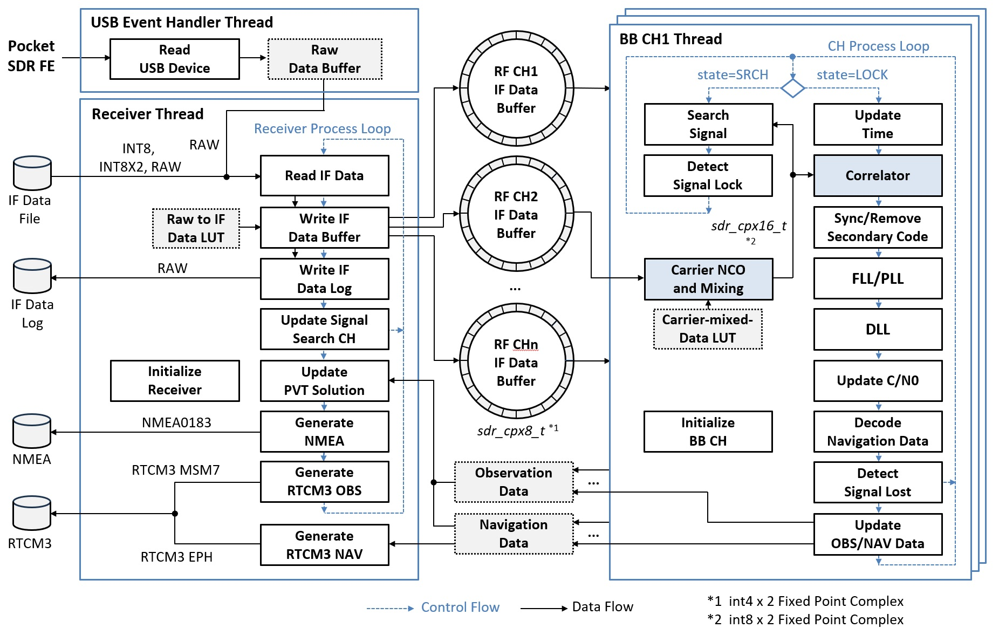
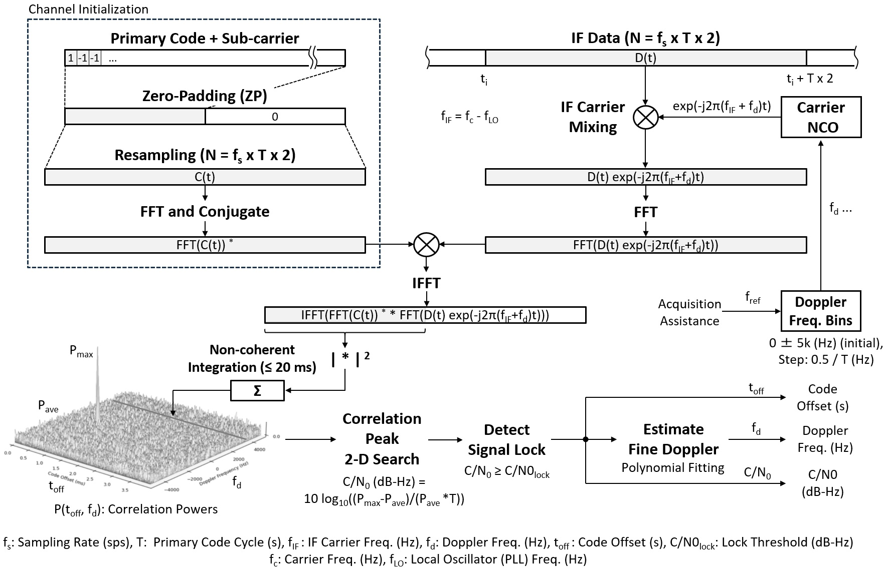
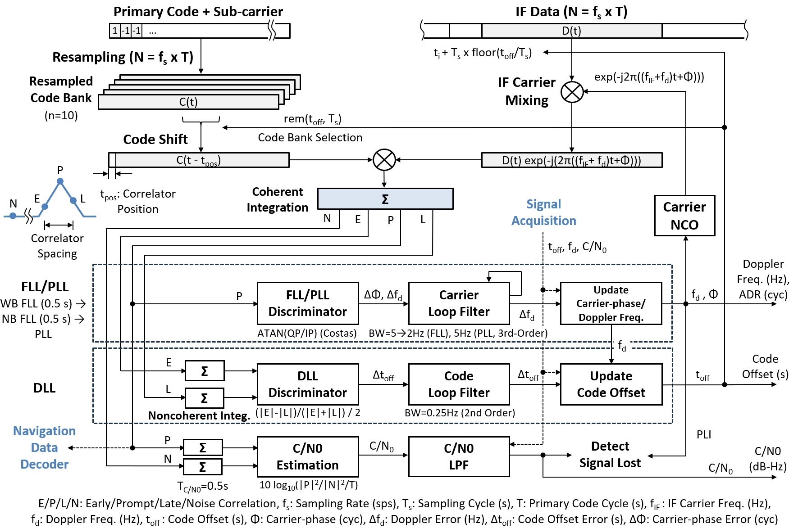
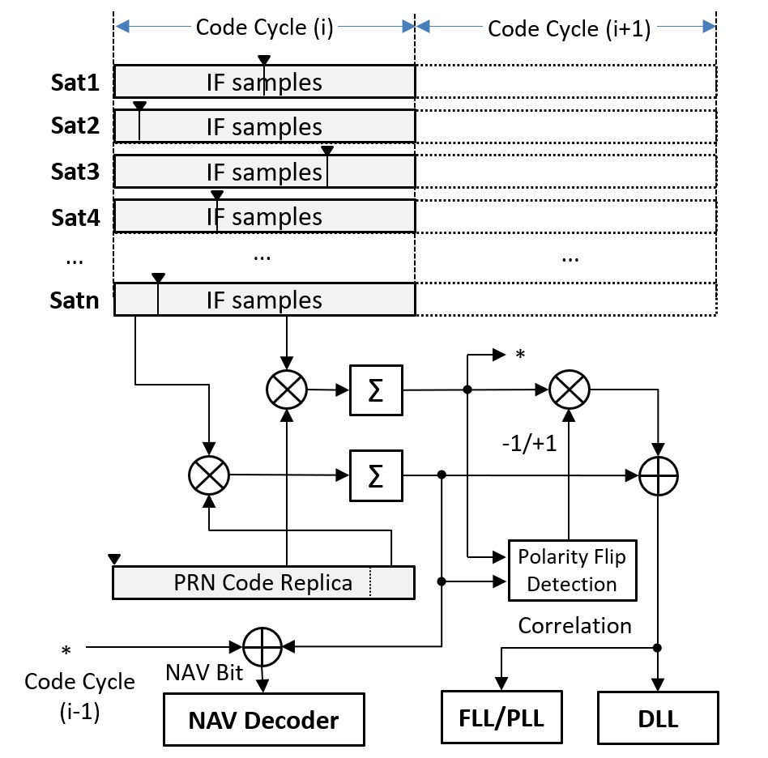
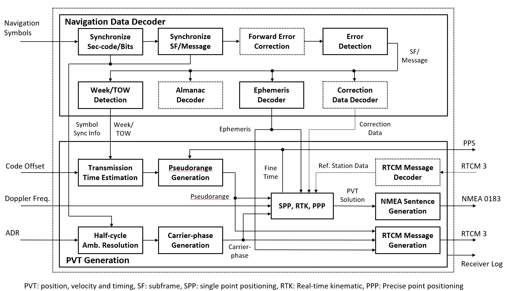
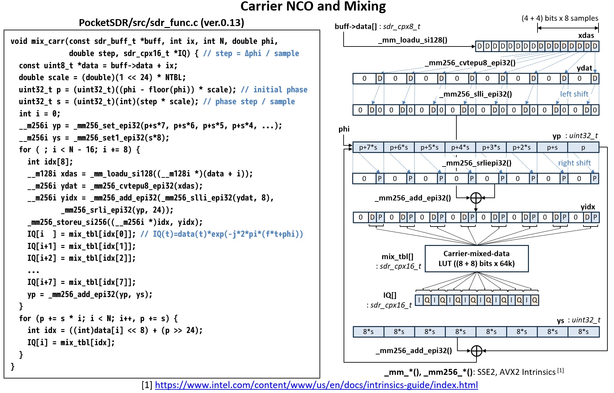
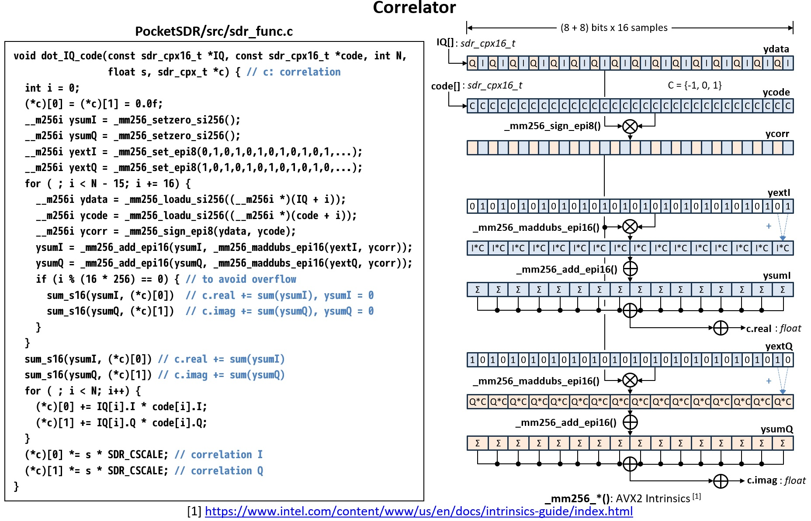

# **Pocket SDR** GNSS SDR アルゴリズム解説

<div style="text-align: right;">
<strong>ver.0.17  2026-06-17</strong>
</div>

---

## 目次

- [範囲](#sec-scope)
- [1. GNSS 信号の概要](#sec-gnss-signal)
- [2. GNSS SDR 全体アーキテクチャ](#sec-architecture)
- [3. 信号捕捉アルゴリズム](#sec-acquisition)
- [4. 信号追尾アルゴリズム](#sec-tracking)
- [5. 航法データ復号](#sec-nav-decoding)
- [6. 観測値と測位解の生成](#sec-pvt)
- [7. 高速化のための実装](#sec-speed)
- [8. その他の実装上の注意](#sec-other)
- [付録 A. 受信機定数とアルゴリズム上の役割](#app-constants)
- [付録 B. 受信機チャネルのライフサイクル](#app-lifecycle)
- [付録 C. 主要なコールグラフ](#app-call-graphs)
- [付録 D. 信号ごとの動作概要](#app-signal-summary)
- [付録 E. 受信機を拡張する際の注意](#app-extending)
- [付録 F. ステータスフィールドの実用的な読み方](#app-status)
- [付録 G. 数式の詳細](#app-math)
- [付録 H. 実装レビュー用詳細チェックリスト](#app-review)
- [付録 I. 症状別トラブルシューティング](#app-troubleshooting)
- [付録 J. 設計上の選択理由](#app-rationale)
- [付録 K. アルゴリズム変更時の最小テストマトリクス](#app-test-matrix)
- [参考文献](#sec-references)


<div class="pagebreak"></div>
<a id="sec-scope"></a>

## 範囲

---
<br>


本文書では、`src/sdr_rcv.c` と、その受信機から直接呼び出される
受信機チャネル処理、航法データ処理、測位解処理の各関数で構成される
GNSS SDR 受信機について解説する。対象は `pocket_trk` が使用する
リアルタイム信号追尾受信機経路に限定する。すなわち、RF/IF 入力処理、
信号捕捉、信号追尾、航法データ復号、観測値生成、測位解生成である。

本文書では、単体の後処理ユーティリティ、スナップショット測位、受信機経路から
呼び出される場合を除くアレー校正アルゴリズム、および `sdr_rcv.c` で使われて
いない提案段階のアルゴリズムは扱わない。

記述の粒度は実装寄りである。受信機の動作を明確にするために式も示すが、
主な目的は、アルゴリズム上の考え方を実際の **Pocket SDR** のデータ構造と
呼び出し経路に結び付けることである。例えば、最上位の受信機ループは
`read_data()`、`write_buff()`、`update_srch_ch()`、`sdr_pvt_udsol()` の
関係として説明し、受信機チャネルループは `sdr_ch_update()`、`search_sig()`、
`track_sig()`、`sdr_nav_decode()`、`sdr_pvt_udnav()`、`sdr_pvt_udobs()` の
関係として説明する。

概要だけを把握したい読者は、まず 1 章と 2 章を読み、その後 3 章から 7 章の
冒頭を拾い読みすればよい。コードを変更する読者は、詳細な小節まで読むべきである。
1 ms の受信機周期、2 周期分の信号捕捉入力長、同時に 1 つだけ動作する信号探索中の受信機チャネル、`SDR_N_CODES` 個の小数コード位相バンクなど、多くの実装上の選択が、
どの変更を安全に行えるかを強く制約しているためである。

本文書で使う記法は、この受信機内での意味に限定する。

| 記号 / 名称 | 本文書での意味 |
|---|---|
| `fs` | IF サンプルレート、単位はサンプル毎秒 |
| `fi` | 受信機チャネルに割り当てられた IF 周波数 |
| `fc` | 信号追尾中に使う搬送波レプリカ周波数。通常は `fi + fd` |
| `fd` | 推定ドップラー周波数、単位は Hz |
| `T` | 対象信号のプライマリコード周期 |
| `N` | 1 コード周期あたりのサンプル数。`N = fs * T` |
| `coff` | 1 コード周期内のコードオフセット、単位は秒 |
| `adr` | 搬送波サイクル単位の積算ドップラー周波数レンジ |
| `lock` | ロック後に信号追尾したコード周期数 |
| `tow` | 受信機チャネルが復号または推定した週内時刻、単位は ms |
| `cn0` | 搬送波対雑音密度比、単位は dB-Hz |
| `P`, `E`, `L`, `N` | prompt、early、late、noise 相関器出力 |


<div class="pagebreak"></div>
<a id="sec-gnss-signal"></a>

## 1. GNSS 信号の概要

---
<br>


**Pocket SDR** が受信する GNSS オープンサービス信号は、スペクトラム拡散信号である。
各衛星は、システムごとに定義された RF 周波数の搬送波を送信し、その搬送波は
衛星固有の測距コードで変調される。一部の信号では航法メッセージも掛け合わされる。
一方、パイロット信号はデータビットを持たないが、セカンダリコードによる
オーバーレイを持つ場合がある。

受信機のベースバンド処理では、信号を以下のようにモデル化できる。

$$
r(t) = A\,d(t)\,c(t-\tau)\,\exp(j(2\pi(f_{\mathrm{IF}}+f_D)t+\phi)) + n(t)
$$

ここで、`c(t)` はプライマリ拡散コード、`d(t)` は航法データまたは
セカンダリコード極性、`tau` はコード遅延、`f_D` はドップラー周波数、`n(t)` は
雑音と干渉である。SDR 受信機は `f_D`、`tau`、搬送波位相、コード位相、最終的には
航法データ時刻を推定し、それらを観測量へ変換する。

**Pocket SDR** は、`L1CA`、`L2CM`、`L5I`、`E1B`、`E5AQ`、`B1I`、`I5S` などの
文字列 ID で信号を識別する。コード生成、公称搬送波周波数、コード周期、
セカンダリコード生成、BOC 処理、RINEX コードへの対応付けは、この信号 ID から
選択される。

受信機は、コマンドリファレンスに示された以下の信号ファミリをサポートする。

| システム | 例 |
|---|---|
| GPS / QZSS | `L1CA`, `L1CB`, `L1CD`, `L1CP`, `L2CM`, `L5I`, `L5Q` |
| QZSS augmentation | `L1S`, `L5SI`, `L5SQ`, `L5SIV`, `L5SQV`, `L6D`, `L6E` |
| GLONASS | `G1CA`, `G2CA`, `G1OCD`, `G1OCP`, `G2OCP`, `G3OCD`, `G3OCP` |
| Galileo | `E1B`, `E1C`, `E5AI`, `E5AQ`, `E5BI`, `E5BQ`, `E5ABQ`, `E6B`, `E6C` |
| BeiDou | `B1I`, `B1CD`, `B1CP`, `B2I`, `B2AD`, `B2AP`, `B2BI`, `B3I` |
| NavIC | `I1SD`, `I1SP`, `I5S`, `ISS` |
| SBAS | `L1CA`, `L5I`, `L5Q` |

実装では、1 つの `(signal, PRN, RF チャネル)` の組み合わせに対して 1 つの
受信機チャネルを使う。各受信機チャネルは、生成済みのプライマリコード、
セカンダリコード、信号捕捉状態、信号追尾状態、航法データデコーダ状態、
および現在の観測量を保持する。

### 1.1 受信機が使う信号構成要素

受信機は各 GNSS 信号を、別々のモジュールで扱う構成要素に分解する。

- 搬送波周波数とドップラー周波数は、受信機チャネルの信号捕捉と信号追尾で扱う。
- プライマリ拡散コードは `sdr_gen_code()` で生成する。
- セカンダリコードまたはオーバーレイコードは `sdr_sec_code()` で生成する。
- コード周期とコード長は `sdr_code_cyc()` と `sdr_code_len()` から取得する。
- 航法メッセージのフレーミングと FEC は `sdr_nav_decode()` で扱う。
- 信号から観測コードへの対応付けは、測位解モジュール内の `sig2code()` で扱う。

ソフトウェアは、実行時に汎用の記号的な信号モデルを保持しない。代わりに、
受信機チャネルを作成するとき、モデルを具体的なコード配列、コード周期、IF 周波数、
デコーダ関数へ展開する。このため、受信機チャネルは `fd`、`coff`、`adr`、`cn0`
のような汎用フィールドと、`code`、`sec_code`、`len_code`、`len_sec_code`、
`sig` によるデコーダ選択のような信号固有リソースの両方を有する。

プライマリコードは、信号捕捉と信号追尾の基本エポックを支配する。セカンダリコードが
存在する場合でも、通常十分な prompt 相関値を積算するまでその位相は確定しないため、
ロック後に扱う。この分離は、長いコードのパイロット信号や近代化信号で重要である。
受信機はまずプライマリコードエポックにロックし、その後でセカンダリコードの
タイミングと航法データ時刻を確立できる。

### 1.2 データ信号とパイロット信号

**Pocket SDR** は、データ信号とパイロット信号に対して同一の基本的な信号捕捉・
信号追尾機構を使う。ただし、航法データ時刻の取得機構は信号により異なる。

データ信号では、prompt の同相相関値を軟判定の 2 値シンボルに変換する。
各シンボルは、符号判定と制限付きの信頼度値の両方を保持する。航法データデコーダは、
シンボル境界、プリアンブル、既知のサブフレームパターン、CRC/parity の成功を
探索する。FEC デコーダは軟判定値を直接処理できる。一方、パリティのみの経路や
CRC チェック経路は、ビットが必要な箇所で局所的に硬判定する。有効な
航法データフレームが復号されると、受信機チャネルでは週番号、TOW、フレーム種別、
生メッセージペイロードが得られる。これらのフィールドは、`sdr_pvt_udnav()` による
エフェメリス更新と、`sdr_pvt_udobs()` による絶対擬似距離生成に使われる。

パイロット信号では、復号対象の航法データフレームが存在しないことがある。
受信機チャネルは搬送波位相とコード位相を信号追尾できるが、時刻については
コード周期またはセカンダリコード周期単位の余り値しか判別しない場合がある。
実装では、このような場合を `tow_v = 2` で表す。これは、受信機チャネルのタイミング
情報の曖昧性が未解決であることを意味する。測位解処理の観測値生成では、
まずそのような受信機チャネルについて短周期の擬似距離を作る。後段で、
選択された短周期の曖昧な信号だけをコンパニオン信号に対して解決し、コンパニオン
信号の擬似距離が得られない場合は無効化する。

受信機は、データ信号/パイロット信号のペア構成もサポートする。例として、GPS L5 I/Q、
Galileo E5a I/Q、BeiDou B1C D/P、Galileo E5 AltBOC `E5ABQ` がある。
このような場合、一方の受信機チャネルをロバストな信号追尾に使い、もう一方の受信機チャネルが航法データ
フレームを処理することがある。実際のペア関係は、独立した高レベルオブジェクトでは
表現しない。受信機チャネルは独立しており、測位解処理が衛星 ID、信号コード、
エポック時刻を使って観測値と航法データを統合する。

### 1.3 時刻スケールとエポック

受信機は、複数の時刻概念を同時に使用する。

- 入力サンプル時刻。受信機チャネルスレッドでは `ix * SDR_CYC` と表す。
- 受信機チャネルの信号追尾時刻。`ch->time` に格納する。
- コードエポック数。`ch->lock` に格納する。
- 復号済み GNSS 週番号/TOW。`ch->week`、`ch->tow`、`ch->tow_v` に格納する。
- 観測エポック時刻。`pvt->time` と `pvt->ix` に格納する。
- 測位解時刻。RTKLIB の `sol_t` オブジェクトに格納する。

1 ms の受信機周期はソフトウェア上のスケジューリング単位であり、必ずしも信号の
コード周期と一致しない。受信機が使う GNSS オープンサービスの測距コード周期は、
大部分が 1 ms または 1 ms の整数倍なので、このスケジューリングモデルは扱いやすい。
1 ms より長いコード周期を持つ信号では、受信機チャネルスレッドは複数受信機周期毎に
動作する。非常に短いサブミリ秒の信号は現在の受信機チャネルモデルには適合しにくいため
より長い周期の信号捕捉/信号追尾手法として設計する必要がある。

受信機チャネル呼び出しは以下の形である。

```text
sdr_ch_update(ch, th->ix * SDR_CYC, buffer, rcv->N * (th->ix % MAX_BUFF))
```

この関数では、受信機チャネル更新開始時の公称時刻と、現在のコード周期に対応する
リングバッファインデックスを渡す。受信機チャネルは、その後、前回の受信機チャネル
更新からの経過時間だけ搬送波状態とコード状態を進める。

### 1.4 IF データ表現

入力変換後、受信機は IF サンプルを `sdr_cpx8_t` として保存する。サンプル値は
浮動小数点複素数ではなく、コンパクトな符号付き整数 I/Q ペアで表される。搬送波
ワイプオフでは、このコンパクトなバッファを相関用の `sdr_cpx16_t` 作業サンプルへ
変換する。相関器出力は `sdr_cpx_t` に積算する。これは FFT とループ弁別器で
使う浮動小数点複素型である。

この IF データ表現は実装の核心である。リングバッファのメモリ帯域を減らし、LUT による
アンパックを軽くし、標準相関器において整数ベクトル演算を使えるようにする。また、
自動スケール制御が内部 IF バッファの前段で実装される必要があることも意味する。
受信機は入力IF データの統計値を推定し、IF バッファのサンプル値が適切なダイナミックレンジ
となるように LUT を周期的に再生成する。

### 1.5 RF 周波数による信号選択

ユーザーが信号を 特定の RF チャネルに明示的に割り当てない場合、`set_rfch()` は信号の
公称周波数と設定されたフロントエンド LO 周波数から RF チャネルを自動選択する。
**Pocket SDR** FE のパック形式では、これにより高周波側と低周波側の信号が
適切な RF 経路に割り当てられる。汎用の単一チャネル IQ 入力では RF チャネルは
1 つだけであり、割り当てられる IF 周波数は `freq - fo` またはゼロ周波数である。

GLONASS FDMA 信号では、`sdr_shift_freq()` が周波数チャネルオフセットを適用する。
このため、受信機は `G1CA` と `G2CA` の信号捕捉および信号追尾で、PRN 引数を
FCN として使う。同じ周波数シフト用ヘルパは、受信機チャネルが RF 搬送波周波数
`fc` と IF 周波数 `fi` の両方を保持するときにも使われる。


<div class="pagebreak"></div>
<a id="sec-architecture"></a>

## 2. GNSS SDR 全体アーキテクチャ

---
<br>

### 2.1 **Pocket SDR** アーキテクチャ

以下の図は受信機の全体アーキテクチャを示している。USB イベントハンドラスレッドと受信機スレッド、
RF チャネルごとのリング IF バッファ、ベースバンド受信機チャネルごとの処理ループである。

<br>
<div style="text-align: center;">


**Pocket SDR** 受信機アーキテクチャと処理フロー
</div>
<br>


### 2.2 受信機オブジェクト

最上位オブジェクトは `sdr_rcv_t` である。これは以下の要素を含む。

- 入力ソース状態。デバイス種別、ファイル/ストリーム/デバイスポインタ、IF 形式、
  サンプリング周波数、LO 周波数、RF チャネル定義。
- 物理 RF チャネルごとのリング IF バッファと、必要に応じてアレー合成チャネル用の
  リング IF バッファ。
- ベースバンド受信機チャネルごとの `sdr_ch_th_t` 受信機チャネルスレッド。
- 航法データ、観測値、測位解を保持する `sdr_pvt_t` オブジェクト。
- NMEA、RTCM3、ログ、生 IF データ用の出力ストリーム。

受信機は固定の処理周期 `SDR_CYC = 1 ms` で動作する。メインの受信機スレッドは
入力から 1 ms ブロックを読み、内部形式の複素 8 bit IF サンプルに変換し、
リングバッファへ書き込み、信号探索を開始または進行させ、測位解エポックを更新する。
受信機チャネルスレッドは、各信号のコード周期毎に同一のリングバッファを消費する。

### 2.3 RF フロントエンドと SDR の分担

RF フロントエンドは、アナログ GNSS 受信、増幅、フィルタリング、周波数変換、
サンプリング、ホストへの転送を担当する。**Pocket SDR** FE デバイスは、
2、4、または 8 RF チャネルの パック済み生形式を出力する。代替フロントエンドは、
ファイル入力、汎用ストリーム、SoapySDR 経由で利用できる。

SDR ソフトウェアは、デジタル IF サンプルから処理を開始する。フロントエンドに
関連する処理は以下のとおりである。

- ファイル、USB FE、TCP/RTKLIB ストリーム、SoapySDR からサンプルを読む。
- パック FE 形式 (`RAW8`, `RAW16`, `RAW16I`, `RAW32`) をアンパックする、または
  汎用形式 `INT8`, `INT8X2`, `CS8`, `CS16` を正規化する。
- LUT を使ってサンプルを内部の `sdr_cpx8_t` 複素サンプルへ変換する。
- 実サンプリング RF チャネルでは、`fs/4` の実数-複素変換と、必要に応じて
  ローパスフィルタを適用する。
- 信号 RF 周波数と LO 周波数から RF チャネルを自動選択する、または `-RFCH` で
  明示的に選択する。
- 必要に応じて複数 RF チャネルを合成してアレー/ビーム合成チャネルを生成する。

この先の信号処理は純粋な SDR 処理であり、信号捕捉、信号追尾、航法データ復号、
観測値生成、測位解生成で構成される。

### 2.4 実行時データフロー

受信機には 2 階層のスレッドがある。

1. 受信機スレッドは IF データを読み、IF バッファへ書き込む。

```text
read_data() -> write_buff() -> update_srch_ch() -> sdr_pvt_udsol()
```

2. 各受信機チャネルスレッドは、十分なバッファ済みデータが利用可能になるまで待機し、
   受信機チャネル処理を進める。

```text
sdr_ch_update()
    if SRCH: search_sig()
    if LOCK: track_sig()
if nav updated: sdr_pvt_udnav()
sdr_pvt_udobs()
```

受信機チャネル状態機械には 3 つの状態がある。

- `SDR_STATE_IDLE`: スケジューラが信号捕捉を開始するのを待つ。
- `SDR_STATE_SRCH`: 信号捕捉を実行中。
- `SDR_STATE_LOCK`: 信号追尾、航法データ復号、観測量生成を行う。

受信機スケジューラは、同時にアクティブな信号探索に入る受信機チャネルを 1 つまでに
制限する。これにより、ロック済みの全受信機チャネルが並列に信号追尾を継続する間も、
信号捕捉による CPU 負荷を抑えられる。

### 2.5 受信機の初期化

メインの受信機オブジェクトは `sdr_rcv_new()` で作成される。この関数は、
ユーザー向けの受信機設定を、実行時ループで使う具体的なオブジェクトへ変換する。
主な手順は以下のとおりである。

1. アレー合成チャネル数、E5 AltBOC 群遅延オフセット、BOC バンプジャンプしきい値など
   全体の受信機チャネル動作に影響する受信機オプションを解析する。
2. IF 形式、サンプルレート、RF チャネル数、LO 周波数、サンプリングモード、
   ビット幅を保存する。
3. 要求された各 `(signal, PRN)` ペアについて、1 つ以上の RF チャネルを選択し、
   受信機チャネル IF 周波数を計算する。
4. `ch_th_new()` で受信機チャネルスレッドオブジェクトを作成する。この内部で
   `sdr_ch_new()` を呼び、`sdr_ch_t` 受信機チャネルを作成する。
5. すべての RF チャネルと、必要に応じてアレー合成チャネル用のリング IF バッファを
   割り当てる。
6. 測位解オブジェクトを作成し、mutex とステータスフィールドを初期化する。

受信機チャネル作成時には、意図的に多くの準備を前倒しする。各 `sdr_ch_t` は、
受信機開始前にプライマリコード、セカンダリコード、信号捕捉 FFT、信号追尾コード
バンク、航法データデコーダ状態、作業バッファを割り当てる。これにより、
リアルタイム信号追尾ループでは大きなメモリ割り当てを避けられる。例外は
信号捕捉の積算バッファで、これは受信機チャネルが信号探索状態にある間だけ
割り当てられる。

初期化経路は実サンプリングの RF チャネルも扱う。RF チャネルが 実 (I-only) サンプリングに
設定されている場合、`write_buff()` がサンプルのアンパック時に対応する `fs/4`
デジタルミキシングパターンを適用するため、RF チャネルの IF 周波数を `-fs/4`
だけシフトする。この補正後は、実サンプリング入力と 複素 (IQ) サンプリング入力のどちらでも、後段の
受信機チャネル処理は同じ複素搬送波ワイプオフ経路を利用できる。

### 2.6 受信機オープン経路

受信機オープン関数の違いは、主に IF メタデータとデータポインタの取得方法である。

| 関数 | 入力ソース | メタデータソース |
|---|---|---|
| `sdr_rcv_open_dev()` | **Pocket SDR** USB FE | デバイス問い合わせとオプション設定ファイル |
| `sdr_rcv_open_sdev()` | SoapySDR デバイス | Soapy ドライバ設定と要求形式 |
| `sdr_rcv_open_file()` | ローカル IF データファイル | コマンドライン引数または `.tag` ファイル |
| 内部ストリームオープン経路 | RTKLIB ストリーム | 呼び出し元が与える形式とサンプル設定 |

メタデータが与えられると、すべての受信機オープン経路は `sdr_rcv_new()` と `sdr_rcv_start()` に
合流する。これはアルゴリズムの一貫性にとって重要である。IF サンプルがハードウェア、
ファイル、ストリームのどこから入力されるかにかかわらず、信号捕捉、信号追尾、
航法データ復号、観測値生成、測位解生成は同一である。

`.tag` ファイル機構も、この合流の一部である。ローカル IF データファイル再生では、タグファイルが
形式、サンプルレート、LO 周波数、IQ モード、ビット幅を上書きできる。ライブ
デバイスから得られた生 IF データを記録する場合、`write_raw_tag_file()` は同等のメタデータを
書き出す。そのため、記録済みのIF データを同一設定で再生することができる。

### 2.7 入力形式と内部バッファ

受信機は、汎用 IF データと パックされたFE 出力の両方を受け付ける。内部での目標は
常に同じであり、RF チャネルごとに 1 本の複素サンプルストリームを生成することである。

| 形式 | 意味 | 内部変換 |
|---|---|---|
| `INT8` | 符号付き 8 bit 実数サンプル | I-only サンプル、Q は 0 |
| `INT8X2` | Q 符号が反転したインタリーブ<br>された符号付き 8 bit IQ | LUT スケール I と符号反転 Q |
| `CS8` | インタリーブされた符号付き 8 bit IQ | LUT スケール I と Q |
| `CS16` | インタリーブされた符号付き 16 bit IQ | I/Q 別 LUT でコンパクトな<br> 8 bit 値へ変換 |
| `RAW8` | パックされた **Pocket SDR** FE 2 チャネル raw | RF チャネルごとにアンパック |
| `RAW16` | パックされた **Pocket SDR** FE 4 チャネル raw | RF チャネルごとにアンパック |
| `RAW16I` | パックされた Spider SDR FE 8 チャネル raw | I-only チャネルをアンパック |
| `RAW32` | パックされた **Pocket SDR** FE 8 チャネル raw | RF チャネルごとにアンパック |

パックされた FE 形式では、1 バイトの中に複数チャネルの量子化サンプルが格納される。
`write_buff()` は RF チャネルごとの LUT を使って選択されたビットをアンパックし、
正しい `sdr_buff_t` へ書き込む。実サンプリングチャネルでは、4 相 LUT が `fs/4`
直交変換を実装する。

```text
phase 0:  I,  0
phase 1:  0, -I
phase 2: -I,  0
phase 3:  0,  I
```

この変換は、サンプルバイトと位相を 1 つのルックアップインデックスにできるためCPU負荷は軽い。
位相は絶対受信機周期とサンプルオフセットから導くので、リングバッファが折り返しても
連続性が保持される。

### 2.8 受信機スレッドループ

受信機スレッドは、入力ソースを読む唯一のスレッドである。そのループは以下のように
要約できる。

```text
受信機動作中、ix = 0, 1, 2, ... について:
    1 ms の生データを読む
    内部 IF バッファを書き込む
    必要なら生 IF ストリームを書き出す
    信号捕捉スケジューラを更新
    update pvt epoch
    update input statistics and sample scaling
    sleep if replaying a file faster than the requested time scale
```

このループは、バッファ使用量、入力データレート、時刻ログも周期的に更新する。
ライブデバイスでは、ループ前に `sdr_dev_start()` または `sdr_sdev_start()` を
呼び、ループ終了後に対応する終了関数を呼ぶ。

受信機ループは意図的に単純化されている。信号捕捉や信号追尾そのものは行わない。
一貫した IF バッファを生成し、受信機チャネル状態の更新をスケジュールするだけである。
この様に分離することにより、突発的になり得る信号捕捉の CPU 負荷から入力タイミングを独立に維持される。

### 2.9 受信機チャネルスレッドループ

各受信機チャネルスレッドは、1 つの受信機チャネルを所有する。入力ソースは読まず、
`ch->rf_ch` で選択された RF チャネルバッファだけを読む。受信機チャネルスレッドは
次を計算する。

$$
n = \frac{N_{\mathrm{ch}}}{N_{\mathrm{rcv}}}
$$

ここで、\(N_{\mathrm{rcv}}\) は `rcv->N`、すなわち 1 ms 受信機周期あたりの
サンプル数に対応し、\(N_{\mathrm{ch}}\) は `ch->N`、すなわちコード周期あたりの
サンプル数に対応する。受信機チャネルスレッドは一度に `n` 受信機周期だけ進む。少なくとも
2 コード周期分のデータが格納されるまで待機する。

```text
while th->ix + 2 * n <= rcv_ix:
    th->ix で受信機チャネルを更新
    th->ix += n
```

2 周期分のデータが必要であることは、信号捕捉で特に重要である。`search_sig()` は
`2 * ch->N` サンプルを `sdr_search_code()` へ渡す。これにより、ゼロパディング
された相関で完全なコードオフセット区間を検索しても、コード周期境界付近のサンプルを失わない。

各受信機チャネル更新後、受信機チャネルスレッドは航法データ状態と観測状態を測位解オブジェクトへ
転送する。航法データ更新は、デコーダが `ch->nav->stat` を設定した場合だけ
行われる。観測値更新は受信機チャネルエポックごとに確認されるが、観測値が生成される
のは現在の測位解エポックで、かつ受信機チャネルが有効なタイミングを持つ場合だけである。

### 2.10 共有状態の境界

実装では、共有状態の一貫性が必要な境界に限定して mutex を使う。

- 受信機バッファインデックス `rcv->ix` は `rcv->mtx` で保護する。
- 受信機チャネルの信号追尾状態は、`track_sig()` 中に `ch->mtx` で保護する。
- 測位解の航法、観測値、測位解状態は `pvt->mtx` で保護する。
- アレー合成チャネルのビーム状態は、IF バッファを合成するときに受信機ロック下で更新する。

IF リングバッファ自体は受信機スレッドが書き込み、受信機チャネルスレッドが読む。
同期は単調増加するバッファインデックスで実現する。受信機は 1 ms ブロックを完全に
書いてから新しいインデックスに更新し、受信機チャネルスレッドは更新されたインデックス
より十分に後ろにあるサイクルインデックスのデータだけを処理する。

### 2.11 処理レイテンシ

レイテンシには複数の要因がある。

- 受信機ライタと受信機チャネルリーダの間のリングバッファ遅延。
- 信号捕捉のノンコヒーレント積分時間。通常は 20 ms。
- シンボル/フレーム復号前の航法データ pull-in 時間。通常は 1.5 s。
- 観測エポック待ちと処理ラグ許容量。
- 測位解計算と出力ストリーム。

測位解処理層は、現在の入力サイクルとエポックサイクルの差を `pvt->latency` として記録する。
すべての受信機チャネルがそのエポックに到達していない場合、測位解の更新は、全受信機チャネルが報告するか `sdr_lag_epoch` を超えるまで待つ。これにより、遅い受信機チャネルや信号ロストした受信機チャネル 1 つのために、測位解生成が無期限に停止することを避ける。


<div class="pagebreak"></div>
<a id="sec-acquisition"></a>

## 3. 信号捕捉アルゴリズム

---
<br>

### 3.1 信号捕捉のデータフロー

以下の図は、信号捕捉のデータフローを示している。コード位相/ドップラー周波数の
並列 FFT 検索、ノンコヒーレント積分、ピーク検出、C/N0 推定である。

<br>
<div style="text-align: center;">


信号捕捉のデータフロー
</div>
<br>

### 3.2 信号探索スケジューリング

受信機は 1 ms 入力ブロックごとに `update_srch_ch()` を呼ぶ。IF バッファがほぼ
満杯であれば、新しい信号探索は開始しない。別の受信機チャネルがすでに信号探索中なら、
スケジューラは待機する。そうでなければアイドル状態の受信機チャネルを順に見て、以下のいずれかの
条件を満たす場合に信号探索を開始する。

- 直近の信号ロスト後で、再信号捕捉が可能である。
- 同一衛星の別のロック済み信号からドップラー周波数支援が可能である。
- 信号のコード周期が直接信号捕捉できるだけ短く (`T <= sdr_max_acq`、既定値は
  `4 ms`)、かつその受信機チャネルが探索可能に設定されている。

再信号捕捉では、前回のロックが少なくとも 2 秒継続していれば、信号ロスト後
最大 60 秒まで、その受信機チャネルが最後に信号追尾していたドップラー周波数を使う。
支援信号捕捉では、同一衛星のロック済み信号を使い、その信号追尾中のドップラー周波数を
搬送波周波数比でスケールする。

### 3.3 並列コード位相検索

信号捕捉では、並列コード FFT 検索を使う。各ドップラー周波数ビンについて、
以下の処理を行う。

1. IF ブロックを `fi + fd` でミキシングする。
2. 事前計算したコード FFT との FFT ベースサーキュラ相関を計算する。
3. 相関電力をノンコヒーレント積算バッファへ加算する。

信号捕捉用コード FFT は、受信機チャネル作成時に生成される。通常の信号捕捉では、
`N = fs * T`、`T` をコード周期として、`2 * N` サンプルへゼロパディングする。
ドップラー周波数ビンは、コード周期と設定された最大ドップラー周波数から生成する。
外部ドップラー周波数支援がある場合、通常のビンリストは、多くの場合、支援された
ドップラー周波数を中心とする 3 ビンに置き換えられる。

$$
f_d \in
\{
f_{d,\mathrm{ext}}-\frac{0.5}{T},\;
f_{d,\mathrm{ext}},\;
f_{d,\mathrm{ext}}+\frac{0.5}{T}
\}
$$

高速検索支援では、`fd_ext_n` を設定することで、より広い支援窓を要求できる。
この場合も `fd_ext` の周囲に、要求された数のビンを同じビン間隔で並べる。

受信機は、`n_sum * T >= sdr_t_acq` (既定値は `20 ms`) になるまで、
ノンコヒーレント相関電力を積算する。その後、ドップラー周波数/コードグリッドから
最大電力を検索し、ピーク対平均比から C/N0 を推定する。

$$
C/N_0 =
10\log_{10}
(
\frac{P_{\max}-P_{\mathrm{ave}}}{P_{\mathrm{ave}}\,T}
)
$$

C/N0推定値がロックしきい値 (`sdr_thres_cn0_l`、既定値は `34 dB-Hz`) を超えれば、
検出したドップラー周波数とコードオフセットを使って信号追尾を開始する。
そうでなければ受信機チャネルはアイドル状態に戻る。

### 3.4 特殊な信号捕捉ケース

`E5ABQ` の信号捕捉では、セカンダリコード整列が分かる前に信号を探索するため、
E5aQ のみの AltBOC 複素レプリカを使う。完全な E5aQ/E5bQ パイロット合成は、
セカンダリコード同期後の信号追尾で使う。

QZSS `L6D` や `L6E` のような長いコードまたは CSK に近い信号では、信号追尾経路でも
FFT 相関を使う。コード構造と CSK シンボル構造のため、ロック後にも全コード位相相関が
有用だからである。

### 3.5 信号捕捉状態データ

信号捕捉状態は `sdr_acq_t` に格納される。

| フィールド | 役割 |
|---|---|
| `code_fft` | PCPS で使うローカルコードレプリカの FFT |
| `fds` | 通常のドップラー周波数検索ビンリスト |
| `len_fds` | ドップラー周波数ビン数 |
| `fd_ext` | オプションの外部ドップラー周波数支援 |
| `P_sum` | 相関電力のノンコヒーレント和 |
| `n_sum` | 積算済みのコヒーレントなコード周期検索回数 |

`P_sum` は、受信機チャネルが信号探索状態に入ったときにメモリ割り当てされる。
信号捕捉判定が行われると解放される。これにより、多数の受信機チャネルを設定しても
アイドル状態の受信機チャネルを軽く保てる。恒久的な信号捕捉メモリの大半は、コード FFT と
ドップラー周波数ビンリストである。

通常信号のコード FFT は `sdr_gen_code_fft()` で生成される。この関数はプライマリコードを
受信機チャネルのサンプルレートへリサンプリングし、必要ならゼロパディングを適用し、
FFT を実行し、その複素共役を保存する。これにより後段の信号捕捉相関器は、

$$
R =
\mathrm{IFFT}
(
\mathrm{FFT}(x)\,
\mathrm{conj}(\mathrm{FFT}(c))
)
$$

を、データ FFT に `code_fft` を掛けるだけで計算できる。

### 3.6 ドップラー周波数ビン間隔

ビン間隔はコヒーレント積分長に結び付いている。コヒーレント積分時間を `T` とすると、
およそ `1/T` Hz のドップラー周波数誤差で、積分区間全体に 1 サイクルの位相回転が
生じる。このため実装は `sdr_dop_bins(T, 0, sdr_max_dop, &len_fds)` でビンを作り、
支援信号捕捉では支援されたドップラー周波数の周囲に半ビン間隔を使う。

このため、信号捕捉の動作は信号依存になる。1 ms 信号は、4 ms のコヒーレント検索より
ドップラー周波数ビン間隔は広い。位相回転が積算する時間が短いからである。
コード周期が長い場合、同じ最大ドップラー周波数範囲に対してビン間隔が狭くなり、
ビン数も増える。受信機が `sdr_max_acq` で直接信号捕捉を制限する理由の 1 つは
ここにある。非常に長いコード周期は、コード位相方向とドップラー周波数方向の両方で
高コストになる。

設定される最大ドップラー周波数は、通常、0 を中心に対称である。ライブ信号追尾では、
この値が衛星の視線方向速度、受信機発振器誤差、IF 周波数誤差を覆う必要がある。
同一衛星の受信機チャネルがすでにロックしている場合、発振器誤差と衛星ドップラー周波数は
一次的には周波数間で共通なので、受信機は広い検索を避けられる。

### 3.7 コヒーレント積分とノンコヒーレント積分

`sdr_search_code()` の各呼び出しは、全ドップラー周波数ビンについて 1 コード周期分の
コヒーレント相関を実行する。コヒーレント結果は電力へ変換され、`P_sum` に積算される。
十分な回数呼ばれると、ノンコヒーレント積分時間が `sdr_t_acq` に到達する。

両者の違いは以下のとおりである。

$$
\begin{aligned}
\text{coherent} &: \text{complex correlation over one code period} \\
\text{ノンコヒーレント} &: \sum_i |R_i|^2
    \text{ over multiple code periods}
\end{aligned}
$$

ノンコヒーレント積算は位相を捨てるため、データビットの符号反転やセカンダリコードの
極性反転に対してロバストである。その代わり、データ/セカンダリ極性が既知の場合に可能な
完全コヒーレントな複数 ms 積分より感度は低い。実装は、ロック後に信号追尾と
航法データ復号が極性を解決することを前提に、信号捕捉ではロバスト性と単純さを選んでいる。

プライマリコード周期が所望の信号捕捉時間より短い信号では、多数のコード周期を積算する。
1 ms コードで既定の 20 ms 信号捕捉時間なら、受信機は 20 回のコヒーレント検索を
積算する。4 ms コードなら 5 回積算する。

### 3.8 信号捕捉メトリクス

積算後、`sdr_corr_max()` は探索済みのドップラー周波数/コードグリッド全体で平均電力を
計算し、最大ピークを探す。平均に対するピーク超過電力を、C/N0 に似たメトリクスへ
変換する。これは完全な統計的 CFAR 検出器ではない。受信機の信号追尾しきい値と
ステータス表示に合う、実用的な信号捕捉メトリクスである。

信号捕捉判定には 2 つの出力がある。

- `cn0 >= sdr_thres_cn0_l` なら、受信機チャネルは信号追尾を開始する。
- それ以外なら、受信機チャネルは短時間スリープし、アイドル状態に戻り、後でスケジューラに
  よって再検索され得る。

失敗した検索後の短いスリープは、意図的に CPU 時間を解放するためのものである。
大きな設定では多数のアイドル状態の受信機チャネルがあり得るため、この解放がないと、
失敗する信号捕捉試行の連続が信号追尾余裕を削る可能性がある。

### 3.9 コードオフセットの解釈

信号捕捉で得られたコードオフセットは、検索した相関ベクトル内のサンプルインデックスとして返る。
受信機チャネルはこれを秒へ変換する。

$$
\mathrm{coff} = \frac{i_{\mathrm{code}}}{f_s}
$$

信号追尾開始時、`coff` は 1 プライマリコード周期を法とした推定コードオフセットである。
信号追尾ループは、その後 DLL と搬送波支援コード更新で連続的に精密化する。
信号捕捉は `2 * N` サンプルを使うが、ピーク選択では最初の `N` コードオフセットだけを
検索するため、初期オフセットは 1 コード周期内に保たれる。

ドップラー周波数推定値は、`sdr_fine_dop()` で精密化される。この関数は検出された
ドップラー周波数ビンの周囲の局所的な電力形状をフィットする。これにより、離散ビン
中心よりよい初期周波数が得られ、FLL の周波数引き込み負担を減らす。

### 3.10 信号捕捉の擬似コード

実装されている 1 受信機チャネル分の信号捕捉ループは、以下のように表せる。

```text
if external doppler aid is available:
    if fd_ext_n is set:
        fds = fd_ext-centered bins with fd_ext_n entries at 0.5/T spacing
    else:
        fds = [fd_ext - 0.5/T, fd_ext, fd_ext + 0.5/T]
else:
    fds = normal doppler bins

if P_sum is not allocated:
    allocate P_sum for len(fds) x 2N

sdr_search_code(code_fft, T, buffer, ix, 2N, fs, fi, fds, P_sum)
n_sum += 1

if n_sum * T >= sdr_t_acq:
    cn0, fd_index, code_index = peak_search(P_sum)
    if cn0 >= threshold:
        fd = fine_doppler(P_sum, fd_index)
        coff = code_index / fs
        start_track(fd, coff, cn0)
    else:
        アイドル状態へ戻る
    free P_sum
```

この擬似コードは、変更を検討するときに有用である。別の信号捕捉方式を採る場合でも、
受信機チャネル開始時の出力、すなわちドップラー周波数 `fd`、コードオフセット `coff`、
初期 C/N0 は同じ意味で生成しなければならない。また、受信機の単一信号探索スケジューラと
バッファラグ制限にも協調する必要がある。

### 3.11 失敗モードと再信号捕捉

信号捕捉は、想定される理由で失敗し得る。

- 衛星がアンテナの地平線下にある。
- 選択された RF チャネルに対象信号帯域が含まれていない。
- IF 周波数またはサンプリングメタデータが誤っている。
- ドップラー周波数が設定範囲外である。
- 受信 C/N0 に対して積分時間が短すぎる。
- 強い干渉が平均相関電力を押し上げている。
- 長いコードまたはデータ遷移がコヒーレント利得を下げている。

受信機は、失敗した受信機チャネルをブラックリスト化しない。アイドル状態の受信機チャネルを巡回するので、
失敗した受信機チャネルも後で再検索され得る。有効な過去ロックを持つ受信機チャネルでは、
限られた時間だけ古いドップラー周波数から再信号捕捉を開始する。同一衛星の別周波数が
ロックしていれば、支援信号捕捉はその受信機チャネルのドップラー周波数を使う。
この 2 つの仕組みにより、信号ロストからの復帰はコールド信号捕捉よりはるかに速くなる。

### 3.12 `pocket_acq` との関係

受信機は オフライン信号捕捉と同一の中核 PCPS ヘルパを使うが、リアルタイム受信機経路では
スケジューリングと状態管理が異なる。`pocket_acq` は、1 つのファイル区間と 1 組の PRN に
すべての CPU を使える。`sdr_rcv.c` は、進行中の信号追尾を守り、入力バッファの
overflow を防ぎ、航法データ処理や測位解生成と CPU を共有しなければならない。
したがって、単一の信号探索中の受信機チャネルとバッファ使用量ガードは、単なる実装詳細ではなく、
アルゴリズムの一部である。


<div class="pagebreak"></div>
<a id="sec-tracking"></a>

## 4. 信号追尾アルゴリズム

---
<br>

### 4.1 信号追尾のデータフロー

以下の図は、信号追尾のデータフローを示している。搬送波とコードのワイプオフ、
early/prompt/late/noise 相関器、FLL/PLL と DLL の各ループ、C/N0 推定、信号ロスト検出である。

<br>
<div style="text-align: center;">


信号追尾のデータフロー
</div>
<br>

### 4.2 信号追尾レプリカと相関器

受信機は、受信機チャネル作成時に信号追尾レプリカバンクを構築する。通常の実数拡散
コードでは、`SDR_N_CODES = 10` 個の小数コード位相に対して、コードを `fs` で
リサンプリングする。各信号追尾エポックでは、現在の小数コードオフセットに対応する
バンクを選択する。

既定の相関器位置は以下のとおりである。

- Prompt `P`。
- Early `E` と late `L`。間隔は `sdr_sp_corr` chips、既定値は `0.25`。
- noise 相関器 `N`。固定サンプルオフセットで十分離れた位置に置く。
- オプションの BOCフォールスロック検出用 very-early / very-late 相関器。

ほとんどの信号では、信号追尾に時間領域の標準相関器を使う。IF サンプルに搬送波
ワイプオフを行い、その後 prompt、early、late、noise、およびオプションの BOC 監視
レプリカと相関を取る。相関器はコード周期をコード折り返し点で 2 つに分け、
両半分の間の極性反転を検出する。これにより、積分区間内にあるデータビット遷移の
影響を減らす。2 つの相関値をエポックをまたいで組み合わせる処理を含む相関器ロジックは、
以下の図に示す。詳細は §4.10 から §4.11 で説明する。

`E5ABQ` では、相関器は複素拡散コードレプリカを使い、事前計算された 3 つのバンクから
選択する。セカンダリコード同期前は E5aQ のみ、同期後は相対セカンダリコード極性に
応じて 2 種類の E5aQ/E5bQ パイロット合成のどちらかを使う。

`L6D` と `L6E` では、信号追尾に FFT 相関を使い、その後 prompt 付近のピーク変位から
CSK シンボルを検出する。

<br>
<div style="text-align: center;">


相関器ロジック
</div>
<br>

### 4.3 搬送波信号追尾

信号追尾は、ドップラー周波数 `fd`、積算ドップラー周波数レンジ `adr`、搬送波位相を
維持する。搬送波レプリカ周波数は次式である。

$$
f_c = f_i + f_d
$$

各コード周期で次を行う。

- 積算ドップラー周波数レンジを `fd * tau` だけ進める。
- コードオフセットに `-fd / carrier_frequency * tau` の搬送波支援を加える。
- IF サンプルを現在の搬送波レプリカでミキシングする。
- prompt 相関値を prompt 履歴バッファへ保存する。

搬送波信号追尾は、周波数引き込み用 FLL の後に PLL を使う。

最初の `T_FPULLIN = 1.0 s` では、FLL 弁別器が現在と前回の prompt 相関値を
dot 積と cross 積で比較する。最初はワイドバンドFLLを使い、その後ナローバンドFLLを使う。
周波数引き込み後は 3 次 PLL を使う。データ信号では搬送波弁別器は Costas 形式であり、
非 Costas の場合は完全な `atan2` 位相を使う。

### 4.4 コード信号追尾

コード信号追尾は、ノンコヒーレントな early-minus-late DLL を使う。相関電力は
`sdr_t_dll` (既定値 `20 ms`) にわたって積算される。コード弁別器は次式である。

$$
e_{\mathrm{code}} =
\frac{\sqrt{E}-\sqrt{L}}{\sqrt{E}+\sqrt{L}}\,
\frac{0.5\,T}{N_{\mathrm{code}}}
$$

2 次ループフィルタがコードオフセットを更新する。prompt I の符号は、積算した同相
監視値でデータワイプオフに使う。

コードオフセットがコード周期境界をまたぐ場合、受信機はそれを `[0, T)` に折り返し、
ロック数と TOW を一貫して調整する。

### 4.5 セカンダリコード同期と C/N0

セカンダリコードを持つ信号では、受信機チャネルは航法データプルイン時間
(`T_NPULLIN = 1.5 s`) まで待機し、その後 prompt 履歴とセカンダリコード列との相関を
取る。同期判定では、符号付きセカンダリコード相関と平均 prompt 振幅の比を使うため、
弱い信号や散発的な符号誤りだけで即座に不合格にはならない。同期後は、すべての
相関器出力からセカンダリコード極性を取り除く。セカンダリコード境界で平均 prompt
振幅が信号ロストしきい値を下回ると、セカンダリコード同期を解除する。

C/N0 は、`T_CN0 = 0.5 s` ごとに prompt 電力と noise 相関器から推定する。

$$
C/N_0 =
10\log_{10}
(
\frac{P_{\mathrm{prompt}}}{P_{\mathrm{noise}}\,T}
)
$$

推定値にはローパスフィルタをかける。

同じ `T_CN0` 境界で、受信機は搬送波ロック指標 (PLI) も更新する。これは受信電力に
依存しない squaring (Van Dierendonck) 検出器であり、prompt 電力が高いまま搬送波の
位相ロックだけが信号ロストした場合を捉える。

$$
\mathrm{PLI} =
\frac{\sum (I_P^2 - Q_P^2)}{\sum (I_P^2 + Q_P^2)}
\approx \cos 2\bar{\phi}
$$

PLI は、位相ロック中は `+1` に近づき、搬送波が回転している場合や雑音だけの場合は
`0` に近づく。Costas 信号追尾の信号についてのみ計算され、最初の `T_CN0` 窓の後に
有効になる。

信号ロストは、エポックごとではなく `T_CN0` 窓ごとに判定する。フィルタ済み C/N0 が
信号ロストしきい値 (`sdr_thres_cn0_u`、通常は `30 dB-Hz`、L6 では `33 dB-Hz`) を
下回る、または Costas 信号追尾信号の PLI が `sdr_thres_pli` を下回ると、その窓を
bad と判定する。悲観的なカウンタで過渡現象をデバウンスし、`sdr_lost_th` 個の bad 窓が
連続した場合にだけ、受信機チャネルは信号ロストを宣言してアイドル状態に戻り、再信号捕捉の
候補になる。

### 4.6 BOC フォールスロック処理

信号が BOC 系変調を使い、かつこの処理が有効な場合、信号追尾バンクには very-early と
very-late 相関器が含まれる。受信機は C/N0 更新間隔ごとに、これらの積算電力を
prompt 電力と比較する。片側がサイドピークロックを示していれば、変調に依存するバンプステップ
だけコードオフセットをずらす。これは、BOC サイドローブ上のフォールスロックから
抜け出すために使う。

### 4.7 信号追尾状態データ

信号追尾状態は `sdr_trk_t` に格納される。重要なフィールドは以下のとおりである。

| フィールド | 役割 |
|---|---|
| `pos[]` | サンプル単位の相関器位置 |
| `C[]` | 現在の相関器出力 |
| `C0` | FLL 用の前回 prompt 相関値 |
| `C1` | エポックをまたぐ prompt 結合 / bit 遷移処理の<br>ために保持する、前エポック末尾の部分相関 |
| `P[]` | prompt 相関履歴 |
| `sec_sync`, `sec_pol` | セカンダリコード同期と極性 |
| `err_phas`, `phas_acc` | PLL 弁別器履歴と 3 次アキュムレータ |
| `err_code`, `code_int` | DLL 弁別器履歴と 2 次積分器 |
| `sumP`, `sumN` | C/N0 用の prompt 電力和と noise 電力和 |
| `sumD` | 搬送波ロック指標 (PLI) 用の prompt `I^2-Q^2` 和 |
| `sumC[]`, `sumI[]` | DLL 積算バッファ |
| `code` | リサンプリング済み信号追尾コードバンク |
| `code_fft` | L6 用 FFT 信号追尾コードバンク |

受信機チャネルオブジェクト `sdr_ch_t` は、エポックをまたいで保持すべきループ状態を
格納する。具体的には、ドップラー周波数、コードオフセット、連続搬送波位相 (`phi`)、
積算ドップラー周波数レンジ、C/N0、搬送波ロック指標 (`pli`) とその valid flag、
週番号/TOW、ロック数、信号ロスト数、信号ロスト判定カウンタ (`lost_cnt`)、Costas/non-Costas モード、
航法データ状態である。

`start_track()` は、動的な信号追尾状態と航法データ状態をリセットする。
コードや FFT は恒久的な受信機チャネルリソースなので再生成しない。これにより、
再信号捕捉は軽くなる。受信機チャネルは、信号固有リソースを再構築せずにアイドル状態から
信号探索状態、ロック状態へ遷移できる。

### 4.8 搬送波ワイプオフの実装

搬送波ワイプオフは `sdr_mix_carr()` が行う。この関数は、`sdr_buff_t` 内の
コンパクトな IF サンプル、開始インデックス、サンプル数、サンプルレート、
搬送波周波数を受け取り、相関器用の `sdr_cpx16_t` サンプルを生成する。

`sdr_mix_carr()` に渡す位相はサイクル単位で表す。低レベル実装は、位相と周波数ステップを、
事前計算済み複素ミキシングテーブルの固定小数点インデックスへ変換する。これにより、
サンプルループ内で三角関数を呼ぶ必要がなくなる。

信号追尾ループは次を計算する。

$$
\begin{aligned}
\tau &= t - t_{\mathrm{prev}} \\
f_c &= f_i + f_d \\
\mathrm{adr} &\leftarrow \mathrm{adr} + f_d\,\tau \\
\phi &\leftarrow \phi + f_c\,\tau \quad (\text{wrapped to } [0, 1))
\end{aligned}
$$

ミキシング搬送波位相 `phi` (`ch->phi`) は、全搬送波 `f_c = f_i + f_d` の連続
アキュムレータである。各エポックで floor を引いて `[0, 1)` サイクルに戻す
(これにより精度が有界に保たれる。ミキサに必要なのは小数位相だけである)。
これは、搬送波位相観測量に使うドップラー周波数のみの積算値 `adr` とは
分けて保持する。

`phi` をエポックごとに `f_i*tau + adr` から再計算するのではなく連続的に積算すると、
コード周期境界をまたいで搬送波のコヒーレンスを保てる。これは、prompt 相関を
エポック間で再構成するため重要である。現在エポック先頭側の部分相関は、`C1` 境界
バッファに保持された前エポック末尾側の部分相関と組み合わされる。IF 搬送波位相を
エポックごとにリセットすると、その組み合わせに `frac(f_i*T)` の位相ステップが入る。
多くの信号では `f_i*T` が整数 (または ゼロIF) なのでこのステップは無害だが、
GLONASS FDMA の奇数周波数チャネルでは `f_i*T = k*562.5` が半整数となり、半サイクル
(180 度) のステップが入って結合 prompt を打ち消す。以前のバージョンは、これがコード周期ごとの
コード反転として現れ、長さ 2 のセカンダリコードを使って回避していた。連続 `phi` は、
この問題を発生源で取り除く。

### 4.9 搬送波支援コード更新

相関の前に、信号追尾ループはコードオフセットに搬送波支援を適用する。

$$
\mathrm{coff} \leftarrow \mathrm{coff} - \frac{f_d}{f_{\mathrm{RF}}}\,\tau
$$

ここで `fc_RF` は `ch->fc` に格納された RF 搬送波周波数である。これは、衛星-受信機間
レンジレートが搬送波位相とコード遅延の両方を変化させることを反映している。
搬送波支援により、高 SNR の搬送波信号追尾ループが短時間ダイナミクスの大半を供給し、
DLL の負担が下がる。

符号規約は、受信機内のドップラー周波数とコードオフセット定義に従う。搬送波支援更新後、
`adj_coff()` は `coff` を `[0, T)` へ折り返し、コード周期境界をまたいでいれば
受信機チャネルのロック数と TOW を更新する。prompt 相関履歴も一貫してシフトされるため、
セカンダリコードと航法データシンボルのタイミングは整合したままになる。

### 4.10 標準相関器の詳細

通常の信号では、`sdr_corr_std()` が要求された位置の相関を作る。各位置について、
ローカルコードをコード折り返し点の前後で 2 つの連続区間に分ける。

$$
\begin{aligned}
C_1 &= \mathrm{dot}(IQ[0:j],\;code[N-j:N]) \\
C_2 &= \mathrm{dot}(IQ[j:N],\;code[0:N-j])
\end{aligned}
$$

dot 積は prompt、early、late、noise、およびオプションの BOC 監視位置について繰り返される。
その後、この関数は early/prompt/late の結合 dot 積を評価し、2 つの半分が逆極性か
どうかを確認する。符号が bit 遷移を示す場合は、後者を加算せずに減算する。

これは実用的なビット遷移の緩和方法である。信号追尾中にデータビットを復号するわけでは
ないが、コード周期内の 1 つの遷移によってコヒーレント積分全体が打ち消されることを
防ぐ。この方法は、データビットやシンボル境界がまだ分からない信号で特に有用である。

標準の実数コード dot 積は、ローカルコードの I と Q のコード符号が同じであるという
規約を利用する。ローカルレプリカ自体が複素サブキャリア構造を持つ場合、例えば
E5 AltBOC 経路では、複素コード版の `sdr_corr_std_cpx_code()` を使う。

### 4.11 Prompt 履歴と航法データタイミング

各信号追尾エポック後、prompt 相関値は固定長履歴バッファ `trk->P` へ追加される。
後続の複数のアルゴリズムがこの履歴を読む。

- セカンダリコード同期は、最近の prompt I 値の窓を使う。
- 航法データシンボル同期は、シンボル間隔にわたって prompt I を平均する。
- 航法データデコーダは、軟判定 2 値シンボルを `nav->syms` に集める。
- C/N0 推定は prompt 電力積算を使う。
- 観測値生成は、現在の信号追尾状態と同期フラグを使う。

prompt 履歴はコード周期数で index されるため、ロックカウンタはタイミングモデルの
一部である。`coff` が折り返して `lock` が調整される場合、見かけの prompt 時系列が
一貫するように履歴もシフトされる。これは小さいが重要な詳細であり、セカンダリコードを
持つ信号や航法データシンボル周期の長い信号で効いてくる。

### 4.12 FLL 弁別器

FLL は、現在の prompt 相関値 `P1 = IP1 + j QP1` と前回の prompt 相関値
`P2 = IP2 + j QP2` を比較する。実装は次を計算する。

$$
\begin{aligned}
\mathrm{dot}   &= I_{P1}I_{P2} + Q_{P1}Q_{P2} \\
\mathrm{cross} &= I_{P1}Q_{P2} - Q_{P1}I_{P2}
\end{aligned}
$$

Costas 動作では、周波数誤差に `atan(cross / dot)` を使う。非 Costas 動作では
`atan2(cross, dot)` を使う。Costas 形式はデータビットの符号曖昧性を取り除くが、
位相範囲は狭くなる。非 Costas 形式は、データ極性を抑圧しない場合に完全な
位相關係を保つ。

ループ帯域幅は、初期周波数引き込み中は広く、初期過渡後は狭い。

$$
B =
\begin{cases}
B_{\mathrm{FLL,w}}, & \text{during early pull-in} \\
B_{\mathrm{FLL,n}}, & \text{after the early period}
\end{cases}
$$

ドップラー周波数更新は、コード周期あたりの推定位相回転に比例する。これにより、
設定された周波数引き込み時間後に PLL が引き継げる程度まで周波数を引き込む。

### 4.13 PLL 弁別器とループフィルタ

PLL は prompt 位相を使う。

$$
e_{\phi} =
\begin{cases}
\dfrac{\tan^{-1}(Q_P/I_P)}{2\pi}, & \text{Costas mode} \\
\dfrac{\mathrm{atan2}(Q_P,I_P)}{2\pi}, & \text{non-Costas mode}
\end{cases}
$$

実装は、ソース内で定数が文書化された 3 次ループを使う。

$$
\begin{aligned}
W &= \frac{B_{\mathrm{PLL}}}{0.7845} \\
a_{\phi} &\leftarrow a_{\phi} + W^3 e_{\phi} T \\
f_d &\leftarrow f_d + 2.4W(e_{\phi}-e_{\phi,\mathrm{prev}}) + 1.1W^2 e_{\phi}T + a_{\phi}T
\end{aligned}
$$

3 次ループは、単純な 1 次または 2 次ループよりも、搬送波位相の一定加速度をよく
追従できる。これは、発振器ドリフト、受信機運動、衛星ダイナミクスを持つライブ
受信機で有用である。

PLL は、観測量としての搬送波位相を直接出力しない。代わりに、そのドップラー周波数
推定値が `adr` を進め、後で `gen_cphas()` が積算ドップラー周波数レンジを RTKLIB の
搬送波位相観測量へ変換する。その際、信号固有の位相整列補正も適用する。

### 4.14 DLL 弁別器とループフィルタ

DLL は、`N = max(1, sdr_t_dll / T)` コード周期にわたって early と late の電力を
積算する。更新境界では次を計算する。

$$
\begin{aligned}
E &= \sqrt{\sum |C_E|^2} \\
L &= \sqrt{\sum |C_L|^2} \\
e_{\mathrm{code}} &=
\frac{E-L}{E+L}\,\frac{0.5\,T}{N_{\mathrm{code}}}
\end{aligned}
$$

誤差の単位は秒である。2 次ループは次式を使う。

$$
\begin{aligned}
W &= \frac{B_{\mathrm{DLL}}}{0.53} \\
\Delta t &= T\,N \\
i_{\mathrm{code}} &\leftarrow
    i_{\mathrm{code}} + W^2 e_{\mathrm{code}}\Delta t \\
\mathrm{coff} &\leftarrow
    \mathrm{coff}
    - (1.414W e_{\mathrm{code}} + i_{\mathrm{code}})\Delta t
\end{aligned}
$$

DLL の更新間隔は、搬送波更新間隔より長い。コード信号追尾は精度が低く、
ノンコヒーレント平均の恩恵を受けるためである。搬送波支援コード更新がエポックごとに
高速なダイナミクスを扱い、DLL は残留コード位相バイアスを取り除く。

### 4.15 ロック、信号ロスト、しきい値

受信機には、意味の異なる 2 つの C/N0 しきい値がある。

- `sdr_thres_cn0_l` は、信号捕捉後にロックを開始するために使う。
- `sdr_thres_cn0_u` は、信号追尾中に信号ロストを宣言するために使う。

信号ロストしきい値は信号捕捉しきい値より低い。これは意図的なヒステリシスである。
一度ロックしたチャネルは、搬送波とコードの予測があるため、全探索には
不向きな低い C/N0 でも信号追尾を継続できる。L6 では、信号追尾と CSK 相関の挙動が
通常の測距信号と異なるため、別のしきい値を使う。

C/N0 は受信電力だけを測るので、prompt 電力が高いまま搬送波位相ロックが信号ロストした場合を
検出できない。このため信号ロスト判定では、`T_CN0` 窓ごとに評価する 2 つの検出器を組み合わせる。
すなわち、フィルタ済み C/N0 と信号ロストしきい値の比較、および Costas 信号追尾信号についての
搬送波ロック指標 (PLI、4.5 参照) と `sdr_thres_pli` の比較である。どちらかが失敗した
窓を bad とし、`sdr_lost_th` 個の bad 窓が連続した場合にだけ信号ロストを宣言する。
これにより、短いフェードで誤って信号ロストすることを防ぎながら、C/N0 だけでは見逃す
高電力・位相非ロック状態を検出できる。

信号ロスト時、受信機チャネルは信号追尾ロック数、セカンダリコード同期、航法データフレーム
同期、逆極性フラグを消去する。`lost` を増やしてアイドル状態に戻る。その後スケジューラは、
前回のロックが十分長く、かつ十分最近であれば最後のドップラー周波数を使って、
再信号捕捉を試みられる。

### 4.16 L6 CSK 信号追尾

QZSS L6 信号は CSK (code shift keying) を使う。信号追尾経路では、受信機はまず 1 コード周期を
搬送波ワイプオフし、選択された L6 コード FFT で FFT 相関器を実行する。CSK シンボルは、
prompt 領域周辺の相関ピーク位置から検出する。検出したシンボルは航法データ
シンボルバッファへ追加する。

CSK ピーク検出後、受信機は prompt 位置とループ制御位置の相関器出力を補間し、
FLL、PLL、DLL、C/N0 更新が同一の受信機チャネル信号追尾構造を再利用できるようにする。
これにより、シンボル抽出が本質的に異なっていても、外部から見える受信機チャネル状態は
通常信号に近いまま保たれる。

### 4.17 E5 AltBOC 信号追尾

`E5ABQ` 実装は、符号のみ、パイロット専用 の AltBOC 近似である。信号捕捉では E5aQ
レプリカを使う。信号追尾中は、以下の 3 つのコードレプリカバンクのいずれかを使う。

| バンク | 用途 |
|---|---|
| 0 | セカンダリコード同期前の E5aQ-only 信号追尾 |
| 1 | 一方の相対セカンダリコード極性に対する E5aQ/E5bQ 合成 |
| 2 | 反対の相対セカンダリコード極性に対する E5aQ/E5bQ 合成 |

コードレプリカバンクは、E5aQ のセカンダリコード同期後に、E5aQ と E5bQ のセカンダリコード間の
相対極性から選択される。実装は E5b-E5a 群遅延オフセットオプションもサポートし、
E5bQ コードレプリカバンク生成時に適用する。結果として得られる複素コード相関器により、E5 AltBOC を
別の信号追尾状態機械なしで既存の信号追尾ループに扱わせられる。

### 4.18 信号追尾の擬似コード

通常の信号追尾経路は以下のように要約できる。

```text
tau = time - ch.time
fc = ch.fi + ch.fd
ch.adr += ch.fd * tau
ch.coff -= ch.fd / ch.fc * tau
ch.phi += fc * tau; ch.phi -= floor(ch.phi)   # continuous carrier phase [0,1)
ch.time = time
wrap code offset if needed

mix carrier from IF buffer
prompt、early、late、noise、オプションの監視用の相関タップ
append prompt correlation to history
update TOW by one code period if valid
lock += 1

if sec_code can be synchronized:
    sync and wipe sec_code

if inside pull-in time:
    run FLL
else:
    run PLL

run DLL
update C/N0

if nav pull-in reached:
    decode nav data

once per C/N0 window:
    if C/N0 OR carrier-lock (PLI) is bad for sdr_lost_th windows:
        declare signal_lost
```

この順序は重要である。例えば、セカンダリコードワイプオフはループ更新と
航法データ復号の前に行われる。そのため、セカンダリコード同期が分かった後は、
ループ弁別器とシンボル生成が極性補正済みの prompt 値を見る。


<div class="pagebreak"></div>
<a id="sec-nav-decoding"></a>

## 5. 航法データ復号

---
<br>

航法データ復号は、航法データプルイン後に `track_sig()` から実行される。
ディスパッチャである `sdr_nav_decode()` は、`ch->sig` に基づいて信号固有の航法データデコーダを
選択する。

共通する航法データデコーダ処理の流れは以下のとおりである。

1. prompt I 相関値を軟判定 2 値シンボルへ変換する、またはセカンダリコードエポック
   ごとに 1 つの軟判定シンボルを集める。
2. ビット遷移またはセカンダリコードタイミングを確認し、シンボル同期を確立する。
3. フレームプリアンブル、または既知の同期シンボルパターンを検索する。
4. 信号が 畳み込み符号、LDPC符号、BCH符号 などの符号化を使う場合、FEC を復号する。
5. パリティ または CRC を確認する。
6. 週番号/TOW、フレーム種別、生航法データバッファ、状態フラグを更新する。
7. `$NAV` ログを出力し、測位解層で取り込めるよう `ch->nav->stat = 1` を設定する。

例を挙げる。

- GPS/QZSS `L1CA` は、20 ms シンボル同期、LNAV プリアンブル検出、10 word にわたる
  LNAV parity を使う。
- GPS/QZSS `L1CD` は、サブフレームのデインタリーブ、LDPC 復号、CRC 確認によって
  CNAV-2 を復号する。
- GPS/QZSS `L2CM` と `L5I` は、CNAV フレーム同期、convolutional 復号、CRC24Q を使う。
- `L1CP` のようなパイロット専用信号は、データフレームを復号せず、セカンダリコード同期から
  タイミングを確立し、未解決の時刻曖昧性フラグを設定する。
- Galileo、GLONASS、BeiDou、NavIC、QZSS L6、SBAS の各経路には、それぞれ専用の
  フレーム/メッセージデコーダと一貫性チェックがある。

フレームが復号されると、受信機チャネルはパックされた生航法データを
`ch->nav->data` に保存し、`ch->nav->type` を設定し、利用可能であれば週番号/TOW を更新し、
復号カウンタを増やす。フレーム同期または parity/CRC に失敗した場合、航法データデコーダは
航法データ同期と TOW 有効性 を消去する。

以下の図は、航法データデコーダと、§6 で扱う後段の測位解生成を要約している。

<br>

<div style="text-align: center;">航法データデコーダと測位解生成のブロック図</div>
<br>

### 5.1 航法データデコーダ状態

航法データデコーダ状態は `sdr_nav_t` に格納される。

| フィールド | 意味 |
|---|---|
| `ssync` | ロックカウントで表したシンボル同期時刻 |
| `fsync` | ロックカウントで表したフレーム同期時刻 |
| `rev` | 極性反転フラグ |
| `nerr` | 直近フレームで訂正された FEC エラー数 |
| `seq` | フレームまたはページのシーケンス番号 |
| `type` | メッセージ種別、サブフレーム ID、ページ種別、<br>または信号固有の種別 |
| `stat` | 測位解層で取り込む新しい航法データがあることを示す |
| `coff` | 一部の曖昧タイミング経路で使う追加コードオフセット |
| `syms[]` | 2 値航法データンボル用の rolling 軟判定シンボルバッファ。<br>L6 では CSK シンボルを格納 |
| `data[]` | パックされた復号済み生航法データフレーム/メッセージ |
| `lock_sf[]` | 最近復号したサブフレームのロック時間 |
| `count[]` | 成功/失敗した復号のカウンタ |

`sdr_nav_init()` は、信号追尾開始時にこの状態をリセットする。デコーダがシンボル/
フレーム一貫性の信号ロストを検出すると、`unsync_nav()` はシンボル同期、フレーム同期、
極性、コードオフセット補助状態、TOW 有効性を消去する。この保守的なリセットにより、
古い航法データ時刻が観測値に使われることを防ぐ。

### 5.2 航法データシンボル生成

多くの航法データデコーダは prompt I 相関値を使う。ヘルパ `IP2sym()` は、
`corr2soft()` により、最新の prompt I 値を軟判定 2 値シンボルへ変換する。

$$
\mathrm{soft} =
\begin{cases}
0, & 128 - k I_P \le 0 \\
255, & 128 - k I_P \ge 255 \\
\mathrm{round}(128 - k I_P), & \mathrm{otherwise}
\end{cases}
$$

ここで `k` は実装上のスケール係数である。規約は以下のとおりである。

- `0` は強いシンボル 0 を意味する。
- `128` は硬判定境界であり、信頼度が最も低い点である。
- `255` は強いシンボル 1 を意味する。

硬判定処理では `hard_sym()` を使う。この関数は 128 未満を 0、128 以上を 1 に写像する。
極性反転では、硬判定や FEC 復号の前に `255 - soft` を使うことで信頼度を保つ。

シンボル間隔が分かっている信号では、`sync_symb()` が prompt I を `N` コード周期に
わたって平均し、シンボル境界に達したときに 1 つの軟判定シンボルを追加する。
初期シンボル同期判定では、保守的で硬判定互換のシンボル遷移チェックを維持している。
最近の候補シンボルブロックは prompt-I 符号が安定していなければならず、直近 2 つの
ブロックには符号遷移が必要である。同期後に追加されるシンボルは、平均 prompt-I の
信頼度を軟判定値として保持する。平均 prompt 振幅が symbol-loss しきい値を下回ると、
シンボル同期は解除される。

パイロット信号またはセカンダリコードで時刻が決まる信号では、信号追尾側のセカンダリコード
同期が利用可能になった後、`sync_sec_code()` がセカンダリコード周期ごとに 1 つの
シンボルを追加する。保存される値も、セカンダリコード周期にわたって平均した prompt I に
基づく軟判定値である。これにより、航法データデコーダはデータビット遷移を探す代わりに
オーバーレイコードタイミングを使える。

L6 信号は例外である。CSK シンボルは prompt I 符号ではなく、信号追尾相関器によって生成される。
`CSK()` は検出した CSK シンボル番号を `nav->syms` に追加し、L6 航法データデコーダは
そのシンボル列で動作する。これは `nav->syms` に関する 2 値軟判定シンボル規約の主な例外である。

### 5.3 フレーム同期

汎用ヘルパ `sync_frame()` は、既知のプリアンブルがフレーム長だけ離れて 2 回現れるかを
検索する。通常極性と反転極性の両方を確認する。

```text
normal:   preamble matches bits[0:n] and bits[N:N+n]
reversed: inverted preamble matches both positions
```

復号に成功すると、返された極性は `nav->rev` に保存される。以降のフレームも同じ極性を
保つことが期待される。予測されたロックカウントに次のフレームが現れない場合、デコーダは
フレーム同期を解除する。

生の航法シデータンボルバッファ上でフレーム同期を行う場合、デコーダはプリアンブルや
既知シンボル表に対して軟判定シンボルスコアヘルパを使う。期待ビットごとに、保存された
信頼度値からスコアを計算する。許容しきい値は、飽和した 0/255 入力で従来の硬判定
マッチ判定と同じ許容エラー挙動を保つように選ぶ。これにより、同期パターンの残りが信頼
できる場合は低信頼の符号誤りを許容しつつ、間違い確率の高いシンボルは候補を拒否できる。
許容エラー 0 で設定されたパターンは硬判定互換のままであり、短いプリアンブルでフォールスロック
しないよう、完全な硬判定一致を要求する。

近代化信号では、プリアンブルの単純な繰り返しを使用しない場合が多い。そのため実装には、
CNAV-2、Galileo、BeiDou B-CNAV、近代化 GLONASS ストリング、NavIC L1 SPS 用の
信号固有の同期機構を備えている。これらは信号定義に応じて、既知のサブフレームシンボル表、
プリアンブルに似た同期ワード、ページシーケンスフィールド、CRC 成功を使う。

### 5.4 FEC と完全性チェック

航法データデコーダは複数の完全性機構を使う。

- GPS/QZSS L1 C/A 用の LNAVパリティ。
- CNAV 系メッセージと複数の近代化フレーム用の CRC24Q。
- 近代化 GLONASS ストリング用の CRC16。
- CNAV と関連メッセージ用の軟判定畳み込み復号。
- 実装済みの CNAV-2、Galileo CNAV/E6、近代化 BeiDou信号、NavIC L1 SPS 用の LDPC 復号。
- BeiDou D1/D2 サブ構造用の BCH 訂正符号。

畳み込み符号デコーダ、`sdr_decode_LDPC()`、`sdr_decode_NB_LDPC()` は、0 から 255 の
範囲の `uint8_t` 軟判定シンボルを受け付ける。0 と 255 だけを渡せば、硬判定動作も
引き続き可能である。パリティのみ、BCH、CRC 検証の各経路では、軟判定シンボルから
局所的に作った硬判定ビットを使う。

デコーダは、プリアンブルが見つかっただけではメッセージを測位解層へ渡さない。
パリティ/CRC/FEC 条件を満足し、信号固有のタイミングフィールドを抽出した後にだけ
`nav->stat` を設定する。これにより、一貫しないエフェメリス更新や TOW 更新から
測位解層を保護する。

### 5.5 GPS と QZSS の経路

GPS/QZSS `L1CA` と QZSS `L1CB` は LNAV 経路を使う。20 ms シンボル同期後、デコーダは
8 ビット LNAV プリアンブルを検索し、10 ワードサブフレームのパリティを検証する。
サブフレーム ID、サブフレーム 1 からの週番号、HOW ワードからの TOW を抽出する。
復号された 24 ビットデータワードは `nav->data` にパックされる。

`L2CM`、`L5I`、および関連する CNAV 搭載信号は、畳み込み符号復号と CRC24Q を使う。
受信機は CNAV フレームに十分なシンボルを集め、符号化率 1/2 の畳み込み符号を復号し、
CNAV プリアンブルを検索し、CRC を確認し、メッセージ種別と TOW を抽出する。
`L5Q` はパイロット成分であり、通常のデータフレームではなくタイミング支援を使う。

`L1CD` は CNAV-2 を使う。デコーダは既知のサブフレーム 1 シンボル表を使って、
フレームと TOI (time-of-interval) 値を同期する。シンボル行列をデインタリーブし、
サブフレーム 2 と 3 の LDPC ブロックを復号し、CRC を確認し、SF1、SF2、SF3 データを
受信機チャネルの航法データバッファへパックする。`L1CP` は対応するパイロット経路であり、
セカンダリコード同期から曖昧なタイミングを得る。

QZSS L6 `L6D` と `L6E` は CSK シンボルから復号される。信号追尾経路が CSK シフト量を
検出してシンボルを追加し、航法データデコーダが L6 フレーム構造とリードソロモン符号
によるエラーチェックを処理する。
これらの信号は、CSK シンボル復元に全コードシフトの相関が必要なため、信号追尾でも特別扱いされる。

### 5.6 GLONASS の経路

旧来の GLONASS 信号 `G1CA` と `G2CA` は、シンボル同期とフレーム検索の後に GLONASS
航法データストリングを復号する。測位解層への取り込みでは、GLONASS エフェメリスを
`geph[]` に保存し、`ch->prn` から周波数チャネル番号 (FCN) を記録する。FDMA 信号では、
衛星周波数が測定モデルに影響するため、FCN が不可欠である。

航法データデコーダに実装されている `G1OCD` や `G3OCD` などの 近代化 GLONASS
データ経路は、信号固有のストリング処理と CRC 処理を使う。`G3OCP` はセカンダリコード同期から
パイロットタイミングを提供する。`G1OCP` と `G2OCP` は信号捕捉と信号追尾が可能だが、
`sdr_nav_decode()` での航法データデコーダ経路は実装されていない。測位解層は現時点で、
実装済みのデータ信号経路からエフェメリスを取り込み、パイロット信号追尾は主に観測量と
タイミング支援に使う。

### 5.7 Galileo の経路

Galileo `E1B` と `E5BI` は I/NAV 復号を使う。`E5AI` は F/NAV 復号を使う。
Galileo `E1C`、`E5AQ`、`E5BQ`、`E5ABQ`、`E6C` には、セカンダリコード同期と
信号固有フレーム構造に依存するパイロットまたは近代化経路が含まれる。

測位解取り込み層は、RTKLIB 航法データオブジェクト内での保存先によって Galileo I/NAV と
F/NAV エフェメリスを区別する。`E1B`/`E5BI` は通常の Galileo エフェメリススロットを更新し、
`E5AI` は F/NAV 用のエフェメリススロットを更新する。これにより、利用可能な場合には
両方の航法データソースを保持できる。

`E5ABQ` では、信号追尾は AltBOC パイロット合成を使うが、航法データ復号は `E5AQ`
経路に対応付けられる。このため、受信機チャネルは広帯域パイロット信号追尾の利点を得つつ、
既存の Galileo E5aQ タイミング動作を再利用できる。

### 5.8 BeiDou の経路

BeiDou レガシー信号 `B1I`、`B2I`、`B3I` は、PRN に応じて D1 または D2 航法データを
復号する。測位解取り込み経路は、D1/D2 エフェメリスに追加の一貫性チェックを適用する。
新しく復号したエフェメリスを以前のエフェメリス候補と比較してから現在値として受理する。
これにより、下位レベルのチェックを偶然通った破損メッセージを使う可能性を下げる。

BeiDou 近代化信号 `B1CD`、`B1CP`、`B2AD`、`B2AP`、`B2BI` には、専用の B-CNAV
デコーダとシンボル/フレーム同期機構がある。パイロット受信機チャネルは信号追尾と曖昧な
タイミングを提供し、データ受信機チャネルはエフェメリスと時計情報を提供する。

### 5.9 NavIC と SBAS の経路

NavIC `I5S` と `ISS` は NavIC 航法データ復号を使い、有効なメッセージが復号されると
RTKLIB エフェメリスオブジェクトを更新する。`I1SD` と `I1SP` は L1 SPS のデータ成分と
パイロット成分を表し、信号固有の同期表と復号経路を使う。

SBAS は、SBAS PRN 範囲の `L1CA`、`L5I`、`L5Q` 信号 ID として扱われる。SBAS メッセージに
ついては、受信機は生航法データログを出力し、メッセージ種別が GEO 航法データ
メッセージの場合は RTKLIB の SBAS 補正状態を更新する。

### 5.10 タイミング有効性

航法データデコーダは、観測値を生成できるかどうかを制御する。重要な受信機チャネル
フィールドは以下のとおりである。

- `week`: 復号されていれば GNSS 週番号。
- `tow`: 週内時刻、単位は ms。
- `tow_v`: タイミング有効性フラグ。
- `nav->fsync`: フレーム同期ロックカウント。
- `trk->sec_sync`: セカンダリコード同期ロックカウント。

`tow_v = 1` は、一貫した復号メッセージタイミングによって TOW が検証済みであることを
意味する。`tow_v = 2` は、タイミングが曖昧だが、例えばコンパニオン信号観測値から解決できる
可能性があることを意味する。`tow_v = 0` は、その受信機チャネルが絶対疑似距離を生成しては
ならないことを意味する。この分離により、未解決の時刻を絶対時刻であるかのように扱わずに、
復号済み時刻源へ結び付けられる場合だけパイロット信号追尾を寄与させられる。


<div class="pagebreak"></div>
<a id="sec-pvt"></a>

## 6. 観測値と測位解の生成

---
<br>


### 6.1 航法データの取り込み

各受信機チャネル更新後、受信機チャネルスレッドは `ch->nav->stat` を確認する。
設定されていれば、`sdr_pvt_udnav()` が復号済み航法データを共有 RTKLIB
航法データオブジェクトへ転送する。信号種別に応じて、次を復号して保存する。

- GPS/QZSS LNAV エフェメリスと電離層パラメータ。
- Galileo I/NAV と F/NAV エフェメリス。
- GLONASS エフェメリス。
- BeiDou D1/D2 エフェメリス。エフェメリスの反復一貫性チェックを伴う。
- NavIC エフェメリス。
- SBAS 補正メッセージ。
- 該当する場合、出力用 RTCM3 航法データメッセージ。

### 6.2 観測値生成

観測エポックは、有効な週番号/TOW を持つ受信機チャネルから初期化される。エポックサイクルは、
設定された観測間隔に合わせられ、20 ms 単位で丸められる。

そのエポックの各ロック済み受信機チャネルについて、`sdr_pvt_udobs()` は以下の条件を満たす
場合にだけ観測値を生成する。

- TOW が利用可能で、有効または曖昧性解決可能である。
- フレーム同期またはセカンダリコード同期が利用可能である。
- コードオフセットと衛星 ID が有効である。

疑似距離は、受信機エポック時刻、復号された受信機チャネル時刻、信号追尾されたコード
オフセットから計算する。曖昧なタイミングしか持たない受信機チャネルでは、サポートされる
場合に 100 ms 曖昧性解決経路を使う。搬送波位相は積算ドップラー周波数レンジから導出し、
既知のハーフサイクル曖昧性、セカンダリコード、信号固有位相整列を補正する。ドップラー周波数と
C/N0 は信号追尾状態からコピーする。

生成される RTKLIB 観測フィールドは以下のとおりである。

- `P`: 疑似距離。
- `L`: 搬送波位相。
- `D`: ドップラー周波数。
- `SNR`: RTKLIB SNR 単位へ変換した C/N0。
- `LLI`: ロック喪失とハーフサイクル曖昧性の指標。
- `code`: 信号 ID から選択した RINEX 観測コード。

測位解生成前に、受信機は選択された ミリ秒曖昧性をコンパニオン信号観測値を使って
解決する。例として、GPS/QZSS L5Q を別の信号に対して解決する場合や、GLONASS G3OCP を
別の GLONASS 観測値に対して解決する場合がある。

### 6.3 測位解生成

各エポックで、観測値はソートされ、ログと RTCM3 観測メッセージとして出力される。
その後、測位解ソルバーは RTKLIB の単独測位を実行する。使用するのは、L1 疑似距離、
エフェメリス、電離層パラメータ、Saastamoinen 対流圏、仰角マスク、RAIM-FDE 有効化である。

測位に成功した場合、受信機は次を行う。

- GPS 主要クロックオフセットが存在するか、別システムのクロックオフセットが利用可能な場合、
  測位解時刻を補正する。
- `$POS`、NMEA RMC/GGA/GSV、`$SAT` ログを出力する。
- 測位解カウンタと表示ステータスを更新する。

測位に失敗した場合でも、ステータス表示のために、利用可能なエフェメリスから衛星の
方位/仰角は更新する。

各エポック後、受信機は次の観測時刻へ進み、観測バッファを消去し、測位解レイテンシを
記録し、必要に応じて推定受信機クロックオフセットによって次のエポックサイクルを調整する。

### 6.4 測位解オブジェクト状態

`sdr_pvt_t` オブジェクトは、受信機チャネルレベルの信号追尾と、受信機レベルの
測位解出力をつなぐ橋である。これは以下の要素を含む。

| フィールド | 役割 |
|---|---|
| `time` | 現在の観測エポック時刻 |
| `ix` | 現在エポックの受信機サイクルインデックス |
| `nsat` | 現在のステータス表示における衛星数 |
| `nch` | 現在エポックについて報告済みのチャネル数 |
| `obs` | RTKLIB 観測データバッファ |
| `nav` | RTKLIB 航法データバッファ |
| `sol` | RTKLIB 測位解オブジェクト |
| `ssat` | 衛星毎ステータス |
| `rtcm` | RTCM エンコーダ制御 |
| `latency` | 入力サイクルと測位解エポックの時刻差 |
| `count[]` | 測位解、観測データ、航法データのカウンタ |

測位解オブジェクトは、すべての受信機チャネルスレッドと受信機スレッドに共有される。
したがって、常に `pvt->mtx` の下でアクセスされる。受信機チャネルスレッドは
航法データと観測データを追加し、受信機スレッドはエポックを確定して測位解を実行する。

### 6.5 エポック初期化

少なくとも 1 つの受信機チャネルが GNSS 時刻を復号するか、別の方法で確立するまで、
測位解エポックは初期化できない。`init_epoch()` は受信機チャネルの週番号と TOW を使って
`pvt->time` と `pvt->ix` を設定する。サイクルインデックスは 20 ms 境界へ丸められる。

$$
\begin{aligned}
i_{\mathrm{pvt}} &=
i_x +
\mathrm{round}
(
\frac{t_{\mathrm{epoch}}-t_{\mathrm{ch}}-0.07}{T_{\mathrm{cyc}}}
) \\
i_{\mathrm{pvt}} &\leftarrow
20\lfloor\frac{i_{\mathrm{pvt}}}{20}\rfloor
\end{aligned}
$$

小さなオフセットと 20 ms 丸めは、受信機の観測エポック整列方針を反映している。
エポックが初期化されると、以降の測位解更新は `sdr_epoch` ずつ進む。

この設計により、受信機は観測値や測位解を生成できるようになる前から信号追尾を開始できる。
まず受信機チャネルをロックし、次に時刻を復号し、測位解エポックを初期化し、その後で
同期した観測値生成を開始する。

### 6.6 疑似距離モデル

週番号と TOW が復号済みの受信機チャネルでは、疑似距離を以下のように生成する。

$$
\begin{aligned}
t_{\mathrm{rcv}} &= \text{receiver epoch time in GNSS time scale} \\
t_{\mathrm{sig}} &= \text{受信機チャネルが復号した送信時刻マーカー} \\
\tau &= t_{\mathrm{rcv}} - t_{\mathrm{sig}} + \mathrm{coff} \\
P &= c\,\tau
\end{aligned}
$$

実装は、測位解エポックと受信機チャネルが復号した週番号の間の週番号ロールオーバーを考慮する。
コードオフセット `coff` を加えるのは、受信機チャネルの TOW がコード/フレーム境界を指すのに
対し、prompt 信号追尾点は現在のコード周期内でずれているためである。

曖昧なタイミングでは、受信機チャネルが `tow_v = 2` を示し、かつ復号済み週番号がない場合、
実装はまず時刻差を 0.05 から 0.15 s の区間へ折り畳む。一部の信号経路では、この折り畳みの
前に追加のヘルパオフセットを加える。選択された短周期の曖昧な観測値は、その後 §6.10 で
説明するコンパニオン信号観測値リゾルバによって精密化または無効化される。

疑似距離を信頼できる形で生成できない場合、`update_obs()` は測定値を追加せずに戻る。
受信機は、古い時刻や曖昧な時刻を持つ観測値を出すより、観測値を欠落させる方を選ぶ。

### 6.7 搬送波位相モデル

搬送波位相は、主に積算ドップラー周波数レンジから生成する。

$$
L = -\mathrm{adr}
$$

その後、追加のハーフサイクル補正と 1/4 サイクル補正を適用する。

- 航法データ極性反転は 0.5 サイクルを加えることがある。
- セカンダリコード極性は 0.5 サイクルを加えることがある。
- 複数の信号では、固定の 1/4 サイクル位相整列補正が必要である。
- 一部の BeiDou GEO/IGSO/MEO レガシー信号経路では、追加のハーフサイクル補正処理が必要である。

結果はサイクル単位の搬送波位相観測量である。これは 曖昧性未解決を表す
ロック喪失指標を持ち得る連続信号追尾観測量である。この受信機経路の
測位解ソルバは単独測位に疑似距離を使うが、搬送波位相も外部処理用にログと観測
ストリームへ出力される。

### 6.8 ドップラー周波数と SNR 観測量

ドップラー周波数は、受信機チャネルが信号追尾した `fd` から直接保存される。符号規約は、
信号追尾と観測出力で一貫して使われる受信機内部規約である。C/N0 は RTKLIB SNR 単位へ
変換される。

$$
\mathrm{SNR} =
\mathrm{round}
(
\frac{C/N_0}{\mathrm{SNR\_UNIT}}
)
$$

観測値はロック喪失指標も持つ。ロックタイムが短い、または位相誤差が大きすぎる
場合、実装は PLL アンロックビットを設定する。フレーム同期もセカンダリコード同期も分かって
いない場合は、ハーフサイクル曖昧性未解決ビットを設定する。

### 6.9 観測値インデックス

各受信機チャネルには、測位解オブジェクトが割り当てた `obs_idx` を持つ。これは信号 ID を
RTKLIB が使う観測コードスロットへ対応付ける。同一衛星からの複数信号は、異なるコードインデックスを
持つ 1 つの観測レコードに現れることができる。アレー観測または RF チャネルごとの観測では、
必要に応じて RTKLIB の受信機番号フィールドも使い、受信機チャネルを区別する。

観測値更新では、現在エポックのバッファ内で同じ衛星、また一部のモードでは同じ受信機番号
を検索し、重複した衛星レコードを避ける。レコードが存在せず、バッファに空きが
あれば、新しい `obsd_t` エントリを生成し、現在の信号に対応するフィールドだけを埋める。

### 6.10 ミリ秒曖昧性解決

一部のパイロット信号または長いコードの観測値は、短い周期を法とした疑似距離を提供する。
測位解を解く前に、`sdr_pvt_udsol()` は選択された信号ファミリについて `res_obs_amb()` を
呼ぶ。

- GPS/QZSS `L5Q` を、20 ms 周期で別の GPS/QZSS 観測値に対して解決する。
- QZSS `L5SQ`/`L5SQV` を、20 ms 周期で解決する。
- GLONASS `G3OCP` を、10 ms 周期で解決する。
- SBAS `L5Q` を、2 ms 周期で解決する。

この曖昧性解結では同一衛星のコンパニオン観測値を使う。曖昧な疑似距離を、コンパニオン信号の擬似距離と
整合する最も近い値で置き換える。コンパニオン信号が利用できない場合、曖昧な疑似距離は
無効化される。

この方針は保守的である。別の信号が粗いレンジを提供する場合にはパイロット信号観測値を寄与させるが、
単独の曖昧なパイロット信号測定が測位解を壊すことは防ぐ。

### 6.11 航法データ更新の詳細

`sdr_pvt_udnav()` は、受信機チャネルの航法データフレームを RTKLIB 航法オブジェクトへ
変換する。信号 ID と衛星システムを使ってデコーダを選択する。

- GPS/QZSS LNAV は RTKLIB `decode_frame()` で復号する。
- GLONASS レガシー航法データは `decode_glostr()` で復号する。
- Galileo I/NAV と F/NAV は `decode_gal_inav()` と `decode_gal_fnav()` を使う。
- BeiDou D1/D2 は `decode_bds_d1()` と `decode_bds_d2()` を使う。
- NavIC は `decode_irn_nav()` を使う。
- SBAS メッセージは、該当する場合に SBAS 補正状態を更新する。

有効なエフェメリスが受理されると、受信機は `out_log_eph()` を通して `$EPH` 形式の情報を
ログ出力し、RTCM ストリームを通して RTCM3 航法データメッセージを出力できる。
航法データカウンタ `pvt->count[2]` は、受理された更新に対してだけインクリメントする。

### 6.12 単独測位設定

単独測位の呼び出しでは、受信機ローカルのオプション設定で RTKLIB の `pntpos()` を使う。

- 航法システムには GPS、GLONASS、Galileo、QZSS、BeiDou、NavIC を含める。
- 放送エフェメリスを使う。
- 放送電離層補正を有効にする。
- Saastamoinen 対流圏補正を有効にする。
- 仰角マスクは受信機オプション `sdr_el_mask` から取る。
- RAIM-FDE を有効にする。

`pntpos()` を呼ぶ前に、受信機は衛星ごとに 1 つの L1 系疑似距離を選択する。実装は、
各衛星の最初の有効疑似距離を残して、重複した L1 観測値を削除する。これにより、
観測バッファがログや外部ユーザー向けに衛星ごとの複数信号を含み得る場合でも、
単独測位ソルバへの入力は衛星毎の単一データに限定される。

### 6.13 出力プロダクト

受信機経路は、複数のプロダクトストリームを出力できる。

- コンソール/UI 表示用のステータス文字列t。
- `$CH`、`$OBS`、`$NAV`、`$POS`、`$SAT` などの受信機ログレコード。
- RTCM3 MSM 観測メッセージ。
- RTCM3 航法データメッセージ。
- NMEA `RMC`、`GGA`、`GSV` センテンス。
- 生 IF データストリームとタグファイル。

これらの出力は同じ測位解状態と受信機チャネル状態から導かれる。そのため受信機ログストリームは、
受信機動作のデバッグに有用である。信号捕捉イベント、信号ロスト、航法データ復号の
成功/失敗、エフェメリス更新、観測エポック、単独測位エラーが、共通の受信機時系列に現れる。

### 6.14 測位解での失敗処理

信号追尾が健全でも、測位解生成は失敗し得る。一般的な原因は以下のとおりである。

- 信号追尾衛星について十分な復号済みエフェメリスがない。
- 衛星配置が不十分である。
- 疑似距離タイミングが無効または未解決である。
- 航法データフレームに一貫性がない。
- RAIM-FDE が棄却する。
- 仰角マスクによって除外される衛星が多すぎる。

`pntpos()` が失敗しても、受信機は信号追尾中の受信機チャネルを消去しない。測位エラーを
ログ出力し、利用可能なエフェメリスから衛星方位/仰角を更新し、測位解衛星数を
0 に設定し、次のエポックを待つ。この分離は重要である。信号追尾は信号処理上の状態であり、
測位解有効性は航法処理上の状態である。


<div class="pagebreak"></div>
<a id="sec-speed"></a>

## 7. 高速化のための実装

---
<br>


受信機は、複数の高速化方針を中心に実装されている。

### 7.1 固定 1 ms 入力周期とリングバッファ

入力は 1 ms ブロックで処理する。各 RF チャネルは最大 `MAX_BUFF` サイクルのリングバッファを持つ。
受信機チャネルスレッドはこれらのバッファを独立に消費するため、信号捕捉や信号追尾が
入力ストリームより遅れても、RF 入力をただちに止める必要はない。バッファ使用量は監視され、
設定された最大値を超えた場合は新しい信号探索を抑制する。

### 7.2 サンプル変換用ルックアップテーブル

生 FE 形式は、サンプルごとの算術演算ではなくルックアップテーブル (LUT) を使ってアンパックする。
別々の LUT が次を扱う。

- パックされた 2 ビット / 3 ビット FE 生サンプル。
- 符号付き 8 ビット / 16 ビット整数複素入力の正規化。
- 実サンプリングチャネル用の `fs/4` 実数-複素ミキシング。

汎用の整数形式では、受信機は入力の平均と標準偏差を推定し、内部サンプル範囲が
目標値に合うようにスケーリング用 LUT を周期的に再生成する。

### 7.3 事前計算コードバンク

信号捕捉用コード FFT は受信機チャネルごとに一度だけ生成する。信号追尾レプリカも
`SDR_N_CODES` 個の小数コード位相で事前計算される。そのため、エポックごとの信号追尾は
最も近い小数位相バンクを選び、dot 演算を実行するだけでよい。信号追尾中に拡散コードを
リサンプリングする必要がない。

### 7.4 FFT と SIMD 相関器

信号捕捉では、各ドップラー周波数ビンについて全コード位相にわたる FFT 相関を使う。
通常の短いコードの信号追尾では、時間領域 dot 演算を使う。必要な相関器タップが少ない
場合、FFT より安いからである。L6 は CSK シンボルがコード位相シフトとして符号化されるため、
信号追尾でも FFT 相関を使う。

低レベルの搬送波ミキサと相関器には、利用可能な場合に AVX2 と NEON の経路がある。
複素サンプルとコードレプリカはコンパクトな整数形式で保存されるため、最内ループでは
ベクトル整数演算を使える。

### 7.5 信号探索負荷制御とドップラー周波数支援

アクティブになる信号捕捉用のアイドル状態受信機チャネルは同時に 1 つだけである。これにより、
信号捕捉が信号追尾を飢餓状態にすることを防ぐ。再信号捕捉と同一衛星ドップラー周波数支援は、
ドップラー周波数ビン数をしばしば 3 ビンまで減らし、再信号捕捉信号やコンパニオン信号の
FFT 信号探索コストを大きく下げる。

### 7.6 マルチスレッドチャネル信号追尾

各受信機チャネルは独自のスレッドを持つ。ロック済み受信機チャネルは、十分な IF データが
存在すれば独立に動作する。共有される受信機状態と測位解状態は、バッファインデックス、
受信機チャネル信号追尾状態、測位解更新の周囲で mutex により保護される。

### 7.7 メモリ配置の選択

最内パスのメモリ配置は、コピーとキャッシュプレッシャーを減らすように選ばれている。

- 生入力は 1 ms 受信機周期分の一時バイトバッファへ読む。
- アンパック後の IF サンプルは、RF チャネルリングバッファへ直接書く。
- 搬送波ワイプオフ後のサンプルは、受信機チャネルローカルの作業バッファへ生成する。
- コードレプリカは、受信機チャネルローカルの連続バンクとして事前計算する。
- 相関器出力は、信号追尾状態内の小さな固定配列である。
- prompt 履歴は、動的に伸びるバッファではなく固定長循環配列である。

受信機チャネルローカル設計により、大きな作業バッファをスレッド間で共有しない。
また、メモリの寿命も明確になる。コードバンクはチャネルの寿命中存在し、
信号捕捉積算は信号捕捉試行期間にだけ存在し、搬送波ワイプオフ後のデータは
1 回の信号追尾/信号捕捉処理だけ存在する。

### 7.8 整数サンプルスケーリング

内部 IF 表現は、コンパクトな符号付き整数値を使う。汎用入力形式では、受信機は
小さなサンプルサブセットから平均と標準偏差を推定し、出力値が目標標準偏差を持つように
LUT を再生成する。既定の目標値は `AGC_LEVEL` で制御する。

これは RF AGC ループではない。フロントエンドゲインは変更しない。整数相関器への
入力を有用な範囲に保つためのデジタル正規化である。SoapySDR デバイスや外部
フロントエンドでは、デバイスドライバのサンプルスケーリング差を吸収する助けになる。
**Pocket SDR** のパックされた生データ形式では量子化レベルが既知なので、パックされたサンプル LUT は
ビット幅とサンプリングモードによって固定される。

### 7.9 FFTW と FFT 抽象化

FFT ヘルパ `sdr_cpx_fft()` は FFT 実装を隠蔽する。信号捕捉と L6 信号追尾は、
`sdr_corr_fft()` を通してこれを使う。コードベースは、より広い **Pocket SDR** ツールチェーンで
FFTW wisdom の生成と読み込みもサポートしている。受信機経路でアルゴリズム上重要なのは、
コード FFT が一度だけ生成される一方、データ FFT は各ドップラー周波数ビンまたは
各 L6 信号追尾エポックごとに生成される点である。

1 回のコヒーレント積分に対する PCPS 信号捕捉の計算量は、おおよそ以下のとおりである。

$$
O(N_{\mathrm{dop}}(\mathrm{FFT}(2N)+2N))
$$

ここで `Ndop` はドップラー周波数ビン数である。ドップラー周波数支援と直接信号捕捉制限が
重要なのはこのためである。コード位相方向は FFT により効率的に扱えるが、
ドップラー周波数方向では各ビンにつき 1 回の搬送波ワイプオフと FFT 相関が依然として必要である。

### 7.10 SIMD 最内パス

低レベル関数には、以下の 2 つの重要処理について AVX2 と NEON のブロックが含まれる。

- コンパクト IF サンプルから `sdr_cpx16_t` への搬送波ミキシング。
- 搬送波ワイプオフ後のサンプルとコードレプリカの dot 演算。

ベクトル経路は、コードサンプルが符号であり、IF サンプルがコンパクト整数であることを
利用する。符号との乗算は、一般の浮動小数点乗算ではなく符号演算で実装できる。
スカラーループは、ポータブルなフォールバックとして残されている。

実装は、公開されるアルゴリズムを SIMD 経路から独立に保っている。AVX2 や NEON が
利用できない場合でも、信号捕捉、信号追尾、測位解の挙動は変わるべきではない。
変わるのはスループットだけである。

下の 2 つの図は、最もホットな 2 つのカーネル、搬送波ミキシング (`mix_carr()`) と
相関器内積 (`dot_IQ_code()`) の AVX2 ベクトル化を示す。

<br>

<div style="text-align: center;">搬送波ミキシングの SIMD (AVX2) 最適化</div>
<br>

<br>

<div style="text-align: center;">相関器の SIMD (AVX2) 最適化</div>
<br>

### 7.11 リアルタイム保護機構としてのスケジューラ

受信機スケジューラは高速化機能であると同時に、信頼性機能でもある。信号捕捉は多数の
ドップラー周波数ビンと全コード位相を検索するため、信号追尾よりはるかに高コストになり得る。
すべてのアイドル状態の受信機チャネルに同時検索を許すと、入力リングバッファがオーバフローし、
ロック済み受信機チャネルが遅れ得る。

そのため `update_srch_ch()` は次を強制する。

- バッファ使用量が高すぎるときは、新しい信号捕捉を開始しない。
- 別の受信機チャネルがすでに `SDR_STATE_SRCH` にある間は、新しい信号捕捉を開始しない。
- 次のアイドル状態の受信機チャネルをラウンドロビンで選ぶ。
- 利用可能な場合、再信号捕捉と支援信号捕捉を優先する。

この設計により、多数の受信機チャネルを設定した場合でも、受信機の挙動は予測しやすくなる。
設定された全衛星をコールド信号捕捉するまでの時間は長くなる可能性があるが、
いったん受信機チャネルがロックすれば、受信機は信号追尾の連続性を守る。

### 7.12 信号追尾が時間領域相関器を使う理由

信号捕捉後、受信機チャネルは全コード位相を必要としない。必要なのは prompt、early、
late、noise、およびオプションの監視用タップだけである。各信号追尾エポックで全コード位相の
FFT を行うより、少数タップに対する時間領域 dot 演算の計算コストが低い。このため通常の
信号追尾では `sdr_corr_fft()` ではなく `sdr_corr_std()` を使う。

例外は L6 である。CSK データはコード位相シフトとして符号化される。受信機は
シンボルシフト量を見つけるために広い相関領域を調べる必要があるので、信号追尾でも
FFT 相関器が有用なままである。

### 7.13 アイドル状態の受信機チャネルでの作業回避

アイドル状態の受信機チャネルは相関器を実行しない。スケジューラが信号探索を開始するまで、
設定済みオブジェクトとして存在するだけである。典型的な設定には、見えていない
PRN/信号の組み合わせが多数含まれ得るため、これは重要である。アイドルチャネルの
恒久的なコストは、コードレプリカとスレッド状態のメモリである。高価な信号捕捉和は
信号探索中にだけ割り当てられる。

受信機チャネルスレッドは周期的に起こされるが、スケジューラがチャネル状態を変更した場合、
またはロック中の場合にだけ実行される。すべての受信機チャネルが常に信号の有無を試す設計に比べ、
これにより CPU 負荷が下がる。

### 7.14 出力コスト制御

受信機は、受信機経路と測位解経路から受信機ログとストリームを書き出す。出力がブロックしたり、
多数のメッセージを出したりすると、出力自体が高コストになり得る。実装はストリームヘルパを
使い、高レートのチャネルステータスは設定間隔でのみ出力する。生 IF ストリーム出力では、
内部バッファを再符号化するのではなく、元の生入力ブロックを書き出す。

性能に敏感なライブ利用では、出力設定が重要である。RTCM/NMEA/log ストリームが必要とする CPU 負荷は
信号捕捉より少ないが、遅いファイルまたはネットワークストリームは、ブロックすればレイテンシに
影響し得る。


<div class="pagebreak"></div>
<a id="sec-other"></a>

## 8. その他の実装上の注意

---
<br>


### 8.1 入力ソースとタグファイル

受信機は、**Pocket SDR** FE デバイス、SoapySDR デバイス、ローカル IF ファイル、
またはストリームをオープンできる。ファイル入力では、`.tag` タグファイルを使って
IF 形式、サンプリング周波数、LO 周波数、サンプリング種別、ビット幅を復元できる。
デバイス入力で生 IF 出力が有効な場合、受信機は対応するタグファイルを書き出すため、
捕捉データを後で再生できる。

### 8.2 実サンプリングチャネル

実サンプリング RF チャネルでは、ソフトウェアは生サンプル変換中に `fs/4` だけシフトし、
受信機チャネル IF 周波数から `fs/4` を引く。これにより、後段の搬送波ミキシングと
相関コードは、IQ チャネルで使うものと同じ複素サンプル経路上に保たれる。

### 8.3 アレー合成チャネル

マルチチャネル生 FE 形式では、RF チャネル IF バッファをビームフォームウェイトを使って合成して、
オプションのアレー合成チャネルを生成できる。これらの派生チャネルは、信号追尾受信機からは
追加の RF チャネルのように扱われる。アレー校正とビーム制御 API は `sdr_rcv.c` に
存在するが、派生 IF バッファが生成された後の中核の信号捕捉/信号追尾アルゴリズムは同一である。

### 8.4 ステータスと診断

受信機ステータスは、アルゴリズムで使うものと同じ内部状態から導かれる。ロック済み
チャネル数、信号探索中の受信機チャネル数、バッファ使用量、C/N0、コードオフセット、
ドップラー周波数、積算ドップラー周波数レンジ、同期フラグ、航法データカウンタ、
測位解ステータスである。相関器ステータスと履歴 API は、可視化とデバッグのために
prompt/early/late と追加相関器出力を公開する。

### 8.5 主要ソースファイル

| ファイル | この受信機経路での役割 |
|---|---|
| `src/sdr_rcv.c` | 最上位受信機、入力、バッファリング、<br>信号探索スケジューリング、スレッド、<br>ステータス、ストリーム |
| `src/sdr_ch.c` | 受信機チャネルの信号捕捉、信号追尾ループ、<br>相関器、C/N0、セカンダリコード同期 |
| `src/sdr_func.c` | FFT/コード探索、搬送波ミキシング、<br>標準/FFT 相関器、SIMDヘルパ |
| `src/sdr_code.c` | プライマリ/セカンダリコード生成、コード周期、<br>信号周波数、コード FFT |
| `src/sdr_nav.c` | 信号固有の航法データメッセージ同期と復号 |
| `src/sdr_pvt.c` | 航法データ取り込み、観測値生成、<br>RTCM/NMEA/受信機ログ出力、測位解 |
| `src/sdr_fec.c`, <br>`src/sdr_ldpc.c`, <br>`src/sdr_nb_ldpc.c` | 航法データ復号で使う FEC デコーダ |
| `src/sdr_dev.c`, <br>`src/sdr_sdev.c`, <br>`src/sdr_usb.c` | デバイス入力サポート |


<div class="pagebreak"></div>
<a id="app-constants"></a>

## 付録 A. 受信機定数とアルゴリズム上の役割

---
<br>


以下の定数はソース上では実装詳細として現れるが、受信機アルゴリズムの実用上の動作も
規定している。

| 定数 | 既定値 | 役割 |
|---|---:|---|
| `SDR_CYC` | `1 ms` | メイン受信機入力周期 |
| `MAX_BUFF` | `8000` サイクル | リング IF バッファ長 |
| `TH_CYC` | `50 ms` | チャネルスレッドスリープ間隔 |
| `LOG_CYC` | `1000` サイクル | 受信機時刻/ステータスログ周期 |
| `SCALE_CYC` | `1000` サイクル | デジタルスケーリング更新周期 |
| `TO_REACQ` | `60 s` | 信号ロスト後にドップラー周波数を再利用する時間窓 |
| `MIN_LOCK` | `2 s` | 再信号捕捉支援に必要な最小ロック時間 |
| `MAX_ACQ` | `4 ms` | 直接信号捕捉する最大コード周期 |
| `MAX_BUFF_USE` | `90 %` | 信号探索抑制しきい値 |
| `SDR_N_CODES` | `10` | 小数コード位相バンク数 |
| `SDR_N_HIST` | `5000` | prompt 履歴長 |
| `SP_CORR` | `0.25 chip` | early/late 相関器間隔 |
| `T_ACQ` | `20 ms` | 信号捕捉のノンコヒーレント積分時間 |
| `T_DLL` | `20 ms` | DLL ノンコヒーレント積分時間 |
| `T_CN0` | `0.5 s` | C/N0 平均化間隔 |
| `T_FPULLIN` | `1.0 s` | PLL 前の FLL プルイン時間 |
| `T_NPULLIN` | `1.5 s` | 航法データデコーダプルイン遅延 |
| `B_DLL` | `0.25 Hz` | DLL 雑音帯域幅 |
| `B_PLL` | `5.0 Hz` | PLL 雑音帯域幅 |
| `B_FLL_W` | `5.0 Hz` | 広帯域 FLL 雑音帯域幅 |
| `B_FLL_N` | `2.0 Hz` | 狭帯域 FLL 雑音帯域幅 |
| `MAX_DOP` | `5000 Hz` | 既定の信号捕捉ドップラー周波数検索上限 |
| `THRES_CN0_L` | `34 dB-Hz` | 信号捕捉ロックしきい値 |
| `THRES_CN0_U` | `30 dB-Hz` | 信号追尾信号ロストしきい値 |

これらの値は、ホスト上で動くソフトウェア受信機向けに調整されている。感度、CPU 負荷、
レイテンシ、ロバスト性のバランスを取っている。信号捕捉積分時間を増やすと、弱信号検出は
改善する可能性があるが、1 つの受信機チャネルが単一の信号探索スロットを占有する時間も
延びる。ループ帯域幅を増やすと動的応答は改善する可能性があるが、ドップラー周波数、
位相、コード観測量の雑音も増える。`MAX_BUFF` を増やすと CPU バーストへの耐性は上がるが、
メモリを消費する。


<div class="pagebreak"></div>
<a id="app-lifecycle"></a>

## 付録 B. 受信機チャネルのライフサイクル

---
<br>


以下の表は、1 つの受信機チャネルの主なライフサイクルイベントを示す。

| イベント | 前の状態 | 後の状態 | 主な関数 |
|---|---|---|---|
| 受信機チャネル作成 | なし | `IDLE` | `sdr_ch_new()`, `acq_new()`, `trk_new()` |
| スケジューラが<br>信号探索開始 | `IDLE` | `SRCH` | `update_srch_ch()` |
| 信号探索積算を継続 | `SRCH` | `SRCH` | `search_sig()`, `sdr_search_code()` |
| 信号を発見 | `SRCH` | `LOCK` | `sdr_corr_max()`, `sdr_fine_dop()`, `start_track()` |
| 信号未検出 | `SRCH` | `IDLE` | `search_sig()` |
| 信号追尾更新 | `LOCK` | `LOCK` | `track_sig()` |
| 航法データフレーム復号 | `LOCK` | `LOCK` | `sdr_nav_decode()`, `sdr_pvt_udnav()` |
| 観測エポック到達 | `LOCK` | `LOCK` | `sdr_pvt_udobs()` |
| C/N0 信号ロスト | `LOCK` | `IDLE` | `track_sig()` |
| 再信号捕捉開始 | `IDLE` | `SRCH` | `re_acq()`, `update_srch_ch()` |

ライフサイクルは意図的に循環的である。信号を失っても受信機チャネルは破棄されない。
再信号捕捉を支援できるだけの情報を保持したままアイドル状態に戻る。長寿命の受信機チャネル
オブジェクトにより、ステータス表示も安定する。受信機チャネル番号、信号 ID、PRN、RF チャネル
割り当て、信号ロスト回数は、信号探索とロックのサイクルをまたいで同じオブジェクトに
関連付けられたままである。


<div class="pagebreak"></div>
<a id="app-call-graphs"></a>

## 付録 C. 主要なコールグラフ

---
<br>


### C.1 ライブ受信機の起動

```text
sdr_rcv_open_dev() / sdr_rcv_open_sdev() / sdr_rcv_open_file()
    -> IF メタデータを収集
    -> sdr_rcv_new()
        -> set_rfch()
        -> ch_th_new()
            -> sdr_ch_new()
                -> sdr_gen_code()
                -> sdr_sec_code()
                -> acq_new()
                -> trk_new()
                -> sdr_nav_new()
        -> sdr_buff_new()
        -> sdr_pvt_new()
    -> sdr_rcv_start()
        -> 受信機チャネルスレッドを作成
        -> 受信機スレッドを作成
```

### C.2 受信機スレッド

```text
rcv_thread()
    -> read_data()
    -> write_buff()
        -> 生データをアンパック/スケーリング
        -> オプションの LPF を適用
        -> オプションのアレー合成チャネルを合成
        -> バッファインデックスを公開
    -> sdr_str_write(生ストリーム)
    -> update_srch_ch()
    -> sdr_pvt_udsol()
    -> update_data_stats()
    -> update_scale()
```

### C.3 受信機チャネルスレッド

```text
ch_thread()
    -> sdr_ch_update()
        -> search_sig() if SRCH
        -> track_sig()  if LOCK
            -> sdr_mix_carr()
            -> sdr_corr_std() / sdr_corr_fft()
            -> sync_sec_code()
            -> FLL() or PLL()
            -> DLL()
            -> CN0()
            -> sdr_nav_decode()
    -> sdr_pvt_udnav() if nav->stat
    -> sdr_pvt_udobs()
```

### C.4 測位解エポック確定

```text
sdr_pvt_udsol()
    -> resolve selected ms ambiguities
    -> sortobs()
    -> out_log_obs()
    -> out_rtcm3_obs()
    -> update_sol()
        -> pntpos()
        -> corr_sol_time()
        -> out_log_pos()
        -> out_nmea()
        -> out_log_sat()
    -> sdr_rcv_array_calib()
    -> advance next epoch
```

これらのコールグラフではエラーリターンとストリーム設定を省いているが、主なアルゴリズム上の
所有範囲を示している。受信機を変更する際には、この所有範囲はファイル境界だけより重要である。
例えば、信号捕捉コードは `sdr_ch.c` と `sdr_func.c` にあるが、信号捕捉スケジューリングは
`sdr_rcv.c` にある。


<div class="pagebreak"></div>
<a id="app-signal-summary"></a>

## 付録 D. 信号ごとの動作概要

---
<br>


受信機は汎用の信号捕捉/信号追尾スケルトンを持つが、いくつかの信号では特別な動作が有効になる。

| 信号ファミリ | 特別な動作 |
|---|---|
| GLONASS FDMA legacy | PRN 引数が FCN を表す。搬送波周波数をシフトする |
| BOC 系信号 | オプションのバンプジャンプモニタタップ |
| パイロット信号 | タイミングがセカンダリコード基準になり、<br>曖昧性解決されることがある |
| `L6D`, `L6E` | FFT 信号追尾と CSK シンボル検出 |
| `E5ABQ` | E5aQ 信号捕捉、AltBOC 複素コード信号追尾バンク |
| GPS/QZSS CNAV-2 | LDPC 復号と既知 SF1 シンボル表同期 |
| Galileo I/NAV/F/NAV | エフェメリス取り込み経路を分離 |
| BeiDou D1/D2 | 受理前のエフェメリス一貫性チェック |
| SBAS | 該当するメッセージ種別に対する SBAS メッセージ更新経路 |

この表はソースコードの代替ではない。汎用受信機モデルがどこで拡張されるかを示す地図である。
新しい信号サポートを追加する場合、まずその信号がどの行に近いかを決めるべきである。
通常のデータ信号、通常のパイロット信号、長いコードの信号、CSK 信号、複素コード信号、
または特殊な航法データデコーダを必要とする信号である。


<div class="pagebreak"></div>
<a id="app-extending"></a>

## 付録 E. 受信機を拡張する際の注意

---
<br>


### E.1 新しい通常信号の追加

1 つのプライマリコード、オプションのセカンダリコード、データビットの航法データメッセージを
持つ通常信号では、一般に以下の箇所を変更する必要がある。

1. `sdr_code.c` のコード生成。
2. コード周期、コード長、公称搬送波周波数の helper。
3. PRN/system が新しい場合は衛星 ID 対応付け。
4. `sdr_nav_decode()` の航法データデコーダ dispatch。
5. 測位解モジュール内の RINEX 観測コード対応付け。
6. 信号 ID の文書と command reference。

コード周期が `sdr_max_acq` 以下であれば、既存の信号捕捉経路を再利用できることが多い。
信号が BOC 系の相関関数を持つ場合は、bump-jump 間隔を定義する必要があるかもしれない。
信号がパイロット専用の場合、デコーダは TOW 有効性 を慎重に設定し、観測値生成が未解決の
時刻を使わないようにしなければならない。

### E.2 長いコードまたは特殊変調信号の追加

長いコードの信号は、直接信号捕捉の前提を超えることがある。新しい信号では、以下のいずれかの
戦略が必要になり得る。

- より短いパイロット/信号捕捉支援成分を使う。
- 同一衛星の別信号から支援信号捕捉を使う。
- 信号固有の折り畳み信号捕捉または部分信号捕捉経路を実装する。
- `sdr_max_acq` によって直接信号捕捉を制限し、事前支援を必須にする。

特殊変調では、複素ローカルレプリカや、prompt/early/late 位置より広く検索する
信号追尾相関器が必要になることもある。`E5ABQ` と L6 は 2 種類の解法の例である。
AltBOC には複素コードバンクを使い、CSK には FFT 信号追尾を使う。

### E.3 ループ帯域幅の変更

ループ帯域幅の変更は、測定雑音、動的耐性、信号ロスト挙動に影響する。広い PLL は高速な
ダイナミクスや発振器雑音に追従しやすいが、搬送波位相雑音を増やす。狭い DLL は
コード雑音を減らすが、ダイナミクスや不十分なドップラー周波数支援の下では遅れ得る。
帯域幅を変更する場合は、次でテストすべきである。

- 静的で clean-sky なデータ。
- 弱信号データ。
- 受信機運動または発振器ドリフト。
- 信号ロスト後の再信号捕捉。
- 複数周波数観測値の一貫性。

### E.4 1 ms 受信機周期の変更

1 ms 周期は、バッファ index、スレッドスケジューリング、測位解エポック整列、prompt 履歴の
解釈、直接信号捕捉の前提に現れる。これを変更することは、局所的な定数編集ではなく
受信機アーキテクチャ変更である。少なくとも次をすべてレビューしなければならない。

- 受信機チャネルスレッドのステップ計算 `ch->N / rcv->N`。
- リングバッファ容量と index。
- 信号捕捉サンプル窓長。
- ファイル再生タイミング。
- 測位解エポック丸め。
- ステータス/ログ周期。
- 提案中の短コード信号サポートにある前提。

### E.5 並行処理の安全性

新しいコードは、既存の ownership model を尊重すべきである。

- 受信機スレッドは IF バッファを書き、`rcv->ix` を公開する。
- 受信機チャネルスレッドは IF バッファを読み、自分の受信機チャネルを更新する。
- 測位解更新は `pvt->mtx` の下でのみ行う。
- 受信機チャネルステータスの読み取りでは、信号追尾中に変わり得る値を読む場合、
  受信機チャネル状態をロックすべきである。
- 長時間処理は、一貫性を保つ必要のあるデータを保護する場合を除き、受信機または
  測位解 mutex を保持したまま行うべきではない。

並行処理の退行を避ける最も簡単な方法は、高コストな信号処理を共有ロックの外に置き、
コンパクトな状態を共有オブジェクトへコピーする間だけロックすることである。


<div class="pagebreak"></div>
<a id="app-status"></a>

## 付録 F. ステータスフィールドの実用的な読み方

---
<br>


コンソールと API のステータスフィールド は、受信機状態を直接見せるものである。

| ステータス項目 | 解釈 |
|---|---|
| `LOCK(s)` | `ch->lock * ch->T`。現在の lock 以降に信号追尾した経過時間 |
| `C/N0` | prompt/noise 相関器電力から得たフィルタ済み C/N0 推定値 |
| `COFF(ms)` | 現在のプライマリコード周期内のコードオフセット |
| `DOP(Hz)` | 現在のドップラー周波数推定値 |
| `ADR(cyc)` | 搬送波位相に使う積算ドップラー周波数レンジ |
| `SYNC` `S` | 信号追尾側のセカンダリコード同期 |
| `SYNC` `B` | 航法データシンボル同期 |
| `SYNC` `F` | 航法データフレーム同期 |
| `SYNC` `R` | 航法データ極性反転 |
| `#NAV` | 成功した航法データ復号数 |
| `#ERR` | 失敗した航法データ復号数 |
| `#LOL` | ロック喪失数 |
| `FEC` | 直近に復号したフレームで訂正された FEC エラー数 |

これらのフィールドは、受信機の問題がどこにあるかを診断するのに役立つ。高い C/N0 があるのに
フレーム同期がない受信機チャネルでは、通常、航法データデコーダまたは信号選択に問題がある。
信号捕捉と信号ロストを繰り返す受信機チャネルでは、IF 周波数、RF チャネル、ループ帯域幅、
C/N0 に問題がある可能性がある。安定して信号追尾しているのに測位解に寄与しない
受信機チャネルでは、未解決 TOW、エフェメリス欠落、曖昧な疑似距離を疑うべきである。


<div class="pagebreak"></div>
<a id="app-math"></a>

## 付録 G. 数式の詳細

---
<br>


### G.1 サンプリング済み IF モデル

フロントエンドサンプリングとソフトウェアアンパックの後、1 つの RF チャネルバッファにある
サンプルは以下のようにモデル化できる。

$$
x[k] = A\,b[k]\,c[k-k_{\tau}]\,\exp(j(2\pi f_{\mathrm{IF}}\frac{k}{f_s}+\phi)) + w[k]
$$

ここで、`b[k]` は現在区間のデータまたはセカンダリコード極性、`c[k]` は `fs` で
サンプリングされたローカル拡散コード列、`k_tau` はサンプル単位のコード遅延である。
受信機は `A` を直接推定しない。相関からコード遅延、搬送波周波数、搬送波位相、C/N0 を
推定する。

搬送波ワイプオフでは、共役搬送波レプリカを掛ける。

$$
y[k] = x[k]\,\exp(-j(2\pi f_{\mathrm{rep}}\frac{k}{f_s}+\phi_{\mathrm{rep}}))
$$

`f_rep` が真の IF + ドップラー周波数に近ければ、目的信号は 1 コード周期内でほぼ静止し、
コード相関で積分できる。残留位相回転を FLL/PLL が推定する。

### G.2 並列コード検索

固定されたドップラー周波数ビンについて、信号捕捉は搬送波ワイプオフ後データと
ローカルコードの循環相関を計算する。

$$
R[m] = \sum_k y[k]\,\mathrm{conj}(c[k-m])
$$

すべての `m` について直接評価すると高コストである。PCPS 法は FFT を使う。

$$
R =
\mathrm{IFFT}
(
\mathrm{FFT}(y)\,
\mathrm{conj}(\mathrm{FFT}(c))
)
$$

実装は `conj(FFT(c))` を `code_fft` に保存する。信号捕捉中は、ドップラー周波数ワイプオフ
後データを FFT し、`code_fft` を掛け、逆 FFT するだけでよい。`2 * N` へのゼロパディングは
ブロック境界付近の曖昧性を下げ、2 コード周期入力窓を使った全コードオフセット検索を
支える。

受信機は次を積算する。

$$
P_{\mathrm{sum}}[f_d,m]
\leftarrow
P_{\mathrm{sum}}[f_d,m] + |R_{f_d}[m]|^2
$$

このノンコヒーレント和は、コード周期間で未知の bit 極性やセカンダリコード極性があっても
ロバストである。信号捕捉ピークは `P_sum` から選択する。

### G.3 相関電力からの C/N0

信号捕捉メトリクスと信号追尾 C/N0 推定は、どちらも信号に関係する電力をノイズ的な基準と
比較する。ただし使う基準は異なる。

信号捕捉では、ドップラー周波数/コード探索グリッド全体の平均が背景相関電力を近似する。
ピーク超過分を信号電力と解釈する。

$$
(C/N_0)_{\mathrm{acq}} =
10\log_{10}
(
\frac{P_{\max}-P_{\mathrm{ave}}}{P_{\mathrm{ave}}\,T}
)
$$

信号追尾では、受信機は prompt 相関器と、意図的に離したノイズ相関器を持つ。
prompt/ノイズ電力比を 0.5 s にわたって積算する。

$$
(C/N_0)_{\mathrm{trk}} =
10\log_{10}
(
\frac{\sum |P|^2}{T\sum |N|^2}
)
$$

どちらも実用的な受信機メトリクスである。同一の推定器ではないので、ロック遷移時に
厳密に一致するとは期待すべきでない。信号捕捉メトリクスは検出に使い、
信号追尾メトリクスはステータスと信号ロスト検出に使う。

### G.4 Early-Late DLL の形状

early-minus-late 弁別器は、prompt ロック点がコード自己相関ピークの近くにあることを前提にする。
early tap と late tap を prompt の周りに対称配置すると、正規化誤差

$$
\frac{E-L}{E+L}
$$

はロック点付近で 0 に近い。`0.5 * T / code_length` を掛けることで、ローカル chip 間隔を
使って正規化値を秒へ変換する。この弁別器は、prompt 符号ではなく大きさを使うためロバストである。
それでも実装は、ステータスと可視化用のデータワイプ済み同相モニタ値を提供するために、
`sumI[]` で prompt 符号を使う。

BOC 信号は複数の相関ピークを持ち得る。標準 early-late DLL は、信号捕捉または過渡的な
ダイナミクスによってコードオフセットがサイドピークに置かれると、そこにロックする可能性がある。
オプションのバンプジャンプロジックは very-early と very-late tap を追加し、そのようなフォールスロックを
検出してコードオフセットを main peak 側へずらす。

### G.5 搬送波ループの符号規約

受信機の搬送波ループはドップラー周波数 `fd` を更新する。観測用の積算搬送波位相は
`adr` から導かれる。正の `fd` は `adr` を増やし、搬送波位相観測量は `-adr` に
位相整列項を加えたものとして生成される。

この規約は、搬送波ワイプオフと RTKLIB 観測出力の内部で一貫している。**Pocket SDR** の
ドップラー周波数や搬送波位相を別の受信機と比較する場合、符号規約はループ式だけから
推測するのではなく、観測形式のレベルで確認しなければならない。

### G.6 時刻曖昧性

疑似距離には、受信機時刻に対する絶対送信時刻が必要である。受信機チャネルはコード位相を
非常に高精度に知っていても、それがどのミリ秒、20 ミリ秒、100 ミリ秒、
またはそれ以上のエポックに属するかを知らないことがある。航法データ復号は TOW を抽出して
この曖昧性を解決する。パイロット専用受信機チャネルではコンパニオン信号が必要になることがある。

実装はこれを `tow_v` で表す。

```text
0: no valid TOW
1: valid absolute TOW
2: ambiguous TOW that may be resolved
```

これはコンパクトだが重要な設計である。信号追尾層が早まって絶対時刻を主張することを防ぎ、
測位解層に複数信号観測値を使って曖昧性を解決する余地を与える。


<div class="pagebreak"></div>
<a id="app-review"></a>

## 付録 H. 実装レビュー用詳細チェックリスト

---
<br>


### H.1 受信機入力とバッファリング

入力またはバッファコードを編集するときは、次を確認する。

- コードは、完全な 1 ms ブロックを書き終えてから `rcv->ix` を公開しているか。
- リングバッファの折り返しで、搬送波位相と `fs/4` 位相の連続性が保たれるか。
- パック FE チャネルは正しい RF バッファへアンパックされるか。
- I-only チャネルと IQ チャネルの両方が、内部では複素サンプルとして表現されるか。
- 新しいローパスまたはスケーリング処理は、意図した RF チャネルだけにインプレースで動くか。
- 生 IF ログは、元のバイトストリームと対応するタグメタデータを保つか。
- ファイル再生は、ライブデバイス経路をブロックせずに `tscale` に従ってスリープできるか。

バッファのバグは、多数の信号にまたがる一見ランダムな信号捕捉失敗として現れることが多い。
1 つの RF チャネル上の全信号が失敗する場合、航法データデコーダを見る前に、
RF チャネル割り当て、LO メタデータ、アンパック、スケーリングを確認する。

### H.2 信号捕捉

信号捕捉を編集するときは、次を確認する。

- コヒーレント積分区間は今も 1 プライマリコード周期か。
- 入力データ長は、選択した FFT 相関長に十分か。
- `P_sum` は各信号捕捉判定後に クリアまたは解放 されるか。
- 支援信号捕捉は、正しい中心周波数を失わずにドップラー周波数ビンを減らしているか。
- 失敗した信号捕捉は受信機チャネルをアイドル状態に戻すか。
- 成功した信号捕捉は、`fd`、`coff`、`cn0`、`lock`、`week`、`tow`、
  信号追尾状態、航法状態を初期化するか。
- スケジューラは今も同時複数信号探索を防いでいるか。

信号捕捉変更は、コールド信号捕捉と再信号捕捉の両方でテストすべきである。
コールド信号捕捉で動く変更でも、`fd_ext` や古い `P_sum` 状態を無視すると
再信号捕捉を壊す可能性がある。

### H.3 信号追尾

信号追尾を編集するときは、次を確認する。

- 搬送波位相はエポック間で連続しているか。
- `adr` は観測値生成が読む前に更新されるか。
- コードオフセットはロックカウントと TOW と一貫して折り返されるか。
- セカンダリコードワイプオフは航法データシンボル生成より前に行われるか。
- prompt 相関値はコードエポックごとに正確に 1 回だけ追加されるか。
- FLL/PLL のプルイン遷移は今も `lock * T` に基づいているか。
- 信号ロスト判定は、1 つの雑音性の高い prompt サンプルではなくフィルタ済み C/N0 を使っているか。
- L6 や E5ABQ のような信号固有経路は、共通ループコード向けに通常の `trk->C[]` 出力を
  生成しているか。

信号追尾バグは、不安定なドップラー周波数、周期的な信号ロスト、フレーム同期なし、
大きな搬送波位相不連続として現れることが多い。このような場合は、prompt 履歴と
ロックカウント 処理を早めに確認すべきである。

### H.4 航法データ復号

航法データデコーダを編集するときは、次を確認する。

- デコーダは、履歴バッファへアクセスする前に十分なシンボルを待つか。
- 信号が反転して現れ得る場合、反転極性をサポートしているか。
- FEC 経路では軟判定シンボルの大きさを保ち、ビット単位パリティ、BCH、CRC ロジック が必要な
  箇所でだけ局所的な 硬判定 を使っているか。
- `nav->stat` を設定する前に parity、CRC、または FEC を検証しているか。
- 週番号と TOW は、有効なメッセージフィールドからだけ更新しているか。
- データケースとパイロットケース で `tow_v` を正しく設定しているか。
- フレーム不一致で sync と TOW を消去しているか。
- 成功カウンタと失敗カウンタを一貫して増やしているか。
- パックされた `nav->data` のレイアウトは測位解取り込みデコーダと一致しているか。

航法データデコーダのバグは、信号追尾が完全に見えるため見つけにくいことがある。
安定した C/N0 と prompt 履歴があるのに測位解に寄与しない受信機チャネルでは、
シンボル同期、フレーム同期、CRC/FEC 成功、TOW 有効性 を確認すべきである。

### H.5 観測値と測位解

観測値または測位解コードを編集するときは、次を確認する。

- 観測値は現在の測位解エポックでのみ生成されるか。
- `update_obs()` は無効な衛星 ID と無効な疑似距離を拒否するか。
- コンパニオン観測値がない場合、パイロット曖昧性は無効化されるか。
- 搬送波位相整列定数は意図した信号にだけ適用されるか。
- RTKLIB コードインデックスと受信機番号は一貫して割り当てられるか。
- 測位解更新は測位解 mutex で保護されるか。
- 測位解失敗は信号追尾状態を乱さないか。
- 出力ストリームはオプションであり、有効なストリームハンドルが確認されるか。

測位解変更は、単一システムデータと複数システムデータでテストすべきである。
エフェメリス欠落や部分的な信号追尾でもテストすべきである。受信機は、
位置測位解が得られない場合でも動き続けなければならない。


<div class="pagebreak"></div>
<a id="app-troubleshooting"></a>

## 付録 I. 症状別トラブルシューティング

---
<br>


### I.1 信号が捕捉されない

考えられる原因:

- IF 形式またはサンプルレートが誤っている。
- LO 周波数または RF チャネル対応付けが誤っている。
- I/Q 規約が誤っている。
- フロントエンドが ストリーミングしていない、またはファイル終端に達している。
- ドップラー周波数範囲が狭すぎる。
- 入力スケーリングが小さすぎる、または clipped している。
- アンテナまたはフロントエンド故障。

有用な確認:

- 受信機データレートとバッファ使用量。
- RF チャネル PSD とヒストグラム API。
- ファイル入力の `.tag` メタデータ。
- `SIGNAL NOT FOUND` を示す信号捕捉ログ。
- 広いドップラー周波数検索を使った既知の強い L1 C/A 信号。

### I.2 一部の帯域だけ捕捉される

考えられる原因:

- RF チャネルごとの LO メタデータが誤っている。
- `-RFCH` 割り当てが信号を間違った RF チャネルへ向けている。
- あるチャネルの実数/IQ サンプリング種別が誤っている。
- パック済み生入力でチャネルごとのビット幅が誤っている。
- フロントエンド設定で期待する帯域が有効になっていない。

この症状は、通常、汎用の信号捕捉アルゴリズムではなく RF-front-end 分割を示す。
IF バッファ生成後は、同じ `sdr_ch.c` の信号捕捉経路が使われる。

### I.3 信号は捕捉されるがすぐにロックを失う

考えられる原因:

- 信号捕捉ドップラー周波数がビン端に近く、FLL がプルインできない。
- 搬送波ループ帯域幅が、ダイナミクスまたは発振器誤差に対して狭すぎる。
- BOC 信号でコードオフセットがサイドピークにある。
- C/N0 が信号ロストしきい値付近にある。
- IF スケーリングが clip している、または内部範囲を十分使っていない。
- 誤った信号 ID により、コードまたはコード周期が間違っている。

有用な確認:

- `SIGNAL FOUND` 後のドップラー周波数変化。
- 最初の 1 秒間の C/N0 trend。
- BOC 信号の bump-jump ログ。
- prompt/early/late 相関器履歴。
- 支援信号捕捉で lock 安定性が改善するか。

### I.4 安定して信号追尾するが航法データ復号しない

考えられる原因:

- data/パイロット信号の取り違え。
- フレーム極性を扱っていない。
- 誤った I/Q 規約により prompt 符号が反転している。
- C/N0 は信号追尾には十分だが復号には不足している。
- デコーダが別の PRN/system mode を期待している。
- パイロットタイミング経路でセカンダリコード同期が確立していない。

有用な確認:

- `SYNC` フラグ: `S`, `B`, `F`, `R`。
- `#NAV` と `#ERR` カウンタ。
- `$NAV` ログ。
- prompt I 符号履歴。
- `sdr_nav_decode()` 内の信号固有デコーダ経路。

### I.5 航法データ復号するが測位解が出ない

考えられる原因:

- 有効な疑似距離を持つ衛星が少なすぎる。
- 信号追尾中の衛星についてエフェメリスが復号されていない。
- 測位解エポックが初期化されていない。
- パイロット曖昧性が未解決である。
- 仰角 mask が高すぎる。
- RAIM-FDE が観測セットを棄却している。
- 複数システムクロック処理に十分な衛星がない。

有用な確認:

- `$OBS` ログの数と衛星リスト。
- `$EPH` または航法データ更新ログ。
- `pntpos()` からの測位解エラーメッセージ。
- `pvt->count[]` の測位解/観測値/航法データカウンタ。
- 十分な衛星について L1 系疑似距離が存在するか。

### I.6 測位解がジャンプする、または大きなバイアスを持つ

考えられる原因:

- 誤ったサンプルレートまたは LO 周波数により、コード信号追尾にバイアスがある。
- 未解決のミリ秒曖昧性がレンジとして使われている。
- 信号から RINEX コードへの対応付けが誤っている。
- エフェメリス不一致または古いエフェメリス。
- 受信機クロックのエポック調整の問題。
- 新しく追加した信号の位相/コードアライメントが誤っている。

有用な確認:

- RTKLIB trace における衛星ごとの疑似距離残差。
- コンパニオン信号による曖昧性解決。
- 航法データメッセージの時刻フィールド。
- 測位解クロックオフセットとエポック調整ログ。
- 既知の良好な RINEX 変換結果との比較。


<div class="pagebreak"></div>
<a id="app-rationale"></a>

## 付録 J. 設計上の選択理由

---
<br>


### J.1 信号/PRN/RF チャネルごとに 1 受信機チャネルとする理由

受信機は、衛星を最上位オブジェクトとし、その下に複数の信号成分を持つ設計にもできた。
しかし **Pocket SDR** は、`(signal, PRN, RF チャネル)` の組み合わせごとに 1 つの独立した
受信機チャネルを使う。これにより信号捕捉と信号追尾は一様になる。各受信機チャネルは
1 つのプライマリコード、1 つの IF 周波数、1 つのドップラー周波数推定、1 つのコード
オフセット、1 つの航法データデコーダ状態を持つ。

その代わり、信号間の関係は間接的に扱われる。ドップラー周波数支援は、同じ衛星 ID を持つ
別のロック済み受信機チャネルを探す。測位解は、衛星 ID と観測コードで観測値を統合する。
パイロット曖昧性はコンパニオン観測値から解決する。この設計は単純で柔軟だが、新しい
複数成分信号では、これら既存機構を通した慎重な協調が必要になることがある。

### J.2 軟判定航法データシンボル

航法データデコーダは、2 値軟判定シンボル用に 1 つの rolling `nav->syms` バッファを
使う。これにより、硬判定バッファと軟判定バッファを並行して持たずに、FEC 経路が prompt 相関からの
信頼度情報を利用できる。硬判定経路は、信号定義がビット単位パリティ、BCH、CRC、テーブルマッチングを
要求する箇所で、軟判定シンボルを局所的に変換する。

この設計は航法データバッファをコンパクトに保ち、並列バッファなしでプリアンブルや
既知シンボル表の マッチングに軟判定スコアを使えるようにする。L6 CSK は信号固有の例外として
残る。L6 のシンボルは 2 値 prompt 相関符号ではなく、コードシフトインデックスだからである。

### J.3 測位解が単独測位を使う理由

リアルタイム受信機経路は生観測値と航法データを生成するが、組み込み測位解は
単独測位である。これは受信機ステータス、ライブ表示、健全性確認に適している。より高精度な
処理は、記録された観測値、RTCM ストリーム、または変換済み RINEX データを使って受信機外で
実行できる。

この分離により、受信機は信号処理と基本的な航法処理に集中できる。受信機チャネルの
信号追尾安定性を複雑な推定フィルタへ結合することも避けられる。単独測位が失敗しても、
信号追尾は継続し、生出力は利用可能なままである。

### J.4 信号捕捉が保守的である理由

受信機は、考えられるすべての信号捕捉最適化を試みるわけではない。ノンコヒーレント積分を伴う
ロバストな PCPS 法と、単一の信号探索スロットを使う。これは保守的だが、リアルタイム受信機の
要件に合っている。コールド信号探索を高速化するために、ロック済み受信機チャネルを犠牲にしては
ならない。

より積極的な信号捕捉方式は、特定信号向けに追加できる。ただし以下の 3 つの性質を保つべきである。

- 大きな受信機チャネル構成でも CPU 使用量が有限である。
- 共通信号追尾状態への引き渡しが明確である。
- 支援情報が欠落または誤っている場合にも安全に動作する。


<div class="pagebreak"></div>
<a id="app-test-matrix"></a>

## 付録 K. アルゴリズム変更時の最小テストマトリクス

---
<br>


受信機アルゴリズム変更に対する有用な回帰テストマトリクスは、次を含むべきである。

| 領域 | テストケース |
|---|---|
| 入力変換 | 利用可能なら `INT8X2`, `RAW16`, `RAW32` の既知 IF ファイルを再生 |
| 信号捕捉 | GPS L1 C/A、Galileo E1B、長い/近代化信号の 1 つをコールド信号捕捉 |
| 再信号捕捉 | 信号ロストを強制または待機し、ドップラー周波数支援による<br>信号探索が始まることを確認 |
| 信号追尾 | 固定データ区間でドップラー周波数、C/N0、ロック時間を比較 |
| 航法データ | 影響を受ける各システムで `$NAV` 出力とエフェメリス更新を確認 |
| 観測値 | `$OBS` に期待する RINEX コードと有効な疑似距離が含まれることを確認 |
| 測位解 | 単独測位解と測位解レイテンシが妥当な範囲に残ることを確認 |
| パイロット曖昧性 | 曖昧なパイロット観測値が解決または無効化されることを確認 |
| L6/CSK | L6 コード経路に触れた場合、CSK シンボル検出を確認 |
| E5ABQ | AltBOC コードに触れた場合、セカンダリコード同期後の<br>バンク選択を確認 |

範囲の限られたコード変更では、すべての行が必須とは限らない。ただし、変更されたデータ経路に
触れる行は実行すべきである。例えば、サンプル変換の変更では信号捕捉と信号追尾テストを行い、
航法データ復号の変更では `$NAV`、エフェメリス取り込み、観測時刻 validity、測位解への
寄与に注目すべきである。


<div class="pagebreak"></div>
<a id="sec-references"></a>

## 参考文献

---
<br>


- `src/sdr_rcv.c`, `src/sdr_ch.c`, `src/sdr_func.c`, `src/sdr_nav.c`,
  `src/sdr_pvt.c`, `src/sdr_code.c`.
- `doc/command_ref.md`。特に `pocket_trk` と 信号 ID の節。
- `doc/IPNTJ_Seminar_202605revB.pdf`。現在の **Pocket SDR** 受信機に関する
  実装概要図とセミナー資料。
