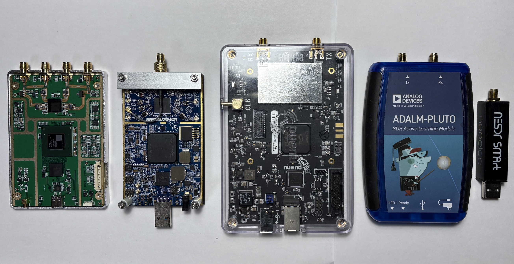

# **SoapySDR Device Notes**

---

Pocket SDR can use third-party SDR hardware through
[SoapySDR](https://github.com/pothosware/SoapySDR/wiki) in addition to the
Pocket SDR FE devices. This note collects verified devices, installation
details, and device-specific workarounds that are too long for the top-level
README.

## Verified Devices

The following devices have been verified with `pocket_trk` / `pocket_sdr.py`.

| Device | IF data format | Sampling rate | Notes |
|---|---|---|---|
| **USRP B210** | `CS16` | ~ 48 Msps | Requires UHD images |
| **LimeSDR-USB** | `CS16` | ~ 60 Msps | Widest verified bandwidth |
| **bladeRF X40** | `CS16` | ~ 40 Msps | Use recent SoapyBladeRF / libbladeRF packages |
| **PlutoSDR** | `CS8` / `CS16` | ~ 6 Msps | Doppler search may exceed the default range |
| **RTL-SDR** | `CS8` | ~ 2.4 Msps | Single-channel L1 only (RTL2832U + R820T) |
| **Airspy Mini** | `CS16` | ~ 6 Msps | Linux only; 10 Msps mode unverified; close-time SIGSEGV on Windows (see notes) |

The sampling rates above are the maximum rates verified in practice, not
device hardware limits. Higher rates may work depending on host USB bandwidth,
CPU load, driver version, and the number of tracked channels.

<p align="center">
  
  <b>USRP B210 (LibreSDR), LimeSDR-USB, bladeRF X40, PlutoSDR, RTL-SDR (NESDR)</b>
</p>

## Runtime Driver Shortcuts

Runtime device selection examples are in
[`app/pocket_trk/pocket_trk.sh`](../app/pocket_trk/pocket_trk.sh). Typical
usage:

```sh
$ cd <install_dir>/app/pocket_trk
$ ./pocket_trk.sh lime           # LimeSDR
$ ./pocket_trk.sh usrp           # USRP B2xx
$ ./pocket_trk.sh blade          # bladeRF
$ ./pocket_trk.sh pluto          # PlutoSDR
$ ./pocket_trk.sh rtl            # RTL-SDR
$ ./pocket_trk.sh                # Pocket SDR FE
```

Before running Pocket SDR, verify that SoapySDR sees the target device:

```sh
$ SoapySDRUtil --info
$ SoapySDRUtil --probe="driver=lime"
```

Change the `driver=...` probe argument for each device, for example
`driver=uhd`, `driver=plutosdr`, `driver=rtlsdr`, or `driver=bladerf`.

## Windows

On Windows, [radioconda](https://github.com/ryanvolz/radioconda) is the
recommended way to get SoapySDR and per-device plug-in DLLs in one consistent
runtime.

1. Download `Radioconda-Windows-x86_64.exe` from the radioconda releases page.
   Use the default per-user install unless you have a reason to customize it.
2. Add the runtime DLL directory to PATH:

```text
<radioconda_install_dir>\Library\bin
```

The typical default is:

```text
C:\Users\<user>\radioconda\Library\bin
```

3. Verify the install in a fresh command prompt:

```bat
> SoapySDRUtil --info
> SoapySDRUtil --probe="driver=lime"
```

`SoapySDRUtil --info` should list discovered modules such as `LMS7`, `HackRF`,
`RTLSDR`, `SDRPlay`, or `BladeRF`. If a module is missing, install the
matching radioconda package, for example:

```bat
> mamba install -c conda-forge soapysdr-module-bladerf bladerf
```

### Windows USB Driver Setup

For many SoapySDR devices, replace the USB device driver with **libusb-win32**
using [Zadig](https://zadig.akeo.ie/). The SoapySDR plug-in DLLs bundled with
radioconda link against libusb-1.0 and require a libusb-compatible driver to be
bound to the hardware.

1. Plug in the target SDR device.
2. Run `zadig.exe`.
3. Enable `Options` -> `List All Devices`.
4. Select the target device and verify the USB VID/PID.
5. Choose `libusb-win32` and press `Replace Driver` or `Install Driver`.
6. Unplug and re-plug the device.
7. Run `SoapySDRUtil --probe="driver=..."` again.

Do not replace the driver for an unrelated USB device. To revert later, use
Windows Device Manager or Zadig to remove the libusb driver and reinstall the
vendor driver. Pocket SDR FE devices use separate Cypress FX2/FX3 drivers and
are not affected by this step.

### Windows Airspy Notes

Airspy (driver `airspy`) is **not officially supported on Windows**. Basic
signal acquisition and tracking work, but device cleanup on close is unreliable
because radioconda's libairspy 1.0.10 has a known bug in `airspy_close()`: it
calls `libusb_free_transfer()` on pending USB transfers without canceling them
first, which races with the libusb async I/O thread.

Observed symptoms on Windows:

- `pocket_trk` exits with a SIGSEGV after printing `TIME(s) = ...`. The
  segfault happens during process teardown; the data captured before exit is
  intact and the OS releases the USB handle when the process ends.
- `pocket_sdr.py` Start / Stop / Start cycle: the second `Start` fails with
  `Unable to open AirSpy device` (`access denied`) because the previous
  `Stop` either crashed or left the USB handle in an inconsistent state.

The bug is in upstream libairspy itself (still present in master at the time
of this note), not in radioconda's build, so updating the radioconda package
does not fix it. Patching libairspy from source is the only known cure.

Linux is unaffected in practice: the same code paths run cleanly with no
SIGSEGV on close and Start / Stop / Start cycles re-open the device normally.
The race exists in libairspy on Linux too, but the kernel usbfs backend in
libusb cleans up orphaned URBs synchronously at the close call, so the race
window does not lead to a crash.

Recommended usage on Windows:

- One-shot `pocket_trk` runs only. Accept the exit-time segfault as harmless.
- Avoid Start / Stop cycles in `pocket_sdr.py` with the airspy driver; relaunch
  the GUI between sessions if you need to re-open the device.
- For continuous / interactive use, prefer one of the verified devices (see
  the table above) or run airspy on Linux.

### Windows bladeRF Notes

For bladeRF, keep both the SoapySDR module and libbladeRF from the same
radioconda environment. Older `bladeRFSupport.dll` builds, notably
SoapyBladeRF 0.4.1, and PATH mixtures with a separate
`C:\Program Files\bladeRF` install can cause frequent RX overflows at 8 Msps.

Recommended checks:

```bat
> mamba install -c conda-forge soapysdr-module-bladerf bladerf
> SoapySDRUtil --info
> SoapySDRUtil --probe="driver=bladerf"
```

If a standalone bladeRF host package is also installed, put
`<radioconda_install_dir>\Library\bin` before the standalone bladeRF directory
in PATH so the SoapySDR plug-in loads the matching `bladeRF-2.dll` /
`bladeRF.dll`.

## Windows Build Notes

Use the **MSYS2 UCRT64** environment when rebuilding Pocket SDR for Windows.
The UCRT64 toolchain links against the same C runtime (`ucrtbase.dll`) as
radioconda's SoapySDR DLLs. The legacy **MINGW64** environment can build, but
it can suffer high-rate streaming performance loss with SoapySDR devices due to
msvcrt/UCRT mixing.

The Pocket SDR build uses SoapySDR headers and the import library from
radioconda:

- Headers: `<radioconda>\Library\include\SoapySDR\`
- DLL: `<radioconda>\Library\bin\SoapySDR.dll`
- Import library: generated as `libSoapySDR.dll.a` from `SoapySDR.dll` during
  the first library build via `gen_soapysdr_implib.sh`

The default radioconda path used by the Makefiles is:

```sh
/c/Users/<user>/radioconda/Library
```

If radioconda is installed elsewhere, override `SOAPY_ROOT`:

```sh
$ make SOAPY_ROOT=/c/path/to/radioconda/Library
```

## Linux / Raspberry Pi OS

On Ubuntu / Debian, install SoapySDR and per-device modules through apt when
the distro packages are recent enough:

```sh
$ sudo apt install libsoapysdr-dev soapysdr-tools soapysdr-module-all
```

`soapysdr-module-all` pulls in most modules. On Debian Bookworm and later it
does not pull in UHD/USRP packages, so install UHD explicitly if needed:

```sh
$ sudo apt install soapysdr-module-uhd libuhd-dev uhd-host
```

If you prefer to install only the modules you need:

```sh
$ sudo apt install libsoapysdr-dev soapysdr-tools
$ sudo apt install soapysdr-module-rtlsdr      # RTL-SDR
$ sudo apt install soapysdr-module-hackrf      # HackRF
$ sudo apt install soapysdr-module-lms7        # LimeSDR
$ sudo apt install soapysdr-module-bladerf     # bladeRF
$ sudo apt install soapysdr-module-sdrplay     # SDRPlay
$ sudo apt install soapysdr-module-airspy      # Airspy
$ sudo apt install soapysdr-module-uhd libuhd-dev uhd-host  # USRP
```

After install, verify that the module loads:

```sh
$ SoapySDRUtil --info
$ SoapySDRUtil --probe="driver=lime"
```

### Linux USB Access

The apt SoapySDR module packages and their dependencies usually install
per-device udev rules into `/lib/udev/rules.d/`. You still need to add your
user to the access group used by those rules, typically `plugdev`:

```sh
$ sudo usermod -aG plugdev $USER
```

Log out and back in, or reboot, then verify device access as a normal user:

```sh
$ SoapySDRUtil --probe="driver=lime"
```

SDRPlay is the exception. It requires the proprietary Mirics API installer from
the SDRPlay site, which ships its own service and udev rules.

### UHD / USRP Images

For USRP devices, fetch the FPGA / firmware images via `uhd_images_downloader`
before first use. The script is not always in PATH. Find its package path:

```sh
$ dpkg -L uhd-host | grep uhd_images_downloader
```

Typical paths:

- `/usr/libexec/uhd/utils/uhd_images_downloader.py`
  (Debian Bookworm and later, Raspberry Pi OS / Ubuntu 24.04+)
- `/usr/lib/<arch>/uhd/utils/uhd_images_downloader.py`
- `/usr/lib/uhd/utils/uhd_images_downloader.py`
- `/usr/local/lib/uhd/utils/uhd_images_downloader.py`

Run with `sudo` when writing into `/usr/share/uhd/images/`:

```sh
$ sudo /usr/libexec/uhd/utils/uhd_images_downloader.py
```

### Ubuntu 24.04 bladeRF Notes

The Ubuntu 24.04 apt package `soapysdr-module-bladerf` may install an older
SoapyBladeRF module, observed with 0.4.1, that causes frequent RX overflows
with bladeRF at 8 Msps even though `bladeRF-cli` capture works correctly. Use
SoapyBladeRF 0.4.2 or later and keep `libbladeRF` and the SoapySDR module from
the same package set.

One practical workaround is to rebuild and install Debian's newer
`soapybladerf` package on Ubuntu:

```sh
$ sudo apt remove soapysdr-module-bladerf soapysdr0.8-module-bladerf
$ sudo apt install build-essential devscripts debhelper cmake pkgconf \
    libsoapysdr-dev libbladerf-dev soapysdr-tools bladerf
$ mkdir -p ~/src && cd ~/src
$ dget -u https://deb.debian.org/debian/pool/main/s/soapybladerf/soapybladerf_0.4.2-1.dsc
$ cd soapybladerf-0.4.2
$ dpkg-buildpackage -us -uc -b
$ cd ..
$ sudo apt install ./soapysdr0.8-module-bladerf_0.4.2-1_$(dpkg --print-architecture).deb \
                   ./soapysdr-module-bladerf_0.4.2-1_$(dpkg --print-architecture).deb
```

Then verify the loaded module:

```sh
$ SoapySDRUtil --info
$ SoapySDRUtil --probe="driver=bladerf"
$ find /usr /usr/local -path '*SoapySDR*' -iname '*blade*' 2>/dev/null
```

If an older `libbladeRFSupport.so` remains under `/usr/local`, move it out of
the SoapySDR module search path or remove it, then run:

```sh
$ sudo ldconfig
```

For distros without usable prebuilt packages, build SoapySDR and the required
device modules from source.

## macOS

For macOS, radioconda is the recommended SoapySDR runtime. On Apple Silicon:

```sh
$ curl -L -O https://github.com/ryanvolz/radioconda/releases/latest/download/Radioconda-MacOSX-arm64.sh
$ bash Radioconda-MacOSX-arm64.sh
```

For Intel mac, use `Radioconda-MacOSX-x86_64.sh`. Accept the license, use the
default install path (`~/radioconda`), and answer "yes" to the shell init
question. Re-open the terminal so the `(base)` conda environment activates.

Verify SoapySDR:

```sh
(base) $ SoapySDRUtil --info
(base) $ SoapySDRUtil --probe="driver=lime"
(base) $ SoapySDRUtil --probe="driver=uhd"
(base) $ SoapySDRUtil --probe="driver=plutosdr"
(base) $ SoapySDRUtil --probe="driver=rtlsdr"
```

The `pocket_trk.sh` driver script auto-detects macOS and sets
`PATH` / `SOAPY_SDR_PLUGIN_PATH` to radioconda's layout:

```text
~/radioconda/bin
~/radioconda/lib/SoapySDR/modules0.8
```

### macOS radioconda Workarounds

Some radioconda macOS builds have had packaging issues that need manual
patching once after install.

If the RTL-SDR module fails to load with `librtlsdr.2.dylib` missing:

```sh
(base) $ cd ~/radioconda/lib
(base) $ ln -sf librtlsdr.2.0.1.dylib librtlsdr.2.dylib
```

If `numpy` fails to import through `libopenblas` because
`libgfortran.5.dylib` has duplicate `LC_RPATH @loader_path` entries:

```sh
(base) $ chmod u+w ~/radioconda/lib/libgfortran.5.dylib
(base) $ install_name_tool -delete_rpath @loader_path ~/radioconda/lib/libgfortran.5.dylib
(base) $ otool -l ~/radioconda/lib/libgfortran.5.dylib | grep -A2 LC_RPATH
```

The last command should show `@loader_path` exactly once. If
`python -c "import numpy"` still fails after this, apply the same
`install_name_tool -delete_rpath` fix to `libopenblas.0.dylib`.

If UHD firmware / FPGA images are missing or incomplete, copy them from a
working radioconda install on another OS, or run `uhd_images_downloader` after
the Python/numpy environment is fixed:

```sh
(base) $ mkdir -p ~/radioconda/share/uhd/images
(base) $ # copy *.hex and *.bin into ~/radioconda/share/uhd/images/
```
